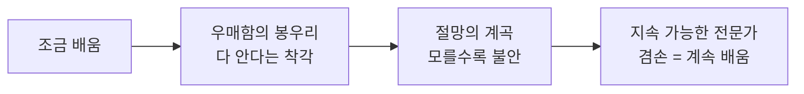
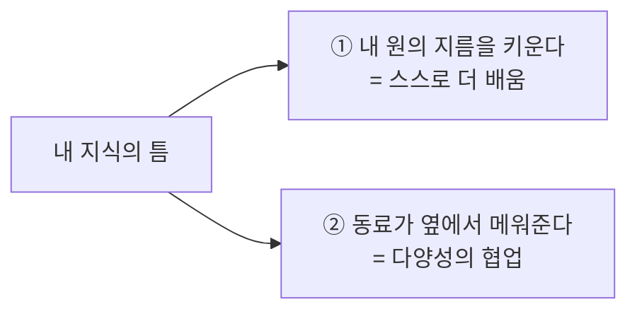
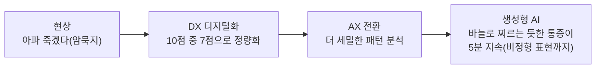
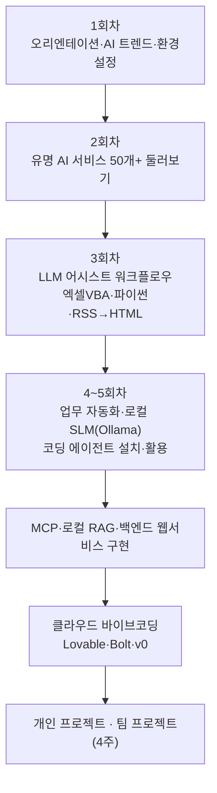
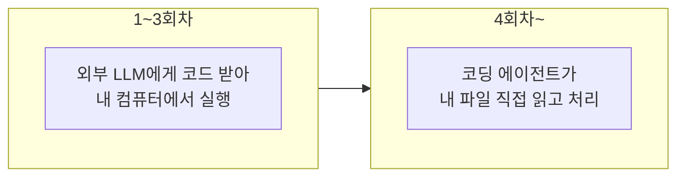
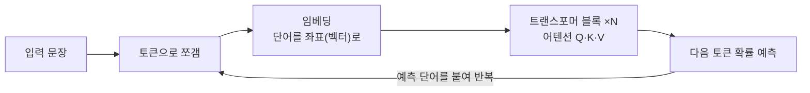
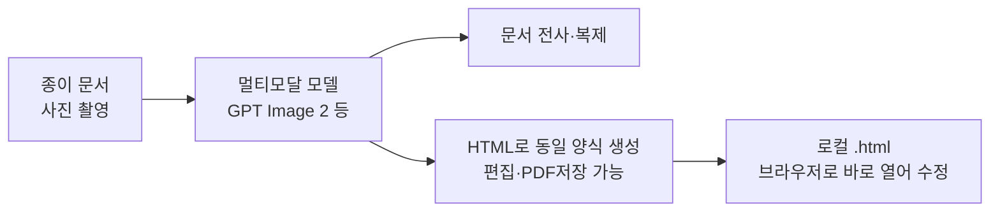
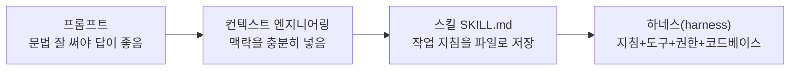
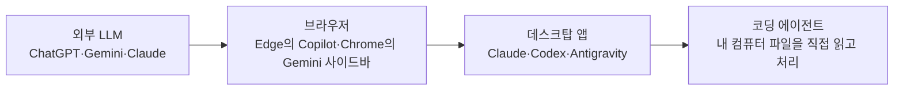

# 1회차 — AI 에이전트 시대: 전문가의 태도와 트렌드 지도

Lecture Note · 기술 보강판

# 1회차 — AI 에이전트 시대: 전문가의 태도와 트렌드 지도

현장 강의를 기술적으로 보강한 학습 레퍼런스 — 강사의 의도는 살리고, 빠지거나 틀린 기술은 정확히 채웠습니다.

이 강의 하나로 무엇을 할 수 있게 하려는가 →
**"거대한 AX(수십억짜리 사업)가 아니라 내 책상 위 작은 문제부터 AI로 푸는 마인드셋을 잡고, 그걸 위해 머릿속에 'AI 트렌드 전체 지도'를 심는 것."**

> [!NOTE]
> **핵심**
> ★ 1회차는 실습 회차가 아니라 **오리엔테이션 + AI 트렌드 오버뷰 + 환경설정 예고**다. 그래서 이 노트도 위계를 억지로 세우지 않고, 강의에 실제로 있던 *나란한 주제들*을 그대로 두되 하나의 태도로 꿰었다. 관통하는 태도는 딱 한 줄: **"지식·기술(how)보다 태도(attitude)가 먼저다. 다양한 도구를 겸손하게 모아서 오케스트레이션하라."**
>
>
>
> **보강 안내** — 강사가 이름을 안 밝히고 넘어간 사이트·도구, 그리고 낡았거나 부정확한 수치는 웹 검색으로 확인해 본문에 녹이고 `(검색 보강)`으로 표시했다. 출처는 맨 끝 부록에 모았다.

---

# 오리엔테이션 — 이 시대의 AI 전문가는 누구인가

## 교과서가 없는 "초학문의 시대"

강사(신성진, 한국데이터사이언티스트협회)가 처음 던진 화두는 *"과연 이 시대의 AI 전문가는 누구인가"*다. 핵심은 이거야.

* **교과서가 없다.** ChatGPT 책을 사면 그 안에는 이미 한물간 모델이 기다리고 있다. GPT-4o로 배웠는데 현장은 5.5다. 기술이 책보다 빨리 바뀐다.
* 그래서 **FOMO**(Fear Of Missing Out, 뒤처질까 봐 느끼는 불안)에 시달리거나, 반대로 "여기까지만 알면 돼" 하고 멈춰 선다. 둘 다 위험하다.
* 공공(공직자)이 민간보다 AI 활용 역량이 **오히려 높다**는 게 강사의 현장 관찰이다. 외부망·OpenRouter·엔터프라이즈 API를 도입해 직원이 쓰게 하는 지자체가 많다.

> [!NOTE]
> **핵심**
> ★ **AI 전문가의 정의를 스스로 잡아라.** 강사 본인도 "나는 AI 전문가인가? 사실 아니다"라고 말한다. 정답이 없으니 각자 정의를 내리고, 그 정의를 동료에게 전파할 수 있어야 한다는 게 이 과정의 출발점이다.

## knowledge보다 attitude — 더닝-크루거와 겸손

강사가 가장 길게 강조한 부분. 초보자가 꼭 기억할 그림이 하나 있다.

**더닝-크루거 효과(Dunning–Kruger effect)** — 조금 배운 사람일수록 자신을 과대평가한다는 심리 현상.



> [!NOTE]
> **핵심**
> ★ 강사의 한 줄: **"절망의 계곡을 '겸손'으로 바꿔 읽어라."** 진짜 전문가는 만족이 없고 늘 불안하다. 나보다 더 아는 사람, 내가 알던 게 부정당할 순간을 늘 대비하기 때문이다. 그래서 `knowledge`보다 `attitude`(세상·현상·문제를 다르게 보는 자세)가 먼저다.

## 전문가의 좁은 스펙트럼, 그리고 "틈 메우기"

한 사람이 소화하는 AI 영역은 좁다. 안드레이 카파시(Andrej Karpathy, "바이브 코딩"이라는 말을 만든 사람) 같은 대가도 전부는 못 다룬다. 그래서 좁은 전문가들이 모이면 반드시 **틈**이 생긴다. 틈을 메우는 방법은 두 가지다.



> [!NOTE]
> **보강**
> **보강 — 용어 한 줄 정리.** 강의에 등장한 카파시의 명언 *"망치를 들고 있으면 모든 게 못으로 보인다"* 는 도구 편식 경고다(2장에서 워밍업 문제로 다시 나온다). 그리고 *바이브 코딩(Vibe Coding)* 은 "코드 문법을 몰라도 자연어로 AI에게 시켜서 프로그램을 만드는 방식"을 뜻한다. 이 과정의 핵심 도구가 된다.

---

# 미시적 혁신 — 책상 위 문제부터 푼다

강의 전체를 관통하는 실천 메시지. **거대한 AX(AI Transformation, 수십·수백억짜리 전환사업)에 짓눌리지 말고, 2~5분짜리 작은 문제부터 AI로 풀라**는 것.

> [!WARNING]
> **주의**
> ⚠ **주의 — "진격의 거인 콤플렉스"를 경계하라.** 강사 표현으로, "몇십억 들여야 AI가 도입된다"는 생각에 빠지면 정작 책상 위 작은 문제를 풀 에너지를 잃는다. AX로만 풀리는 문제는 없다. **기존 레거시(legacy, 이미 쓰던 낡은) 워크플로우 + LLM**을 어떻게 결합하느냐가 진짜 실력이다.

## 워밍업 문제 ① — 교안 사이트에 접속하라

강사는 단톡방에 링크를 안 뿌리고, "수단·방법 가리지 말고 알아서 접속하라"는 문제를 냈다. 그 사이트("AI 챔피언 고급 과정 교안 편집기 = 워크벤치")의 정체를 보강하면:

| 구성 요소 | 정체 | 한 줄 설명 |
| --- | --- | --- |
| **HTML** | 브라우저에서 도는 화면 언어 | 페이지의 뼈대. C드라이브의 .html 파일은 브라우저만 있으면 바로 열린다 |
| **Claude Sonnet** | Anthropic의 LLM | 교안 내용을 생성·수정하는 두뇌 |
| **GitHub Pages** | 무료 정적 사이트 호스팅 | 깃허브에 올린 HTML을 인터넷 주소로 띄워줌 (검색 보강) |
| **Supabase** | 백엔드 데이터베이스(BaaS) | 'DB' 버튼을 누르면 교안이 여기 저장됐다 다시 불려옴 (검색 보강) |

> [!NOTE]
> **보강**
> **보강** — 비밀번호는 `2026`. 강사가 보여주려던 건 *"사이트를 만든다"* 가 아니라 *"HTML 한 장 + LLM + 무료 호스팅 + 가벼운 DB만으로도 우리만의 협업 공간을 만들 수 있다"* 는 감각이다. 이게 뒤에 나오는 "HTML 하나로 파생되는 서비스" 이야기와 이어진다.

## 워밍업 문제 ② — 압축파일에서 회의 일시 찾기

노션에 올린 압축 파일(50개 문서) 안에서 "인천광역시 규제혁신담당관이 회의한 일시"를 찾는 문제. 누군가는 반디집으로 그냥 풀었고, 누군가는 Codex/ChatGPT에 통째로 맡겼다. **정답은 하나가 아니다.**

> [!WARNING]
> **주의**
> ★ 이 문제의 진짜 메시지: **도구에 매몰되지 마라.** 반디집으로 30초면 풀 일을 굳이 Codex 띄워서 풀면 그게 "망치 들면 다 못으로 보이는" 함정이다. 동시에, 50개 중 어디 있는지 모를 때 **AI로 빠르게 찾는 것**도 미시적 혁신이다. 상황에 맞는 도구를 고르는 판단이 핵심.

## 레고 블록 오케스트레이션

도구(API, RSS, MCP, 플러그인, 스킬, 프롬프트, 첨부파일, Antigravity, Codex, Claude Code…)를 **레고 블록**처럼 모아서 조합하라는 비유. 블록 8개로 수억 개 형상을 만들 수 있듯, 회차마다 배우는 도구를 *난이도순 정복*이 아니라 *조합 가능한 부품*으로 쌓으라는 것.

> [!NOTE]
> **보강**
> **보강 — 낯선 도구 이름 빠른 사전** (지금 다 이해할 필요 없음, "이런 게 있구나"면 충분)
> - **API**: 프로그램끼리 정보를 주고받는 약속. AI 모델도 API 키 하나로 불러 쓴다.
> - **RSS**: 사이트의 새 글을 자동으로 받아오는 표준 형식(뉴스/공고 수집에 유용).
> - **MCP** (Model Context Protocol): AI에게 외부 도구·데이터를 연결해주는 표준 규격.
> - **Antigravity / Codex / Claude Code / opencode / Goose**: 내 컴퓨터에서 일하는 코딩 에이전트들(10장에서 설명).

---

# DX와 AX — 내 언어로 다시 정의하기

강사가 "여러분은 거점 리더니까 동료에게 개념을 전파할 수 있어야 한다"며 직접 정의한 부분. 외울 게 아니라 **응급실 통증** 비유로 이해하면 된다.



* **DX (Digital Transformation)**: 인간이 감각으로 아는 현상·암묵지를 **컴퓨터가 알아먹게 정량화**하는 모든 노력. 응급실의 "통증 1~10점"이 딱 그거다. 센서 발달 → 데이터 저장 → 패턴 인식(머신러닝·통계)으로 이어졌다.
* **AX (AI Transformation)**: 그 정량 데이터를 **더 디테일하게** 분석하려는 흐름. 생성형 AI가 들어오면서 "7점" 같은 척도를 넘어 *"바늘로 찌르는 듯한 통증"* 같은 비정형 표현까지 다룰 수 있게 됐다.

> [!NOTE]
> **핵심**
> ★ DX와 AX는 단절된 게 아니라 **한 라인**이다. X는 미국식 약자로 Transformation. 강사 메시지: 당연하게 쓰던 용어도 *내 업무·내 현상에 맞춰 스스로 정의*해보는 응용력을 키워라.

---

# 8주 학습 지도 — 무엇을 언제 배우나



핵심 설계 의도 두 가지:

* **처음엔 코딩 에이전트를 쓰지 않는다.** 3회차까지는 외부 LLM의 *어시스트*만 받아서(폐쇄망 상황 가정) 내 로컬에서 분석·자동화·바이브코딩을 한다. 이걸 강사는 **"어시스트형 바이브 코딩"** 이라 부른다.
* **4회차부터 코딩 에이전트로 전환.** Claude Code·Cursor·Windsurf·opencode·Goose·Antigravity 등을 PC가 허락하는 만큼 설치하고, API·MCP·백엔드를 붙여 서비스까지 만든다.



> [!WARNING]
> **주의**
> **보강 — 왜 굳이 어려운 순서로 가나?** 폐쇄망/보안망에서는 코딩 에이전트가 막힐 수 있다. *"외부에서 LLM 도움으로 코드를 만들어 → 내부로 이식해 실행"* 하는 워크플로우를 익혀두면, 망 환경에 상관없이 일할 수 있다. "폐쇄망이니 외부 건 안 배워도 돼"는 강사가 가장 말린 태도.
>
>
>
> ⚠ **주의 — 마인드셋을 내려놓아라.** 100억짜리 조달 용역을 기획해도 되지만, 먼저 **혼자 또는 동료 3~4명**으로 풀 수 있는 작은 것부터 꿈꿔라. 예: 압축파일 50개 일괄 해제·요약, 파일명 200개 1초 변경, HWP 표 200개를 1개로 30초 통합, 동료가 쓸 좋은 프롬프트 1개. 프로그래밍을 안 해도 된다.

---

# AI 트렌드 지도 ① — 어디서 보고, 어떻게 따라잡나

교과서가 없으니 **직접 출처를 보러 다니는 습관**이 곧 실력이다. 강사가 강조한 사이트들.

## 모델 비교·순위 사이트

| 사이트 | 무엇을 보여주나 | 특징 |
| --- | --- | --- |
| **Artificial Analysis**(artificialanalysis.ai) | 모델별 지능·속도·가격 비교 | **자체 독립 벤치마크**를 돌려 비교 (검색 보강) |
| **LMArena**(lmarena.ai, 옛 Chatbot Arena) | 사람이 두 모델 답을 블라인드로 비교·투표 | **Elo 점수**기반 경험적 순위. 실사용 만족도에 가까움 (검색 보강) |
| **LifeArchitect Models Table**(lifearchitect.ai/models-table) | 800개+ 모델의 파라미터·토큰 등 데이터 표 | **Alan D. Thompson 박사**가 손으로 매일 갱신.*기울임 글씨 = 추정치*, 보통 글씨 = 공개된 사실 (검색 보강) |

> [!WARNING]
> **주의**
> ⚠ **주의 · [정정]** — 강사는 Artificial Analysis를 "논문 지표를 모아놓은 곳"이라 표현했는데, 정확히는 **자기들이 직접 측정한 독립 벤치마크**를 싣는 사이트다. "회사들이 자기 자랑한 논문 모음"과는 다르다. (검색 보강)
>
>
>
> **보강 — Models Table 읽는 법.** 표에서 **두 번째 칸이 회사명, 첫 번째 칸이 모델명**이다. 세 번째 줄의 **파라미터**가 핵심(다음 장에서 설명). 구글 시트로 제공돼 'Open in new tab'으로 내 사본을 떠서 쓸 수 있다.

## 회사 공식 문서를 정독하라

ChatGPT만 쓰지 말고 **만든 회사의 개발자 사이트**에 들어가라는 것. 모델 종류·리서치·API 사용법이 다 거기 있다.

| 회사 | 개발자/문서 사이트 | 메모 |
| --- | --- | --- |
| OpenAI | platform.openai.com / developer.openai.com | Agent Builder, 어시스턴트, 특화 모델(GPT Image 등) |
| Google | ai.google.dev (Google AI for Developers) | Gemma·Gemini API, 임베딩 (검색 보강) |
| Anthropic | **platform.claude.com**/ docs | Claude API. 최근 "Managed Agents" 등 신기능 (검색 보강: URL 정확) |

> [!WARNING]
> **주의**
> ★ **API 키 하나면** 그 회사의 이미지·임베딩·웹검색 모델을 내가 만든 사이트에 심을 수 있다. "임베딩을 꼭 로컬에서 어렵게 할 필요 없이 GPT/Claude/Gemini가 제공하는 임베딩 서비스를 써보는" 식의 감각을 키우라는 게 강사 의도. (단, 내 데이터를 학습에 안 쓴다는 보장 하에.)

## 지금 잘나가는 모델(빠르게 바뀜)

강사가 짚은 분야별 강자 — **순위는 계속 바뀌니 위 사이트로 직접 확인**할 것.

* **텍스트 대화 / 웹서치 / 코딩**: Claude가 상위권(LMArena 기준 1~3위). (검색 보강: 모델 세대마다 변동)
* **이미지 생성**: GPT Image 2가 나노바나나 2(구글 제미나이 계열 이미지 모델)를 제쳤다는 평. 일관성 유지·세밀 수정이 강점.
* **비디오 생성**: ByteDance의 **Seedance**가 열풍. 짧은 프롬프트(제로샷)로도 영상을 만든다.

> [!WARNING]
> **주의**
> ⚠ **주의** — 이미지·영상 모델 이름(Nano Banana, Seedance, Seedream, Kling, Veo, Sora 2, Higgsfield 등)은 분기마다 바뀐다. 이름 외우기보다 *"멀티모달 모델을 한곳에 모아 써볼 수 있는 사이트가 있다"* 는 사실만 기억하면 된다(8장 참고).

---

# AI 트렌드 지도 ② — LLM은 도대체 어떻게 작동하나

여기는 강사가 "파라미터가 뭐냐"를 설명하려고 엑셀·사이트를 띄운 부분. **수학 없이** 개념만 잡으면 된다. 초보자에게 가장 중요한 장이라 차근히 보강한다.

## 비유: 뉴런 860억 개

* 인간 뇌엔 뉴런이 약 **860억 개**, 전체가 약 **20와트**로 돈다. (강사 수치 정확 — 확인됨)
* 뉴런 하나하나는 화학물질(나트륨·칼륨)이 오가며 작은 전기를 만들 뿐인데, 860억 개가 모이니 감정·철학·코딩하는 인간이 됐다.
* 인공신경망도 같은 발상: **아주 단순한 곱셈·덧셈 단위**를 수천억 개 연결했더니 복잡한 패턴을 이해하더라.

## 파라미터 = 곱셈에 쓰는 "가중치"의 개수

강사가 CNN(Convolutional Neural Network, 이미지 인식 신경망)으로 손글씨 숫자(0/1)를 맞히는 엑셀 예제를 보여준 게 이거다.

* 이미지를 픽셀 숫자로 바꾸고 → 거기에 **가중치(weight)** 를 곱하고 더한다(엑셀의 `SUMPRODUCT`, 즉 내적). → 결과를 0~1 사이로 눌러서 "1에 가깝나, 0에 가깝나" 판단.
* 답이 틀리면 거꾸로 돌아가 가중치를 0.01씩 조금씩 고친다(이게 *학습*). 이 **가중치 숫자들의 개수 = 파라미터 수**.

> [!WARNING]
> **주의**
> ★ **파라미터를 1차 방정식으로 이해하기.**`Y = WX + b`에서 `W`(기울기·계수)와 `b`(절편·상수)가 파라미터다. 이런 1차식 수천억 개를 엮은 게 모델. 그래서 **파라미터가 많을수록 복잡한 패턴을 더 잘 이해**한다(= 모델이 "크다").
>
>
>
> ⚠ **주의 · [정정]** — 강사가 "3000 빌리언이면 나누기 2 해서 최소 1500 빌리언짜리 1차 방정식"이라 했는데, 이건 어디까지나 *직관 비유*다. 실제로 편향(`b`)은 가중치(`W`)보다 훨씬 적어서 정확히 절반은 아니다. 개념 잡는 용도로만 받아들이자.

## 트랜스포머와 Query·Key·Value

강사가 띄운 "유튜브 사이트"의 정체 → **bbycroft.net/llm** (Brendan Bycroft 제작). GPT 스타일 트랜스포머를 3D로 그려 *덧셈·곱셈 하나하나*까지 보여준다. 화면에 나온 *"Data visualization empowers users to…"* 문장이 그 데모(GPT-2)다. (검색 보강)



강사가 말한 숫자들(768차원, 2304, 12개, 11번)은 **GPT-2 small(약 1.24억 파라미터)** 의 구조다. 풀어보면:

* 단어를 **768차원** 좌표(벡터)로 임베딩한다. "비슷한 단어는 좌표가 가깝다"가 핵심.
* 그 벡터를 **Query·Key·Value(Q·K·V)** 세 개로 변환한다 → 768 × 3 = **2304**. *"data라는 단어가 어떤 단어와 가장 관련 있나"* 를 계산하는 게 어텐션(attention).
* 이 어텐션 블록이 여러 층(GPT-2 small은 12층) 쌓여서 반복된다.

> [!NOTE]
> **보강**
> **보강 — Key-Value 캐시가 뭐길래.** 대화가 길어질 때 이미 계산한 K·V를 저장해 재사용하는 최적화가 KV 캐시다. "컨텍스트가 길수록 메모리를 먹는다"는 말이 여기서 나온다(9장 컨텍스트 윈도우와 연결).
> 더 그림으로 보고 싶으면 **3Blue1Brown**의 신경망·트랜스포머 영상 시리즈도 강력 추천(수식 없이 시각화). (검색 보강)

## 파라미터 수와 토큰 수

* **파라미터**: 모델의 "방정식 계수" 총개수 = 모델 크기.
* **토큰**: 모델이 학습한 단어 조각의 양. 많이 학습할수록 유창하다. (토큰 = 단어가 음절/어절 단위로 쪼개진 조각)

> [!WARNING]
> **주의**
> ⚠ **주의 · [정정]** — 강사는 "GPT-5.5는 파라미터 약 3000 빌리언(3조)"이라 했는데, **OpenAI는 GPT-4 이후 모델의 파라미터 수를 공식 발표하지 않는다.** "3T"는 외부 추정/체감치이지 공식 수치가 아니다. 체감 기준점으로만 쓰고, 사실로 인용하지 말 것. (검색 보강)

---

# 작은 모델의 시대 — 소버린 AI·온디바이스·SLM

큰 모델 이야기 뒤, 강사가 공직자에게 진짜 권한 건 **작은 모델**이다.

## 소버린 AI의 핵심은 "모델의 다양성"

* **소버린 AI(Sovereign AI)**: 자국이 통제하는 AI 역량. GPU 같은 하드웨어 자원도 중요하지만, 강사는 **모델의 다양성**(조선·제조·철강·농업 등 우리 도메인 데이터로 튜닝한 다양한 모델 확보)이 진짜 핵심이라고 본다.

> [!WARNING]
> **주의**
> **보강 · [정정] — 트럼프 vs Anthropic 사건의 실제 내용.** 강사는 "트럼프가 베네수엘라 지도자 검거 때 Claude가 거부하자 내쫓았다"고 기억했는데, 사실관계는 조금 다르다. 실제로는 **미 국방부(DoD)가 Claude를 "모든 합법적 목적(자율무기·국내 대량감시 포함)"에 쓰게 해달라고 요구 → Anthropic이 거부 → 트럼프 행정부가 전 정부기관에 Anthropic 사용 중단 지시 + "공급망 위험(supply chain risk)" 지정 → Anthropic이 연방정부를 상대로 소송(2026년 3월), 1심에서 예비적 금지명령 일부 승소**의 흐름이다. 강사 메시지("특정 모델에 종속되면 위험, 그래서 모델 다양성이 필요")는 그대로 유효하다. (검색 보강)

## 온디바이스·엣지 AI와 SLM

* **SLM(Small Language Model)**: 작은 언어모델. 1B·4B 같은 크기.
* **온디바이스/엣지 AI**: 클라우드 없이 내 폰·라즈베리파이·작은 센서에서 도는 AI. 구글 딥마인드·알리바바 같은 빅테크가 주도하는 트렌드.

강사가 콕 집은 모델: 구글 **Gemma 3n E4B**.

> [!NOTE]
> **보강**
> **보강** — Gemma 3n E4B는 **원본 8B인데 'effective 4B'** 로 도는 게 특징이다. **MatFormer(Matryoshka Transformer)** 구조로, 큰 모델 안에 작은 모델이 들어있어 메모리·배터리를 아끼면서 추론한다. 10B 미만 최초로 LMArena 1300점을 넘겼다. *"이펙티브 4 빌리언"* 이 바로 이 뜻. (검색 보강)
> 그 외: IBM **Granite 8B**, LG **EXAONE**, 업스테이지 **Solar** 등도 표에 보인다.

## 직접 해보기 — Hugging Face + Ollama

강사가 "Ollama 1B로 엑셀 함수도 설명시킨다"고 말만 하고 넘어간 부분을 명령어로 채운다.

* **Hugging Face**(huggingface.co): 오픈소스 모델 장터. 검색창에 `1B`처럼 치면 작은 모델이 수만 개. 파일은 보통 **GGUF**(llama.cpp/Ollama가 읽는 양자화 포맷) 확장자.
* **로컬 실행기**: Ollama, LM Studio, MSTY, llama.cpp, AnythingLLM 등. 가장 간단한 게 Ollama.

```shell
# 1) ollama.com 에서 설치한 뒤, 터미널(PowerShell)에서 바로 실행
ollama run gemma3:1b           # 1B 초경량 — 처음이면 자동 다운로드 후 대화 시작
ollama run gemma3n:e4b         # 온디바이스용, 추론 가능 (effective 4B)
ollama pull qwen3:1.7b         # 받아만 두기(실행은 나중에)
ollama list                    # 설치된 모델 목록
```

```text
# 실제로 1B에게 시켜볼 프롬프트 예시 (강의에서 보여준 것)
엑셀 VLOOKUP 함수를 설명하고, 예제 데이터로 풀이 방법까지 보여줘.
```

> [!WARNING]
> **주의**
> **보강 — 폐쇄망 활용 포인트.** 모델 태그(`gemma3:1b` 등)는 바뀔 수 있으니 `ollama.com/library`에서 확인. Ollama는 **인터넷 없이 로컬에서** 도니까, 외부망이 막힌 환경에서도 "민원 분류만 잘하는 1~2B 모델" 같은 *스페시픽(specific) 작은 모델*로 동료 업무의 숨통을 틔울 수 있다. 단, 설치 전 보안 점검은 필수.
>
>
>
> ★ 강사의 결론: 큰 모델만 AI가 아니다. **GPU 없는 평범한 PC의 작은 모델 하나로 미시적 문제를 푸는 POC(개념 증명)** 가 지금 시점에 굉장히 중요하다.

---

# 멀티모달과 워크플로우 — 결과만 보여준 것 채우기

**멀티모달(multimodal)**: 텍스트뿐 아니라 이미지·음성·영상까지 함께 다루는 능력.

강사 시연: 종이 보고서를 **사진 찍어** "여기에 똑같이 그려줘"라고 하면 GPT Image 2가 문서를 통째로 전사·복제하고, 동시에 *"이 문서와 똑같은, HTML 편집 가능 + PDF 저장 사이트를 만들어줘"* 로 바이브코딩까지 한다. 이게 **워크플로우** — 프롬프트 한 줄이 아니라 여러 도구를 엮어 문제를 푸는 방식.



> [!NOTE]
> **보강**
> **보강 — 왜 HTML을 자꾸 강조하나.** C드라이브의 `.html`은 브라우저만 있으면 열린다. 자주 쓰는 양식(주간/월간 보고서)을 HTML로 만들어 두고 **작은 4B 모델 하나만 붙여도** 문서를 자동 생성하는 서비스가 된다. 외부 API가 허용되면 더 다양한 AI 서비스로 확장. 1장의 "워크벤치"가 바로 그 예(HTML로만 만든 서비스).
>
>
>
> **보강 — 멀티모달 모델 모아 쓰는 곳.** Higgsfield 같은 사이트에 들어가면 GPT Image 2·Nano Banana 2·Seedream·Seedance·Kling·Veo·Sora 2 등을 한곳에서 써볼 수 있다. (이름은 자주 바뀐다 — 8주 과정 중 영상·홍보 제작 때 직접 다룸.)

---

# 프롬프트에서 컨텍스트·하네스로 — 용어 정리

강사가 "용어 전쟁"이라 부른 부분. **흐름 하나만** 잡으면 된다: 모델이 똑똑해질수록, *프롬프트를 잘 쓰는 기술*에서 → *맥락(컨텍스트)을 잘 떠먹이는 기술*로 무게가 옮겨갔다.



## 메타 프롬프트 — "AI에게 질문을 시켜라"

내가 잘 모르는 주제라 프롬프트 쓰기가 막막할 때, **AI가 먼저 객관식으로 물어보게** 만드는 기법. 강사가 Claude Code의 "플래닝 질문" 방식을 차용한 것.

```text
[역할] 너는 보고서 기획 도우미야.
[작업] "행정안전부 AI 미시적 혁신 운영방안 보고서"를 쓸 건데, 뭘 넣을지 잘 몰라.
[방식] 보고서에 들어갈 요소를 객관식 10지선다(A~J)로 5문항 만들어 나에게 먼저 질문해줘.
       내가 각 문항에서 하나씩 고르면, 그 선택을 종합해 '완성된 보고서 작성 프롬프트'를 만들어줘.
지금부터 질문 시작.
```

> [!NOTE]
> **핵심**
> ★ 5문항 × 10지선다면 경우의 수가 `10⁵`. 내가 원하는 딱 그 주제의 프롬프트로 **분기**시킬 수 있다. 이미지가 막막할 땐 똑같이 *"포토그래퍼 전문 기법 10가지로 객관식 질문해줘"* 로 응용. (광각·삼분할·웜즈아이뷰·블루아워·얕은 심도 같은 걸 몰라도 AI가 골라준다.)
>
>
>
> **보강 — 병렬로 일 시키기.** ChatGPT에서 한 채팅창만 붙들지 말고, 메시지를 **편집·분기**(서브 에이전트처럼)해 여러 인격을 동시에 굴리는 습관도 권한다. 또 만든 프롬프트는 *새 창*에 옮겨 실행하라 — 만들던 창은 이미 "프롬프트 만드는 맥락"으로 오염돼 엉뚱한 답을 낼 수 있다.

## 컨텍스트 윈도우 / 컨텍스트 엔지니어링

* **컨텍스트 윈도우(context window)**: 한 대화에서 모델이 한 번에 기억하는 토큰의 총량(질문+답변 누적).
* **컨텍스트 엔지니어링**: 정형화된 프롬프트 문법보다, *내가 가진 맥락·자료를 최대한 구체적으로 떠먹이는* 행위.

> [!WARNING]
> **주의**
> ⚠ **주의 · [정정]** — 강사는 "컨텍스트 윈도우가 12만 8천 토큰까지, 책 한 권"이라 했는데 이 수치는 **이미 낡았다(GPT-4 Turbo 시절 128K)**. 2026년 기준 **Claude(Opus 4.8/Sonnet 4.6)는 200K가 기본, 100만(1M) 토큰도 일반 제공**, **Gemini는 1M(2M 예정)**. "책 한 권"이 아니라 "책 여러 권" 수준으로 더 커졌다. (검색 보강)

## 스킬·하네스·규칙 파일

| 용어 | 정체 | 비유 |
| --- | --- | --- |
| **스킬 (SKILL.md)** | "이 작업은 이렇게 해라"는**작업 지침 파일** | AI에게 미리 쥐여주는 매뉴얼 |
| **하네스 (harness)** | 지침 +**도구 호출(tool calling)·파일 권한·코드베이스**까지 묶은 실행 환경 | 매뉴얼 + 연장통 + 작업장 |
| **규칙 파일** | CLAUDE.md / AGENTS.md / Cursor·Windsurf Rules | 프로젝트마다 AI가 먼저 읽는 규칙서 |

예: "행안부 문서 가이드 기반으로 HWPX를 만들어주는 스킬"을 두면, 내가 "보고서 써줘" 한 줄만 던져도 AI가 그 `SKILL.md`를 읽고 *"파이썬 hwpx 라이브러리를 호출하고, 서식은 이렇게"* 까지 알아서 처리한다. 이게 다 **컨텍스트**다.

> [!WARNING]
> **주의**
> ⚠ **주의 — 오버 엔지니어링 경계.** "하네스 안에 또 하네스"를 만들며 용어에 매몰되는 사람들이 있다. 용어 전쟁에 휘둘리지 말고 **흐름**만 기억하라: 컨텍스트가 좋아져서, 제로샷(맨몸 한 줄)만 던져도 AI가 관련 지침을 읽어가며 실행할 수준이 됐다.

---

# AI가 내 컴퓨터로 들어온다 — 통합 전략과 에이전트

마지막 트렌드. AI는 외부 사이트 → 브라우저 → 내 컴퓨터 순으로 점점 안쪽까지 들어온다.



## 회사별 통합(생태계) 전략

* **OpenAI(ChatGPT)**: 자체 플랫폼이 없어 **MCP로 서드파티**(공공데이터포털·법령정보 등)를 붙여 생태계 확장.
* **Google(Gemini)**: 시트·코랩·슬라이드·지메일·캘린더 등 **자기 생태계** 안에 통합.
* **Anthropic(Claude)**: 엑셀·파워포인트에 들어가고, 스킬·플러그인·Managed Agents 등 **독립 생태계**를 강화. 최근 금융·회계용 엑셀 에이전트로 월가에서 화제.

> [!NOTE]
> **보강**
> **보강 — 에이전틱 AI는 아직 신중하게.***에이전트*가 "내가 시킨 자동화를 수행"하는 단계라면, *에이전틱(agentic) AI*는 "무엇을 할지 **판단·의사결정**까지 맡기는" 단계다. 강사 경험상 아직 불안하다(실제로 에이전트가 파일을 다 지운 적도). 그래서 **사람 승인(approval) 단계**를 끼우는 게 현실적이다.
>
>
>
> ★ **공공의 과제 = 거버넌스.** 이 에이전트가 Gemini가 아니라 AI 공통기반(FabriX·네이버 클로바)과 연결된다면 어떻게 운영·통제할지 고민하라. 에이전트를 굴리는 브릿지 파일들은 오픈소스로 많이 나와 있어, **오픈소스 + Gemma 4B로 공공 자체 하네스 시스템**을 만드는 게 좋은 팀 프로젝트가 될 수 있다(= "애자일 AI").

---

# 부록 — 용어 사전·환경설정·출처

## 용어 빠른 사전

| 용어 | 한 줄 정의 |
| --- | --- |
| 바이브 코딩 | 문법 몰라도 자연어로 AI에게 시켜 프로그램을 만드는 방식 |
| DX / AX | 디지털 전환(정량화) / AI 전환(더 세밀한 패턴·비정형까지) |
| 파라미터 | 모델의 곱셈 가중치 개수 = 모델 크기 |
| 토큰 | 단어가 쪼개진 조각. 컨텍스트 윈도우의 단위 |
| 임베딩 | 단어를 좌표(벡터)로 바꿔 의미 거리를 재는 것 |
| 트랜스포머 / Q·K·V | LLM의 핵심 구조 / 어텐션에서 관련도를 계산하는 세 벡터 |
| 컨텍스트 윈도우 | 한 번에 기억하는 토큰 총량 |
| 컨텍스트 엔지니어링 | 맥락·자료를 잘 떠먹여 답을 끌어내는 기술 |
| SLM / 온디바이스·엣지 AI | 작은 언어모델 / 클라우드 없이 내 기기·센서에서 도는 AI |
| GGUF | 로컬 실행기(Ollama 등)가 읽는 모델 양자화 포맷 |
| MCP | AI에 외부 도구·데이터를 연결하는 표준 규격 |
| 스킬(SKILL.md) / 하네스 | 작업 지침 파일 / 지침+도구+권한까지 묶은 실행 환경 |
| RAG | 외부 정보를 검색해 LLM 답변에 섞어 신뢰도를 높이는 방식 |
| 소버린 AI | 자국이 통제하는 AI 역량(특히 모델 다양성) |

## 환경설정 체크리스트(과제 예고)

1회차 과제는 **환경설정 완비**다. 강사가 따로 리스트·가이드를 보낼 예정이지만, 미리 준비하면 좋은 것:

* [ ] **Python** 설치 (대부분 이미 됨)
* [ ] **구글 계정** (가능하면 부계정 — 단, 생년월일을 오늘 날짜로 넣지 말 것: 미성년 처리되어 잠긴다)
* [ ] **코딩 에이전트** 중 PC가 허락하는 것: Claude Code · Codex · Cursor · Windsurf · Gemini용 Antigravity · opencode · Goose
* [ ] **Ollama** (로컬 SLM 실험용) + 작은 모델 1개 받아두기
* [ ] 주요 서비스 계정/구독 상태 점검: ChatGPT · Gemini · Claude (2회차에 50개+ 서비스 투어)

> [!NOTE]
> **보강**
> **보강 — 폐쇄망 대안 한 줄.** 외부망이 막히면 코딩 에이전트 대신 **외부 LLM 어시스트 → 코드 이식 → 로컬 실행** 워크플로우로 간다(4장). 로컬 추론은 **Ollama**, 로컬 STT가 필요하면 **faster-whisper** 같은 오프라인 도구로 같은 일을 할 수 있다.

## 검색으로 보강·정정한 출처

* Gemma 3n E4B(MatFormer, effective 4B): [Google AI for Developers](https://ai.google.dev/gemma/docs/gemma-3n), [Artificial Analysis](https://artificialanalysis.ai/models/gemma-3n-e4b)
* LifeArchitect Models Table (Alan D. Thompson): [models-table](https://lifearchitect.ai/models-table/)
* LLM 시각화(GPT-2, 768/2304 구조): [bbycroft.net/llm](https://bbycroft.net/llm), [GitHub bbycroft/llm-viz](https://github.com/bbycroft/llm-viz)
* 컨텍스트 윈도우 현황(Claude 200K~1M, Gemini 1M~2M): [Claude Platform Docs](https://platform.claude.com/docs/en/build-with-claude/context-windows)
* 트럼프 행정부 vs Anthropic(국방부 분쟁·소송): [Wikipedia](https://en.wikipedia.org/wiki/Anthropic%E2%80%93United_States_Department_of_Defense_dispute), [NPR](https://www.npr.org/2026/03/09/nx-s1-5742548/anthropic-pentagon-lawsuit-amodai-hegseth)

