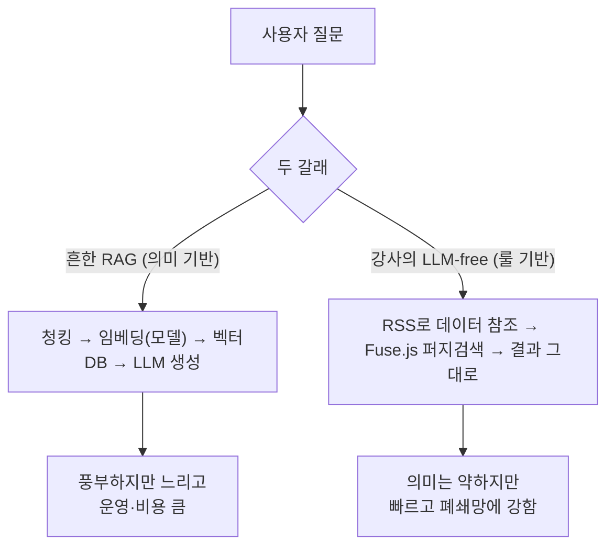
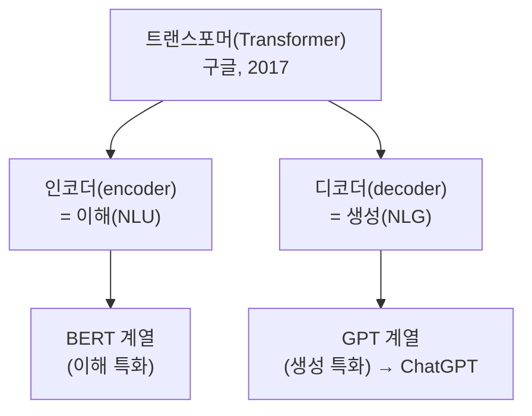
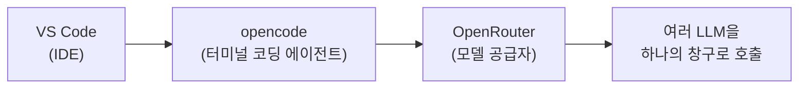
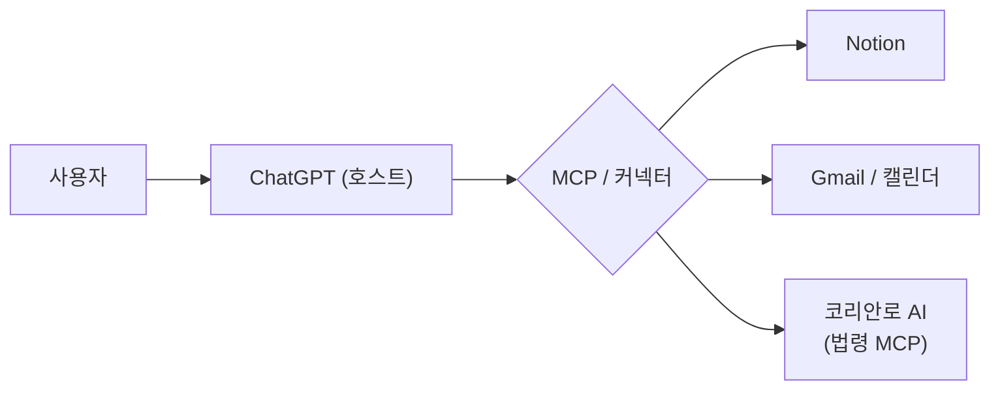
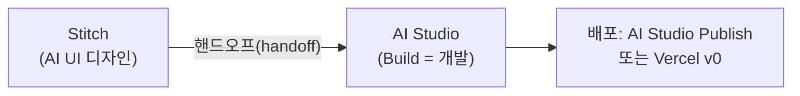

# 2회차 — AI 프론티어 탐색: 최전선 도구를 직접 써보고, 직접 만든다

Lecture Note · 기술 보강판

# 2회차 — AI 프론티어 탐색: 최전선 도구를 직접 써보고, 직접 만든다

현장 강의를 기술적으로 보강한 학습 레퍼런스 — 강사의 의도는 살리고, 빠지거나 틀린 기술은 정확히 채웠습니다.

이 강의 하나로 무엇을 할 수 있게 하려는가 →
**"프론티어 모델(LLM) 생태계를 한 바퀴 돌면서 ChatGPT·Claude·Gemini와 그 주변 도구(코딩 에이전트·MCP·GPTs·바이브 코딩)를 직접 설치·연동·배포해보고, '딸깍'으로 진입장벽이 무너진 시대에 '내가 필요한 걸 내가 만드는' 감각을 잡는 것."**

> [!NOTE]
> **핵심**
> ★ 이 회차는 **최전선 트렌드 투어 + 손으로 하는 실습**이 섞여 있다. 깔끔한 위계(○○ 3계층 식)가 있는 강의가 아니라 **나란한 주제들**이 쭉 이어지고, 그걸 하나의 태도로 꿴다. 관통하는 태도는 한 줄: **"딸깍의 시대다 — 반대 방향까지 의심하며 직접 써보고, 트렌드를 누구보다 빨리 캐치하고, 결국 남는 건 사람(네트워크)이다."**
>
>
>
> **보강 안내** — 강사가 이름만 흘리고 넘어간 도구·모델, 그리고 건너뛴 실제 명령어/코드/설정을 채워 넣고, 틀리게 말한 기술 사실은 `정정`으로 바로잡았다. 웹으로 확인한 항목은 `(검색 보강)`으로 출처를 밝혔다. **요청대로 이번 회차는 참가자 자기소개 구간을 노트에서 뺐다.**

---

# 0. 관통하는 태도 — "딸깍의 시대"

강사가 강의 내내 반복한 키워드가 **'딸깍'**이다. 자동화/AI로 옛날엔 며칠 걸리던 걸 클릭 한 번에 해내는 상태를 가리키는 말장난인데, 이게 이 회차의 정서다.

* **진입장벽이 무너졌다.** 코드 문법을 몰라도 자연어로 시켜서 앱을 만들고 배포한다. 그래서 "먼저 설치하고 한 번이라도 더 돌려본 사람"이 리드를 잡는다.
* **반대 방향까지 의심하라.** 다들 "LLM에 벡터 붙여 RAG" 한 방향만 보는데, 강사는 일부러 그 **정반대(룰 기반·LLM 없는 검색)**를 들고 나왔다(1장). "오픈AI 없이 RAG 못 만들어?" 같은 질문을 던지는 게 핵심.
* **트렌드를 빠르게 캐치하라.** AI는 교과서가 없다. 먼저 써본 사람이 1등이다(2장).
* **결국 남는 건 사람.** 기술 진입장벽이 낮아질수록, 뜻을 같이하는 네트워크가 진짜 자산이다.
* **작게 시작하고, 도메인 전문가와 함께하라.** MVP로 작게 시작하고, 업무를 정확히 아는 사람과 짜면 시스템이 간결해진다(7장).

---

# 1. RAG를 거꾸로 — LLM 없는 검색 시스템 ('Who am I')

강사가 수강생 정보를 검색해주는 'Who am I' 시스템을 만들어 보여줬다. 핵심은 **여기에 LLM이 0% 들어갔다**는 것 — "LLM-프리(LLM-free)" 시스템이다.

## 보통의 RAG vs 강사의 룰 기반 검색

우리가 흔히 듣는 RAG는 단계가 길다. 문서를 잘게 쪼개고(청킹) → 숫자 벡터로 바꾸고(임베딩) → 벡터 DB에 저장 → 질문도 임베딩해서 의미가 가까운 걸 찾아 → LLM이 답을 생성. 강사는 이걸 **정반대로**, 의미를 담는 임베딩 없이 글자 그대로 빠르게 찾는 룰 기반으로 만들었다.



| 구분 | 흔한 RAG (의미 기반) | 강사의 LLM-free (룰 기반) |
| --- | --- | --- |
| 핵심 기술 | 임베딩 + 벡터 DB + LLM | RSS(XML) + 퍼지 검색(Fuse.js) |
| 검색 방식 | 시맨틱 서치(의미가 가까운 것) | 글자/문자열 기반 매칭 |
| 장점 | 표현이 풍부, 맥락 이해 | 빠르다, 명확하다, 폐쇄망에 쉽게 넣음 |
| 단점 | 느려질 수 있음, 임베딩 모델·벡터DB·LLM 운영비 | 의미를 담지 못함(다국어·동의어 약함) |

> [!NOTE]
> **핵심**
> ★ **공공·실무에선 "명확한 게 중요"할 때가 많다.** 의미를 두루뭉술 담는 것보다, 한글 파일 안에 적힌 그대로(예: "김태우"라는 글자) 빠르고 정확히 뽑는 게 더 맞는 상황이 있다. 그래서 애매함(fuzzy)을 다루는 기술인데도 결과는 명확하게 떨어지는, 역설적인 조합이다.

## 쓰인 부품 — RSS, Fuse.js(퍼지 검색), BM25, 레벤슈타인

* **RSS** — 블로그·뉴스 같은 데서 콘텐츠를 XML 형태로 받아오는 오래된 표준. 여기선 데이터 참조 통로로 썼다.
* **Fuse.js** — "Lightweight Fuzzy Search", 자바스크립트 라이브러리. npm으로 설치한다. **퍼지(fuzzy)** = "이것도 저것도 아닌" 모호한 정도를 점수로 재는 기법이라, 오타나 부분 일치도 잡아준다.
* **레벤슈타인 거리(Levenshtein distance)** — 문자열 두 개가 얼마나 다른지(몇 글자 바꿔야 같아지는지)를 재는 아주 고전적인 방식. 퍼지 검색의 바탕에 깔린다.
* **BM25** — 검색 랭킹에서 유명한 룰 기반 알고리즘. 이것도 의미 모델 없이 동작.

```shell
npm install fuse.js
```

```javascript
// 최소 예시 — 이름/경력 안에서 오타까지 감안해 검색
import Fuse from "fuse.js";
const people = [{ name: "김태우", career: "AI 프랙티셔너" }, /* ... */];
const fuse = new Fuse(people, { keys: ["name", "career"], threshold: 0.4 }); // threshold↑ = 더 느슨
const hits = fuse.search("김대우"); // 오타여도 "김태우"가 잡힘 (fuzzy)
```

> [!NOTE]
> **보강**
> 보강 — **이게 왜 폐쇄망에 강하냐.** Fuse.js·BM25·레벤슈타인은 전부 룰 기반이라 외부 AI API가 필요 없다. 파이썬/JS 라이브러리 한두 개로 패키징해 인터넷 없는 사내망에 넣어도 그대로 돈다. 보안 심사를 통과하기도 쉽다. (의미 기반 RAG는 임베딩 모델·LLM 호출 때문에 통신이 필요해 이 점에서 불리하다.)

---

# 2. 트렌드를 누구보다 빨리 캐치하는 법

AI는 교과서가 없고 매일 쏟아진다. 강사가 쓰는 "비밀 장소"들을 공유했다.

## AI 타임즈 + RSS로 자동 수집

* **AI 타임즈(AI Times)** — 국내 기준 AI 소식이 가장 빠른 신문. 해외 모델 출시도 유튜브보다 먼저 뜬다. 브라우저 시작 페이지로 걸어두면 하루 한 번은 보게 된다는 게 팁.
* **RSS.app** — 아무 사이트(심지어 스레드 같은 SNS)나 주소를 넣으면 RSS(XML) 피드로 **래핑(wrapping)**해주는 서비스. 이걸로 최신 글을 자동으로 땡겨와 나만의 채팅/이메일/슬랙으로 받아볼 수 있다.
* **Slack 자동 수집** — 기업들은 유명 IT 기업 테크블로그들의 RSS를 한 채널에 몰아넣어 두고, 쉴 때 한 번씩 본다. "자동화 + API 오케스트레이션"만 잘해도 이런 트렌드 파이프라인이 만들어진다.

> [!NOTE]
> **보강**
> 보강 — **'오픈AI 초이'.** 강사가 강력 추천한 스레드(Threads) 계정. 프로필이 강아지 사진인 익명 계정인데, 최신 AI 소식을 하루 5~10개씩 GIF까지 붙여 뿌린다. 스레드는 메타(인스타그램 회사)가 만든 글 중심 SNS(옛 트위터/X 대항마)이고, 국내에선 특이하게 반말 커뮤니티다. 이런 개인 계정이 공식 신문보다 빠를 때가 많다는 게 포인트.

## "데이터를 어떻게 합법적으로 모으나" — 토스 페이스페이 사례

기술 자체보다 **기획 한 번이 문제를 푼 사례**로 소개됐다. 토스(Toss)가 **페이스페이(face pay, 얼굴로 결제)**를 밀면서 결제 단말기 시장을 노리는데, 여기 필요한 건 얼굴 인식(**facial recognition**) 모델. 문제는 "수많은 사람 얼굴 데이터를 어떻게 합법적으로 구하나"다.

* 보통은 개인정보 동의 문제로 막힌다.
* 토스(로 알려진 방식)는 **대형 콘서트 입장 시 암표(부정 입장) 방지**라는 목적을 걸고, 입장장에 얼굴 인식 카메라 + 카드 인증을 붙여 데이터를 합법적으로 모으고, 잘 마스킹해서 학습에 썼다는 식.

> [!NOTE]
> **핵심**
> ★ 교훈: "어떻게든 데이터를 구해서"가 아니라, **사람이 합법적으로 몰리는 상황을 사업으로 설계**해 데이터 문제를 푼 것. 기술이 아니라 기획이 본질을 흔든 사례다.

---

# 3. 잠깐 개념 정리 — 트랜스포머와 GPT의 역사

"거점 리더라면 GPT가 어디서 왔는지는 알고 가자"며 강사가 짚은 부분. 초보자가 가장 헷갈리는 용어라 정리해둔다.



> [!NOTE]
> **참고**
> ⚠ 정정 — **NLP / NLU / NLG 정리.** 강사가 디코더 영역을 한 번 "NLP"라고 불렀는데, 용어를 정확히 하면: **NLP(자연어 처리)**가 큰 우산이고, 그 아래 **NLU(자연어 이해 — 입력을 해석)**와 **NLG(자연어 생성 — 출력을 만듦)**가 있다. 트랜스포머의 인코더는 NLU 쪽, 디코더는 NLG 쪽에 대응한다고 보면 쉽다. ChatGPT는 디코더 계열(생성 특화).
>
>
>
> 보강 — **한 줄 히스토리.** 트랜스포머 논문은 2017년 구글의 *"Attention Is All You Need"*. 정작 트랜스포머를 처음 만든 건 구글인데, 공개 정책 탓에 선점하지 못했고 오픈AI가 디코더 부분을 픽업해 키웠다. GPT-3까지는 주어진 지문 안에서만 잘 푸는 **인컨텍스트 러닝(in-context learning)** 수준이었는데, 여기에 **RLHF(인간 피드백 기반 강화학습)**를 얹은 GPT-3.5에서 체감 성능이 폭발했고, 그게 2022년 말 ChatGPT 공개로 이어졌다.
>
>
>
> ⚠ 정정 — 강의 중 "GPT 5.5 / 5.6" 같은 버전 숫자가 나오는데, 이는 강사가 어림으로 던진 표기다. 모델 버전 숫자는 워낙 빨리·헷갈리게 바뀌니 정확한 제품명으로 외우기보다 **"최신 GPT-5 계열"** 정도로 기억해두는 게 안전하다.

---

# 4. SLM(소형 언어모델) 지형 — 숙제 리뷰

지난주 숙제가 "SLM(Small Language Model, 소형 언어모델) 조사"였다. 강사가 제출물을 모아 리뷰했다. 등장한 모델들:

* **Gemma 4**(구글), **Qwen3 / Qwen2.5**(알리바바) — 최신·인기 라인
* **Mistral**(프랑스), **Granite**(IBM), **DeepSeek-OCR**(중국)
* 국산: **EXAONE**(LG), **Kanana**(카카오), **42dot**(현대차그룹 — 강사가 의외라고 평한 모델)
* **OpenAI Privacy Filter** (← STT가 "Owl/오프네일"로 잘못 들은 그 모델)

> [!WARNING]
> **주의**
> 보강 — **'Owl / 오프네일 프라이버시 필터'의 정체 = OpenAI Privacy Filter.** STT가 "OpenAI"를 "오프네일/Owl"로 잘못 들은 것이고, 실제 모델명은 **OpenAI Privacy Filter**다(2026년 4월 공개, 오픈소스). **1.5B 파라미터(활성 50M)의 양방향 토큰 분류(token classification) 모델**로, 텍스트를 한 번에 훑어 이름·주소·이메일·전화·URL·날짜·계좌·비밀번호 8개 범주의 개인정보(PII)를 찾아 가린다. 강사의 질문("임베딩 직전이냐 후냐, 분류 모델이냐 회귀 모델이냐")에 대한 답: **사용자가 입력하자마자 도는 분류(classification) 모델**이고, 클라우드 LLM에 보내기 **전 단계**에 두어 개인정보가 밖으로 나가기 전 로컬에서 먼저 마스킹한다. 그래서 **온프레미스(내 노트북/사내 서버) 구동**이 핵심 가치다. (검색 보강: openai.com/index/introducing-openai-privacy-filter, Hugging Face `openai/privacy-filter`)
>
>
>
> ★ **초보자 교훈 — AI의 환각(hallucination).** 강사가 이 모델을 Claude에게 물었더니 "그런 모델 없습니다"라고 답했다고 한다. 하지만 실제로 존재한다. **LLM은 자기 학습 시점 이후이거나 모르는 것을 종종 단정적으로 '없다'고 지어낸다(환각).** "AI가 아니라고 했으니 없는 거겠지"라고 믿지 말고, 한 번 더 직접 확인하는 습관이 필요하다.
>
>
>
> 보강 — **이 작은 모델들이 왜 중요한가.** Qwen2.5급 소형 모델은 GPU 없이 **CPU(우리 PC)에서도 돌아간다.** 오픈웨이트(open-weight)라 **허깅페이스(Hugging Face)**에서 누구나 받아 폐쇄망에 넣어 쓸 수 있다. 로컬 구동이 목적이면 **올라마(Ollama)** 같은 도구로 사내망에 올려 서빙하는 게 표준적인 출발점이다.

---

# 5. 실습 — 개발 환경부터 배포까지 풀 사이클

강의의 첫 손풀기 실습. **VS Code + opencode + OpenRouter**로 코딩 환경을 만들고 → 계산기를 만들어 → EXE/웹으로 배포하는 한 바퀴.

## 5-1. 개발 환경 3종 세트



* **VS Code** — 코드 편집기(IDE). 커서(Cursor)의 근간이기도 하다. [code.visualstudio.com](https://code.visualstudio.com)에서 설치.
* **opencode** — 터미널에서 도는 오픈소스 AI 코딩 에이전트. VS Code 안 터미널에 띄워 쓴다.
* **OpenRouter** — 여러 AI 모델을 **하나의 API 창구**로 묶어주는 모델 공급자. 회사에 배치할 때도 모델 교체가 쉬워진다.

실제 설치 순서(강사가 "힌트는 Node.js"라고만 하고 넘어간 부분을 채움):

```shell
# 1) Node.js 18+ 설치 (https://nodejs.org) — opencode를 깔기 위한 런타임 + npm 제공
node -v                       # v18 이상인지 확인

# 2) opencode 전역 설치  (npm 패키지명은 opencode가 아니라 opencode-ai!)
npm install -g opencode-ai

# 3) 프로젝트 폴더에서 실행
opencode

# 4) OpenRouter 연결 — opencode 안에서
/connect                      # 안내에 따라 OpenRouter API 키 붙여넣기
#   또는 환경변수로 (Windows, 새 터미널부터 적용)
setx OPENROUTER_API_KEY "sk-or-..."

# 5) 모델 바꾸기 — opencode 안에서
/models                       # 목록에서 원하는 모델 선택
```

> [!NOTE]
> **참고**
> ⚠ 정정 — 강사는 *"Node.js를 깔면 리눅스 환경이 같이 깔린다"*고 했는데, 정확히는 아니다. **Node.js는 opencode를 설치·구동하는 런타임(과 npm)을 줄 뿐, 리눅스를 설치해주지 않는다.** opencode는 Windows의 PowerShell에서도 동작하지만, 공식 문서는 호환성 문제를 줄이려면 **WSL(Windows Subsystem for Linux)**에서 쓰길 권장한다. 강사가 느낀 "리눅스 같다"는 인상은 유닉스 셸/WSL 위에서 돌 때의 경험으로 보인다. (검색 보강: opencode.ai 공식 문서, OpenRouter의 opencode 연동 가이드)
>
>
>
> 보강 — 코딩 에이전트엔 보통 **Plan 모드(대화·계획)**와 **Build 모드(실제 코딩)**가 있다. Plan에서 무엇을 할지 합의하고 Build로 넘기는 흐름은 거의 모든 코딩 에이전트(Claude Code, Codex 등)에 공통이다.

## 5-2. 계산기 → EXE → 웹 → GitHub Pages 배포

무료 모델(느림)로 시작해도 되지만, 외부 패키지 없이 **파이썬 내장 함수**만으로 간단한 계산기/날짜계산기를 만들게 했다. 그다음 두 갈래로 배포.

**(A) EXE로 묶기 — PyInstaller**

```shell
pip install pyinstaller
pyinstaller --onefile --noconsole calculator.py   # 단일 .exe, --noconsole은 콘솔창 숨김(GUI용)
# 결과물: dist/calculator.exe  → 탐색기에서 더블클릭 실행
```

**(B) 웹으로 띄우기 — Flask (127.0.0.1:5000)**

강사 화면에 뜬 `127.0.0.1:5000`은 Flask 기본 포트다. 최소 예시:

```python
# app.py
from flask import Flask, request, render_template_string
app = Flask(__name__)
PAGE = """
<form method=post><input name=expr value="{{expr}}"><button>=</button></form>
<p>결과: {{result}}</p>
"""
@app.route("/", methods=["GET", "POST"])
def index():
    expr, result = "", ""
    if request.method == "POST":
        expr = request.form["expr"]
        try:
            result = eval(expr)           # ⚠ 데모용. 실제 서비스면 eval 금지(보안)!
        except Exception as e:
            result = f"오류: {e}"
    return render_template_string(PAGE, expr=expr, result=result)
if __name__ == "__main__":
    app.run(host="127.0.0.1", port=5000)  # http://127.0.0.1:5000
```

> [!WARNING]
> **주의**
> ⚠ 주의 — 위 `eval()`은 데모를 짧게 보이려 쓴 것. 사용자 입력을 그대로 `eval` 하면 임의 코드가 실행될 수 있어 **실제 서비스에선 절대 금지**다. 안전한 수식 파서를 쓰거나 연산을 직접 구현해야 한다.

**(C) GitHub Pages로 무료 공개**

프론트(HTML/CSS/JS)로 만든 정적 페이지는 GitHub Pages로 공짜 호스팅된다. 주소는 `username.github.io` 형태.

```shell
git init && git add . && git commit -m "calculator"
git branch -M main
git remote add origin https://github.com/<username>/<repo>.git
git push -u origin main
# GitHub → 레포 → Settings → Pages → Branch: main / (root) → Save
# 몇 분 뒤  https://<username>.github.io/<repo>/  로 공개
```

> [!NOTE]
> **핵심**
> ★ 강사 의도: 대단한 걸 만드는 게 아니라 **기획 → 코딩 → 테스트 → 배포의 풀 사이클을 MVP로 한 번 겪어보는 것**. 환경 설정이 사람마다 달라 까다로운데, 그 까다로움을 직접 통과해보는 게 이 실습의 진짜 목적이다.

## 5-3. 모델 교체 — MiniMax M2

무료 모델은 응답이 느리니, OpenRouter에서 **MiniMax M2**(유료)로 바꿔 속도를 확보하는 실습.

> [!NOTE]
> **보강**
> 보강 — **MiniMax M2.** 중국 MiniMax가 내놓은 오픈웨이트 모델로 코딩·에이전트 작업에 강한 편이라 무료 모델 대신 권한 것. 강사가 말한 "(M2.5)"는 곁가지 표기로 보이고 핵심 모델명은 MiniMax M2. 모델 바꾸는 명령(`/models`)을 모르면 AI에게 "opencode에서 모델 바꾸는 법" 물어보면 바로 알려준다.

---

# 6. ChatGPT 깊게 쓰기

"고급 과정이니 기본 프롬프트는 건너뛰고" 한 단계 위 기능들로 갔다.

## 메타 프롬프트(meta prompt)

**프롬프트를 위한 프롬프트.** 내가 좋은 프롬프트를 직접 짜기 어려우니, "이런 워크플로우/봇을 만들려는데 거기 맞는 최적의 프롬프트(시스템 프롬프트)를 네가 짜라"고 AI에게 시키는 기법.

> [!NOTE]
> **핵심**
> ★ 프레임워크적 사고와 궁합이 좋다. 마케팅의 3C, 시장성/수익성/경쟁/실행난이도 같은 **틀**을 많이 알수록, 그 틀을 메타 프롬프트에 넣어 결과를 빠르게 뽑는다. 컨설팅이 하던 "프레임으로 사고 → 장표화"를 AI로 가속하는 셈.

## Claude in Excel / Claude for Financial Services

> [!NOTE]
> **보강**
> 보강 — 둘 다 Anthropic의 실제 제품. **Claude in Excel**은 엑셀 안에서 Claude가 셀을 잡아 분석·작성해준다(Claude 프로 계정 연동, 애드인 설치). **Claude for Financial Services**는 밸류에이션·리서치 같은 금융 업무용 B2B 서비스다. 한글도 잘 처리한다.

## SVG로 PPT 장표 자동화 (강사의 비밀 무기)

PPT를 AI로 만들 때 이미지로 뽑으면 수정이 안 돼 곤란한데, 강사가 찾은 해법이 **SVG(벡터)로 렌더링해 뽑기**다.

* SVG로 받으면 PPT에 넣고 **우클릭 → 그룹 해제**로 개체별 편집이 된다(이미지와 달리).
* 강사 체감상 **Claude가 SVG를 가장 안 깨지게** 만든다(Gemini 등은 다운로드 후 깨지는 경우가 있었다고).
* 프롬프트에 컨설팅식 약속을 녹인다: **원페이지 원메시지**, 명확한 **거버닝 센텐스(governing sentence, 그 장표의 한 줄 핵심)**, **As-Is / To-Be**, A4 가로 고정, "반드시 SVG로, PPT에 넣어도 안 깨지게, 3장만".
* 컬러는 말로 하기보다 **HEX 색상 코드/브랜드 팔레트**를 직접 주면 잘 따른다. "맥킨지/BCG 스타일로" 같은 지시도 먹힌다.

> [!NOTE]
> **보강**
> 보강 — **plan and execution.** 강사가 언급한 "플랜 앤 익스큐션"은 에이전트가 **계획을 먼저 세우고(plan) → 사용자 승인 후 실행(execution)**하는 구조. 요즘 거의 모든 에이전트 플랫폼(Claude, Codex 등)의 기본 동작이다. Claude의 승인 모드로 직접 체험해볼 수 있다.

## 코덱스 · 딥리서치 · 모델 티어

* **코덱스(Codex)** — ChatGPT의 코딩 에이전트. 내 GitHub과 연동해야 제 화면이 뜨고, 연동하면 코덱스가 직접 코딩하며 GitHub에 푸시한다.
* **딥리서치(Deep Research)** — 한 주제를 **멀티스텝으로 깊게 파고들어** 보고서로 만들어주는 기능. 거의 모든 AI 서비스에 들어와 있다. "활용 방안 5개" 같은 식으로 시킨다.
* **모델 티어** — 어느 서비스든 보통 **소형(빠름) / 표준 / 리즈닝(추론, 깊게 생각)** 으로 나뉜다. 예: Gemini의 Flash(소형) / Pro(표준) / 추론 모드. 차이는 모델 크기·레이어·학습 방식.

## Mermaid로 다이어그램 그리기

ChatGPT가 플로우차트를 그릴 때 따르는 특정 문법이 **머메이드(Mermaid)**다. "머메이드 문법으로 ○○를 N단계 플로우차트로 그려줘"라고 시키면 코드로 그려준다.

```text
flowchart TD
  A[원료] --> B[설계]
  B --> C[제조]
  C --> D[패키징]
  D --> E[유통]
```

* **Mermaid Live Editor**([mermaid.live](https://mermaid.live)) — 문법을 붙여넣으면 바로 그려지는 무료 에디터.
* 활용 팁: 내 하루 업무를 줄글 일기로 쭉 적고 "머메이드로 내 업무 루틴 정리해줘" 하면 깔끔한 흐름도가 나온다.

> [!NOTE]
> **보강**
> 보강 — **폐쇄망용 오프라인 Mermaid 에디터.** 강사는 `mermaid.min.js` + `index.html`만으로 **인터넷 없이 도는 머메이드 에디터**를 바이브 코딩으로 만들어 썼다. 프론트엔드 기술이 좋아져서, 이런 도구는 잘 패키징하면 통신 없이도 사내에서 돌릴 수 있다.

---

# 7. MCP와 앱 커넥터 — 도구를 GPT에 붙이기

ChatGPT의 **앱(앱 커넥터)** 기능으로 외부 서비스를 붙여 쓴다. 그 바탕 규약이 **MCP(Model Context Protocol)**다.

## Notion 연동

ChatGPT 설정에서 노션 앱을 연결하면, ChatGPT 화면에서 노션을 직접 컨트롤할 수 있다.

* 연결 후 채팅에서 "더 보기"에 노션이 잡히고, 노션 모드로 전환된다.
* 예시 지시: **"노션 데이터베이스로 만들어서 AI 트렌드 팔로우할 사이트 100개 정리해줘"** → 단순 링크 모음이 아니라 카테고리·추천도·난이도·"왜 봐야 하는지"까지 속성(property)으로 채워 정리한다.
* 같은 방식으로 Gmail·구글 캘린더 등 여러 개를 동시에 붙일 수 있다("하나씩 붙이면 멀티가 된다" = MCP의 특징).



## 코리안로 AI — 한국 법령정보 MCP

수강생 중 한 분이 만든 **한국 법령정보 MCP**를 강사가 직접 붙여봤다. 예: "법인세법 52조 부당행위계산의 부인" 조회가 잘 됐다. (인증키 없이도 동작.)

ChatGPT에 커스텀 MCP 서버를 붙이는 경로(강사가 "숨어 있다"고 한 부분):

```text
계정 설정 → 앱(커넥터) → 고급 설정 → 개발자 모드 ON
→ "앱 만들기" → MCP 서버 URL 입력 → (인증 없음 가능) → 만들기
→ 채팅창 + 버튼에서 'coriain law(코리안로)' 선택해 사용
```

> [!WARNING]
> **주의**
> ★ **진짜 MCP가 동작했는지 구분법.** 응답 중 **"도구 요청 / 도구 호출(tool call)"** 형식이 떠야 MCP가 실제로 동작한 것. 그게 없이 그냥 웹서치 결과를 긁어오면 MCP가 아니라 웹 검색이다.
>
>
>
> ⚠ 주의 — "MCP 쓰면 다 된다"는 너무 선언적이다. 실제론 ① 그 DB가 MCP를 붙일 수 있는지 ② 권한(role)으로 접근되는지 ③ 외부에서 호출 가능한지 ④ 스키마(schema)가 맞는지를 하나하나 따져야 한다. **기술만으로 밀면 헤매고, 도메인 전문가와 함께 업무를 정확히 알면 구조가 간결해진다.**

---

# 8. GPTs — 나만의 챗봇 만들기

## 프로젝트 / GPTs와 '메모리 분리'

GPT의 **프로젝트** 또는 **My GPT(GPTs)**로 나만의 파일·프롬프트를 고정한 전용 봇을 만든다.

> [!NOTE]
> **핵심**
> ★ 강사가 찾아낸 숨은 설정 — 프로젝트의 **'설정(Settings)' → 메모리(memory)**. 기본값이면 다른 대화 맥락이 섞여 들어와 봇이 이상해질 수 있다. 메모리를 이 프로젝트 안에서만 독립적으로 작동하게 분리하면 깔끔해진다. (이 설정이 깊이 숨어 있어 모르고 지나치기 쉽다.)

GPTs 만들기 흐름: `GPT 탐색 → GPT 만들기 → Configure(구성)`에서 이름·설명·아이콘·시작 버튼(starter)·권장 모델·웹서치/캔버스/이미지 사용 여부를 세팅하고, 시스템 프롬프트를 넣는다. 이 시스템 프롬프트도 **메타 프롬프트로 뽑으면** 빠르다.

## GPTs 작업(Actions) — 외부 API 연동 (Open-Meteo)

**Actions**는 외부 API를 GPTs에 붙이는 기능. **OpenAPI 스키마(schema)**를 넣으면 GPT가 그 API를 호출한다. 강사는 인증 없이 쓰는 **Open-Meteo**(무료 날씨 API)로 시연했다.

```shell
# Open-Meteo는 인증키 없이 바로 호출되는 무료 날씨 API
curl "https://api.open-meteo.com/v1/forecast?latitude=37.57&longitude=126.98¤t=temperature_2m"
```

연동 경로: `Configure → Actions → New Action`에 OpenAPI 스키마 붙여넣기 → `Authentication: None`. 스키마는 직접 짜기 어려우니 **GPT에게 "Open-Meteo를 GPTs Action에 추가하게 스키마랑 인스트럭션 다 짜줘"**라고 시키면 된다.

> [!NOTE]
> **보강**
> ⚠ 정정/보강 — 강사 화면에 뜬 빨간 에러 *"...has unrecognized method ... skipping"*는 **스키마 문법이 GPTs가 요구하는 OpenAPI 3.x 규격과 안 맞을 때** 나는 메시지다. 에러 문구를 그대로 GPT에 던져 "이 에러가 난다, 고쳐줘" 하면 대개 잡힌다. 한글 지명이 안 먹으면 영문 지명을 쓰거나, **Geocoding API로 "Seoul"→위경도 변환 후 forecast** 두 단계로 붙이면 안정적이다.
>
>
>
> 보강 — 같은 방식으로 **data.go.kr(공공데이터포털)** API를 붙이면 공공정보를 GPT 안에서 바로 다룰 수 있다. 또 GPTs/Actions에는 **스케줄링**도 걸 수 있어("매일 9시에 트렌드 찾아와") 정기 작업으로 만들 수 있다.

---

# 9. 구글 Gemini 생태계

강사가 개인적으로 제일 많이 쓴다는 구글 쪽. 한 바퀴 훑었다.

## Gemini의 태생 — 멀티모달 + 자체 칩

> [!NOTE]
> **보강**
> 보강 — ChatGPT는 초기에 **코드·영어 위주로 학습**해 한국어가 약했다(지금은 학습량이 늘어 문제없음). 반면 **Gemini는 태생이 멀티모달** — 이미지 등 다른 데이터와 언어를 동시에 학습한다. 구글은 **TPU 등 칩(하드웨어)을 직접 설계**해 자기 하드웨어에 최적화한다. 초기 이름은 **바드(Bard)**였고, 출시 직후엔 평이 안 좋다가 빠르게 안정됐다.

* **Gems** — GPTs와 같은 개념의 "나만의 Gemini 봇". `새 Gem`에서 프롬프트 세팅.
* **사주 봇 '폴춘테카' 일화** — 강사가 즉석에서 상수학·종교 등을 섞은 "사주 봐주는 Gem"을 만들고, "이거 사업 되겠다 → 이름 지어줘"로 *폴춘테카(Fortuneteca?)*라는 이름까지 뽑은 사례. **결과는 매번 다른 확률 모델이라 '잘 맞는다/안 맞는다'가 갈리는 건 사실 랜덤**이라는 점도 같이 짚었다. (서비스 아이디어로서 "고민·운세" 영역의 수요가 있다는 관찰.)

## NotebookLM

왼쪽에 자료를 넣으면 가운데에서 요약해주는 직관적 도구. 웹서치·딥리서치도 붙어 있고, **오디오(팟캐스트) 자동 생성**이 유명하다.

> [!NOTE]
> **보강**
> 보강 — 강사 코멘트: 팟캐스트 시장은 서양(스포티파이 등)에선 크지만 국내선 아직 약하다. 구글 같은 글로벌 기획팀은 **"한국인만을 위한 게 아니라 전 세계 페르소나"**를 기본 전제로(제로 베이스) 기획한다는 점이 한국 기획과의 차이.

## 슬라이드 · 마인드맵 · Vids

* **구글 Vids** — AI 기반 영상 제작/편집 도구(워크스페이스). 영상을 슬라이드처럼 다룬다.
* Gemini에서 **구글 슬라이드/마인드맵/플래시카드/인포그래픽/데이터표(구글 시트)**로 바로 뽑을 수 있다. 마인드맵은 연산이 가벼워 거의 즉시 나온다.

## 기획→개발 한 번에 — Stitch → AI Studio → 배포



> [!NOTE]
> **보강**
> 보강 — **구글 Stitch → AI Studio.** Stitch는 구글의 AI UI 디자인 도구(피그마 대항마)로, 프롬프트로 화면 시안을 만들고 **HTML+Tailwind CSS 코드**로 내보내거나 Figma로 붙여넣을 수 있다. 거기서 'AI Studio로 내보내기'를 하면 구글 **AI Studio의 Build**가 그 시안을 받아 백엔드·API까지 붙여 동작 앱으로 만든다. 기획(Stitch)→개발(AI Studio)으로 바통을 넘기는 이 이음매가 **핸드오프(handoff)**. 마지막엔 AI Studio에서 URL 공개하거나 **Vercel v0**로 빼서 배포한다. (검색 보강: developers.googleblog.com Stitch 소개 / Stitch↔AI Studio 워크플로우)
>
>
>
> ★ **실전 팁 — AI Studio 무료 배포.** 배포할 때 'Billing / Setup Billing'(결제 설정)으로 가면 안 된다. **'Share'에서 비공개(reject) 버튼을 풀면 그냥 퍼블릭으로 공개**된다(카드 등록 불필요). 설정이 숨어 있을 뿐이다.

* **구글 Flow** — 구글 랩스의 동영상/이미지 생성 도구. 강사 활용 팁: **PPT 커버 페이지에 짧은 동영상**을 넣으면("계속 재생" 체크) 주목도가 올라가 강의평이 좋아진다.

---

# 10. 바이브 코딩 — Lovable

강사가 제일 많이 쓰는 바이브 코딩 플랫폼.

> [!NOTE]
> **보강**
> 보강 — **Lovable(러버블).** 스웨덴 회사의 바이브 코딩 플랫폼. 프롬프트만으로 **프론트 + 백엔드(기본 백엔드는 Supabase 연동)**까지 붙은 웹앱을 만들어 실제 배포까지 한다. 무료는 하루 약 5프롬프트, 유료는 약 월 20달러.

강사가 Lovable로 직접 만들어 쓰는 것들:
- **실시간 강의 인터랙션 보드** — 로그인 없이 링크로 접속, 공지 띄우기, **무기명(익명) 채팅**, **실시간 투표("이해하셨나요?")**, 동시 200명까지 테스트. (조용한 정서의 청중과 강사 사이 "중간 지대"를 만든 도구.)
- **데이터 배포 플랫폼** — 수강생에게 API 키를 발급해 중앙에서 데이터를 받아가게.
- **주식 백테스팅** — **yfinance** 연동으로 롱숏 트레이딩 백테스트.

> [!WARNING]
> **주의**
> ⚠ 주의 — **데이터 주권.** 수강생 질문대로 Lovable+Supabase는 **데이터가 외부(클라우드)에 저장**된다. 데이터 주권·보안이 중요한 공공/민감 업무라면 어디에 데이터가 쌓이는지 반드시 확인하고 써야 한다.
>
>
>
> 보강 — **증권 자동매매 API.** 한국투자증권·하나투자증권은 오픈 API가 잘 돼 있어, **API 키만 발급받으면(이 발급 과정이 제일 번거롭다) 조회는 물론 매수·매도까지 코드로 가능**. 강사는 100만 원 넣고 자동매매를 돌려 약 3만 원 수익을 봤다는 일화. 취미·학습용으로 권함.
>
>
>
> ★ 강사의 마무리 한 줄: **"요즘은 내가 필요한 걸 내가 만들어 쓰는 게 최고다."** 일상/업무에서 겪는 작은 문제를 직접 짜서 풀어보는 것 — 그게 이 회차 전체의 결론이다.

---

# 부록 — 한눈에 보는 도구 맵

| 분류 | 도구 | 한 줄 |
| --- | --- | --- |
| 코딩 환경 | VS Code, opencode, OpenRouter | IDE + 터미널 에이전트 + 모델 창구 |
| 배포 | PyInstaller, Flask, GitHub Pages | EXE 묶기 / 로컬 웹 / 무료 정적 호스팅 |
| 트렌드 | AI 타임즈, RSS.app, 스레드(오픈AI 초이), Slack | 최신 소식 자동 수집 파이프라인 |
| 검색 | Fuse.js, BM25, 레벤슈타인 | LLM 없는 룰 기반 퍼지 검색 |
| 문서 | Claude in Excel, SVG 장표, Mermaid | 분석·PPT·다이어그램 자동화 |
| 연동 | MCP / 커넥터, GPTs Actions, Open-Meteo, data.go.kr | 외부 도구·API를 챗봇에 붙이기 |
| 구글 | Gemini, Gems, NotebookLM, Vids, Stitch→AI Studio, Flow, v0 | 기획→개발→배포 생태계 |
| 바이브 코딩 | Lovable(+Supabase), yfinance, 증권 API | 프롬프트로 실제 서비스 만들기 |
| SLM/보안 | Qwen·Gemma·EXAONE·Kanana·42dot, OpenAI Privacy Filter, Ollama | 로컬·폐쇄망 구동, 개인정보 마스킹 |

## 검색 보강 출처

* opencode 설치·OpenRouter 연동: opencode.ai 공식 문서, OpenRouter "opencode integration" 가이드
* OpenAI Privacy Filter(='Owl/오프네일'): openai.com/index/introducing-openai-privacy-filter, Hugging Face `openai/privacy-filter`
* 구글 Stitch → AI Studio 워크플로우: developers.googleblog.com "Introducing Stitch", Stitch↔AI Studio 디자인-투-코드 가이드

