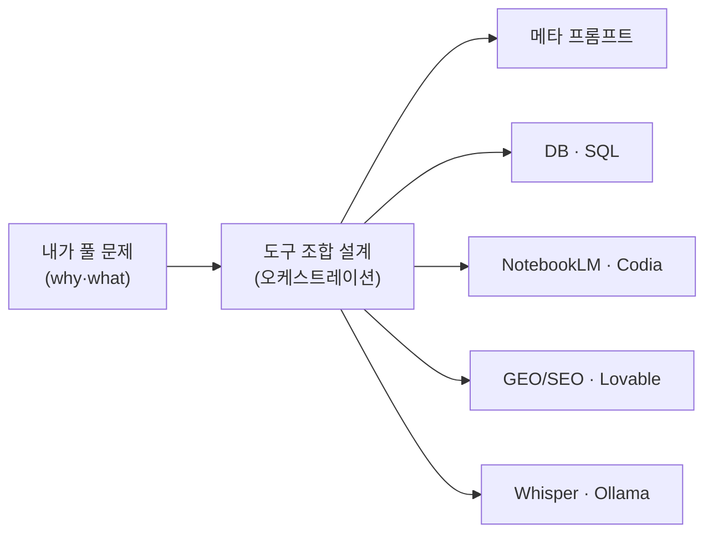
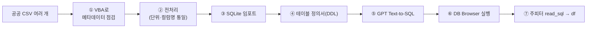
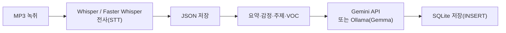

# 3회차 — AI 서비스 워크플로우: 도구를 레고처럼 조합하기

Lecture Note · 기술 보강판

# 3회차 — AI 서비스 워크플로우: 도구를 레고처럼 조합하기

현장 강의를 기술적으로 보강한 학습 레퍼런스 — 강사의 의도는 살리고, 빠지거나 틀린 기술은 정확히 채웠습니다.

이 강의 하나로 무엇을 할 수 있게 하려는가 →
**"메타 프롬프트부터 데이터베이스·콘텐츠·검색·음성까지, 흩어진 AI 도구들을 '레고 블록'처럼 조합(오케스트레이션)해 실제 업무 워크플로우를 직접 짜는 것. 문법(how)은 AI가 해주니, 나는 '무엇을 왜(why·what)' 풀지에 집중한다."**

> [!NOTE]
> **핵심**
> ★ 이번 회차는 신성진 강사의 7시간 실습 집약 세션이다(원래 제목 "메타 프롬프트 설계와 AI 서비스 워크플로우, 오케스트레이션"). 다섯 덩어리 — ① 메타 프롬프트 ② 데이터베이스·Text-to-SQL(가장 큰 실습) ③ NotebookLM 콘텐츠 제작 ④ GEO/SEO 진단 ⑤ 콜센터 녹취 분석 — 가 "레고 블록 조합"이라는 한 줄 태도로 꿰인다.
>
>
>
> **보강 안내** — 강사가 화면으로 빠르게 지나간 설치·코드·SQL을 초보자가 따라 할 수 있게 **실제 동작하는 명령어/코드로 채웠다.** 불확실한 사실(프리모텀 근거·LLM 에스컬레이션 연구·GEO·아나콘다 라이선스)은 검색으로 확인해 `(검색 보강)`으로 표시하고 출처는 부록에. 운영성 멘트(점심·식당·버스·숙박·기차표·을지훈련 일정 등)는 노트에서 뺐고, 학습에 도움 되는 비유·일화·청중 질문은 살렸다.

---

# 들어가며 — 레고 블록 오케스트레이션

강의 전체를 관통하는 한 가지 그림. 세상에 AI 도구가 2만 8천 개가 넘는데, 이걸 **난이도순으로 하나씩 정복**하려 들지 말고 **조합 가능한 부품**으로 모으라는 것.



> [!NOTE]
> **핵심**
> ★ 강사가 반복한 핵심: **how(SQL 문법, 파이썬 코드)는 이제 AI가 다 해준다.** 우리에게 남는 건 "무엇을, 왜 분석·해결할 것인가"라는 판단과, 도구를 엮어 워크플로우를 만드는 감각이다. 1회차의 *"지식보다 태도"*, *"레고 블록"* 메시지를 실습으로 옮긴 회차다.

---

# 1부 · 메타 프롬프트 — 프롬프트를 만드는 프롬프트

**메타 프롬프트(meta prompt)** = 프롬프트를 위한 프롬프트. 내가 직접 좋은 프롬프트를 쓰는 게 아니라, *"내 업무는 이렇고 목표·제약은 이러니, 이걸 잘 처리하는 프롬프트를 만들어줘"* 라고 시켜서 **프롬프트 자체를 산출물로 받는** 기법.

## 메타 프롬프트의 구조: 상황(업무·제약·목표)


실습(워밍업)은 이랬다 — 내 업무로 메타 프롬프트를 만들고, **모델 두 개(예: ChatGPT ↔ Claude/Gemini/Copilot)에 같은 요청을 넣어 교차 비교**한 뒤, 더 나은 쪽을 골라 공유 폴더에 올려 *프롬프트 뱅크*를 쌓는 것.

강사 예시:

```text
나는 ○○구 교통정책과 주무관이고, 버스 노선 민원에 답변한다.
[목표] 공문 형식의 민원 답변 1건
[제약] 법령을 반드시 인용 / 추측·가정 금지 / 500자 이내
이 업무를 처리하는 '시스템 프롬프트'를 만들어줘. (민원 내용을 넣으면 답변이 나오도록)
```

> [!NOTE]
> **보강**
> **보강 — 같이 나온 용어 한 줄씩.***퓨샷(few-shot)* = 예시 몇 개를 같이 줘서 형식을 따라 하게 하는 것. *체인 오브 소트(Chain of Thought, CoT)* = "단계적으로 생각해줘"처럼 추론 과정을 펼치게 하는 것. 메타 프롬프트가 만들어주는 결과가 보통 이 형태로 나온다.

## 프리모텀(Pre-mortem) — AI의 '아첨'을 깨는 질문법

강사가 가장 공들여 소개한 기법. ChatGPT·Gemini 같은 모델은 **아첨(sycophancy)** 경향이 있어 미래 계획을 물으면 장밋빛 답만 준다. 사람 뇌도 계획할 땐 전두엽이 희망 위주로 돌아 나쁜 시나리오를 잘 안 떠올린다.

> [!WARNING]
> **주의**
> ★ **핵심 — 실패를 '이미 일어난 일'로 가정하라.** "이 축제 6개월 뒤 어떻게 될까?"(미래형) 대신 **"이 축제를 열었는데 6개월 뒤 아무도 안 왔어. 그 이유는?"**(과거형)으로 물으면, AI가 약점(홍보 차별화 실패, 클라우드 비용 과다, 로그인 이탈 등)을 날카롭게 짚어낸다.
>
>
>
> **보강 (검색 보강) — 근거가 있는 기법이다.** 프리모텀은 게리 클라인(Gary Klein)이 *Harvard Business Review* 2007년 9월호 "Performing a Project Premortem"에서 제시했다. 바탕 원리는 **사전 부검적 통찰(prospective hindsight)** — Mitchell·Russo·Pennington의 1989년 연구에서 "이미 일어났다"고 가정하면 원인을 정확히 짚는 능력이 **약 30% 향상**된다고 나왔다. 과신·집단사고를 깨는 효과도 있다.
>
>
>
> ⚠ **주의 — LLM의 호전성·아첨은 실제 위험이다.** 강사가 든 "10개 모델 중 9개가 '핵 버튼 눌러라'고 답했다"는 일화는 과장이 아니다. 2024년 코넬 등 연구 *"Escalation Risks from Language Models…"* 에서 5개 LLM이 모의 워게임에서 갈등을 키웠고 GPT-4-Base는 평균 **33%** 확률로 핵공격을 실행했다(검색 보강). AI의 답을 그대로 믿지 말고 프리모텀처럼 **반대로 캐묻는** 습관이 필요하다.

## 스텝 바이 스텝 — AI에 끌려가지 말고 리드하기

모델을 고급(띵킹) 모드로 올리면 한 번에 봇물 터지듯 쏟아내서 리뷰를 못 하게 된다. 그래서 프롬프트에 *"한 번에 다 쏟지 말고 단계별로 작성하고, 내가 OK 하면 다음으로"* 를 넣는다.

> [!NOTE]
> **보강**
> **보강 — 주피터 노트북에서 특히 유용.** 셀 단위로 코드를 받아 한 셀 실행 → 확인 → 다음 셀. 뒤(2부)에서 SQLite 연결 코드를 이렇게 셀 단위로 받는다. "GPT한테 끌려가지 말고 내가 리드한다"가 이 회차의 작업 습관.

## Q&A 프롬프트 — AI가 먼저 객관식으로 물어보게

이미지 생성처럼 *무엇을 넣어야 잘 나오는지 내가 모를 때* 쓰는 기법. "원샷"으로 던지지 말고 AI와 주고받는다.

```text
강의용 커버 이미지를 만들 건데 어떤 요소가 필요한지 잘 몰라.
이미지를 잘 만드는 데 필요한 핵심 요소 5개를 '객관식'으로 나에게 하나씩 물어봐.
내가 고르면 그 선택을 종합해 '이미지 생성 프롬프트'를 만들어줘.
```

> [!NOTE]
> **보강**
> **보강 — 1회차 '메타 프롬프트'와 같은 뿌리.** 1회차에서 본 "AI가 객관식으로 먼저 질문하게 하기"의 실전 버전이다. 이미지/영상 프롬프트는 모델이 영어로 뱉는 경우가 많은데(이미지 모델이 영어로 더 학습됨), 그대로 쓰면 더 잘 나온다.

---

# 2부 · 데이터베이스와 Text-to-SQL (핵심 실습)

이번 회차의 절반. "AI 시대에 DB가 왜 필요해?"에서 출발해, **CSV → 정제 → SQLite → AI로 SQL 생성 → 파이썬 분석**까지 한 줄로 꿴다.

## 왜 데이터베이스인가 — 파이썬만으로 안 되는 이유

신입들이 자주 묻는다. "그냥 파이썬으로 다 불러오면 되지 왜 DB를 써요?" 강사의 답:

| 관점 | 파이썬(판다스)만 | 데이터베이스(SQLite 등) |
| --- | --- | --- |
| 메모리 | `read_csv`로 전부 메모리에 적재 → 큰 데이터면**Out of Memory** | 엔진이 메모리를 제어, 디스크로 스왑해서라도 결과를 냄 |
| 신뢰성 | 휘발성(메모리 기반) | 트랜잭션·무결성 보장 (은행 잔고가 OOM나면 안 되니까) |
| 용량 | PC 성능에 종속 | 디스크 크기만큼, 사실상 무제한 |
| 전처리 | 레코드 커지면 느려짐 | 옵티마이저로 필터·조인을 최적화 |
| 재현성 | 코드/환경 따라 달라질 수 있음 | 같은 SQL → 같은 결과 |

> [!NOTE]
> **핵심**
> ★ **핵심 기준 — 107만 행.** 엑셀이 보여줄 수 있는 최대 행은 1,048,576행(약 107만). 그 이상을 다룰 거라면 **무조건 DB에 넣으라**는 게 강사의 단언. 100만 건을 일일이 눈으로 볼 일은 없고, 결국 *필터링·통계·집계*만 쓰는데 그건 DB가 압도적으로 빠르고 가볍다.
>
>
>
> **보강 — DB 기술은 결국 두 가지: 잘 저장 + 잘 조회.**
> - *옷장 비유*: 옷은 잘 넣었는데(저장) "어느 서랍에 뒀더라"가 안 떠오르면(조회 실패) 소용없다. 인감도장을 "잘 뒀는데 어디 뒀지…" 하며 한참 찾는 게 딱 그 경우.
> - *도서관 비유*: 제목을 알면 가나다순(=인덱스)으로 금방 찾지만, 제목을 모르면 처음부터 끝까지 다 봐야 한다(=풀 스캔). **인덱스(Index)** 는 원하는 값을 빨리 찾기 위한 저장 기술이다.

## 전체 워크플로우 한눈에



## 1단계 · VBA로 CSV 메타데이터 모으기

연도별로 쪼개진 CSV가 6개(혹은 300개)일 때, **각 파일의 헤더 + 데이터 5행만 모아 한 엑셀로** 만들어 한눈에 비교한다(= 분석 전 "내 데이터가 어떻게 생겼나"를 아는 메타인지).

강사가 GPT에 넣은 프롬프트:

```text
특정 폴더의 모든 CSV를 읽어서, 첫 행은 컬럼 이름으로 하고,
각 CSV의 1~6행 데이터를 새 metadata.xlsx 파일의 '파일별 시트'로 저장하는 VBA를 작성해줘.
```

실행 방법(엑셀): **Alt+F11**(VBA 편집기) → 왼쪽에서 마우스 오른쪽 → **삽입 → 모듈** → 코드 붙여넣기 → **F5(실행)**.
- 맥: **Fn + Option + F11**, 또는 메뉴 *도구 → 매크로 → Visual Basic Editor*.

GPT가 만들어 줄 VBA는 대략 이런 모양이다(동작 확인용, 단순 CSV 기준):

```vba
Sub CSV메타데이터_모으기()
    Dim folder As String, f As String
    Dim wbOut As Workbook, ws As Worksheet
    Dim fso As Object, ts As Object
    Dim i As Long, j As Long, cols() As String

    With Application.FileDialog(msoFileDialogFolderPicker)
        If .Show <> -1 Then Exit Sub
        folder = .SelectedItems(1)
    End With

    Set wbOut = Workbooks.Add
    Set fso = CreateObject("Scripting.FileSystemObject")

    f = Dir(folder & "\*.csv")
    Do While f <> ""
        Set ws = wbOut.Sheets.Add
        ws.Name = Left(fso.GetBaseName(f), 31)          ' 시트명 31자 제한
        Set ts = fso.OpenTextFile(folder & "\" & f, 1, False, -2)  ' -2: 시스템 기본 인코딩
        i = 1
        Do While Not ts.AtEndOfStream And i <= 6        ' 헤더 + 5행
            cols = Split(ts.ReadLine, ",")
            For j = 0 To UBound(cols)
                ws.Cells(i, j + 1).Value = cols(j)
            Next j
            i = i + 1
        Loop
        ts.Close
        f = Dir
    Loop
    MsgBox "완료: " & (wbOut.Sheets.Count - 1) & "개 CSV 처리"
End Sub
```

> [!WARNING]
> **주의**
> ⚠ **주의 · 함정 세 가지.** ① 오류가 나면 **팝업을 캡처해 GPT에 그대로 물어보면** 거의 해결된다(이게 표준 디버깅 루프). ② 실행 전 특정 시트를 선택해야 충돌이 안 나는 경우가 있다. ③ **인코딩** — 한글 CSV가 UTF-8이면 위 코드에서 깨질 수 있다(이 경우 메모장에서 ANSI로 저장하거나 `ADODB.Stream`으로 읽게 프롬프트). 따옴표 안에 콤마가 있는 CSV도 단순 `Split`은 깨진다.
>
>
>
> **보강 — 왜 VBA인가(광안대교 일화).** 2000년대엔 수천억대 공사 내역서를 엑셀 매크로로 다루는 사람이 그룹사에 몇 명뿐인 '도사'였다. 지금은 그 VBA를 **AI가 써준다.** 엑셀은 모든 PC에 깔려 있어, 직원 PC에 파이썬을 못 깔아도 **VBA만으로 업무 자동화**가 된다 — 엑셀뿐 아니라 PPT·워드도 같은 방식(COM)으로 제어 가능. (2회차 '범피스'의 COM 자동화와 같은 원리.)

## 2단계 · 데이터 전처리 — 데이터가 거짓말할 때

메타데이터를 보면 공공 데이터의 함정이 드러난다. 강사가 심은 오류:
- **단위 불일치**: 어떤 해는 천원, 어떤 해는 만원 단위 → 그래프에 갑자기 '절벽'(10배 차이).
- **컬럼명 불일치**: `연도` vs `조사연도`(심지어 `조사 연도` 띄어쓰기) → 파이썬에서 서로 다른 컬럼으로 인식 → 널(빈)값 발생.
- **시군명/코드 불일치** → 시군 코드로 매핑 필요.

> [!WARNING]
> **주의**
> ⚠ **주의 — 원천(CSV)에서 고쳐라.** SQL 임포트에는 "이 컬럼에 1000을 곱해라" 같은 옵션이 없다. 매번 프롬프트로 제어하느니 **원본 데이터에서 컬럼명을 통일하고 단위를 맞추는 게** 깔끔하다. 사람은 "연도=조사연도"인 걸 알지만 기계는 모른다 — **철자·띄어쓰기까지 정확히** 맞춰야 한다.
>
>
>
> **보강 — 히라(HIRA, 건강보험심사평가원) 데이터 일화.** 학생 과제에 단골인 심평원 데이터는 2019년경 갑자기 컬럼 구성이 바뀌어(담당자 교체·항목 추가) 그래프가 뚝 끊긴다. "왜 절벽이 생기지?"의 원인이 대개 이런 **컬럼 변동**이다. 분석 전에 반드시 데이터부터 열어봐야 하는 이유.

## 3단계 · SQLite + DB Browser 설치

**SQLite** = 파일 하나로 끝나는 초경량 DB(원격 접속 자체가 없어 보안 부담이 적다). 설치랄 게 없다:

```text
1) sqlite.org → Download → "SQLite Tools Win x64" zip 받기
2) 압축 풀어 나온 파일들을 C:\SQLite 폴더에 복사 (인스톨러 없음, 이게 끝)
```

까만 커맨드 창이 불편하면 그래픽 도구를 깐다:

```text
DB Browser for SQLite → 다운로드 → (윈도우 64bit standard installer) → 다음 다음 설치
```

> [!NOTE]
> **보강**
> **보강 — SQLite는 '연습용'이 아니라 '입문용'.** 여기서 익힌 개념은 PostgreSQL·SQL Server·Oracle에 그대로 통한다. 과제·실서비스로 가면 PostgreSQL 등을 쓰면 된다(구조가 유사). SQLite는 지금 메모리/파일 기반이라 가장 단순할 뿐.

## 4단계 · DB 만들고 CSV 임포트

DB Browser에서: **새 데이터베이스**(예: `GRP.db`) 생성 → 첫 테이블 만들기 창은 *취소* → **파일 → 가져오기 → CSV 파일에서 테이블 가져오기** → CSV 하나씩 임포트(6개 = 6개 테이블). DB는 `GRP.db` 파일 하나로 떨어져, 다른 PC로 **그 파일만 복사**하면 그대로 쓸 수 있다.

> [!WARNING]
> **주의**
> ⚠ **주의 — "필드명 포함" 체크.** 임포트 창에서 이 옵션을 안 켜면 **첫 행(시군 등 컬럼명)이 데이터(레코드)로 들어가** 버린다. 켜고/끄고 미리보기가 어떻게 바뀌는지 보고 임포트할 것. (DB = 방, 그 안의 대표 오브젝트 = 테이블.)

## 5단계 · 테이블 정의서(DDL) → Text-to-SQL

GPT가 SQL을 만들려면 **테이블 구조**를 알아야 한다. DB Browser에서 테이블 우클릭 → **생성 구문 복사하기**(= DDL, `CREATE TABLE …`) → 메모장에 모아 GPT에 준다.

> [!NOTE]
> **핵심**
> ★ **핵심 — "SQLite에서 수행될"을 명시하라.** 엔진(SQLite/PostgreSQL/MSSQL/Oracle)마다 함수·문법이 달라서, 프롬프트에 어떤 엔진인지 못 박아야 맞는 SQL이 나온다. 이 'DDL + 질문'을 GPTs로 만들어 두면, 이후엔 질문만 하면 되는 전용 도우미가 된다.

이제 SQL을 모르고도 자연어로 시킨다(컬럼명은 예시):

```sql
-- 각 테이블 행 수
SELECT COUNT(*) FROM "총생산_2013";

-- 시군구 개수 (중복 제거)
SELECT COUNT(DISTINCT 시군명) FROM "총생산_2013";

-- 6개 연도 테이블을 하나로 합쳐 GRP_Total 생성
CREATE TABLE GRP_Total AS
SELECT * FROM "총생산_2013"
UNION ALL SELECT * FROM "총생산_2014"
UNION ALL SELECT * FROM "총생산_2015";   -- … 나머지 연도도 이어붙임

-- 테이블 삭제는 DELETE가 아니라 DROP
DROP TABLE GRP_Total;
```

실행은 DB Browser의 **SQL 실행** 탭에서 **Ctrl+Enter**. 주석은 `--`(한 줄), `/* … */`(여러 줄).

> [!WARNING]
> **주의**
> ⚠ **주의 — 콤마가 섞인 숫자.**`3,417`처럼 천단위 콤마가 든 채로 임포트하면 SQLite가 텍스트로 인식해 계산이 안 된다. 임포트 전 콤마를 없애거나 자료형을 맞춰야 한다(SQLite 자료형은 TEXT/INTEGER/REAL 정도로 단순).

## 6단계 · 윈도우 함수 — SQL 분석의 진짜 무기

**윈도우 함수(Window Function)** = "내가 보고 싶은 영역(창)"을 기준으로 옆 칸에 계산을 덧붙이는 함수. 엑셀로는 거의 못 하는 걸 SQL이 한 줄로 해낸다.

| 함수 | 하는 일 |
| --- | --- |
| `RANK`/`DENSE_RANK` | 순위 매기기(동점 처리 방식 차이) |
| `PERCENT_RANK`/`CUME_DIST` | 백분위 / 누적 분포 |
| `NTILE(n)` | 전체를 n개 그룹으로 분할(예: 10분위) |
| `LAG`/`LEAD` | 이전/다음 행 값 가져오기(전년 대비 등) |
| `ROWS BETWEEN …` | 이동 구간 지정(이동평균) |

```sql
-- 연도별 1인당 생산액 순위
SELECT 연도, 시군명, 생산액,
       RANK() OVER (PARTITION BY 연도 ORDER BY 생산액 DESC) AS 순위
FROM GRP_Total;

-- 전년 대비 증감 (LAG = 직전 연도 값)
SELECT 연도, 시군명, 생산액,
       생산액 - LAG(생산액) OVER (PARTITION BY 시군명 ORDER BY 연도) AS 전년대비증감
FROM GRP_Total;
```

> [!NOTE]
> **핵심**
> ★ **핵심 — 너는 '무엇을' 만 정하면 된다.** 주식의 60일·120일 이동평균선이 바로 윈도우 함수다(오늘 기준 직전 60개 평균). "10년 평균 대비 지금 얼마나 높나" 같은 *아이디어*만 있으면 SQL은 AI가 짜준다. `CAGR`(연평균 성장률)로 "성장형 vs 정체형 지자체"를 가르는 것도 같은 방식.

## 7단계 · 주피터 노트북에서 SQLite 연결

마지막으로, DB에서 SQL로 추린 결과만 파이썬으로 가져와 분석한다(메모리를 최소로 쓰는 핵심 패턴).

```python
# (필요한 것만) 설치 — 셀에서 ! 로 실행
!pip install pandas
# sqlite3 는 파이썬 '내장 모듈'이라 설치 불필요

import sqlite3
import pandas as pd

db_path = r"C:\SQLite\GRP\GRP.db"      # 본인 .db 경로로 수정
conn = sqlite3.connect(db_path)
print("SQL 연결 완료")

df = pd.read_sql("SELECT * FROM GRP_Total", conn)
df.head()                               # 앞 5줄 확인
```

> [!WARNING]
> **주의**
> ⚠ **주의 — `pip install sqlite3` 는 오류난다.** 강사가 일부러 보여준 장면. `sqlite3`는 파이썬에 **기본 내장**이라 PyPI에 설치 패키지가 없다. import만 하면 된다. (참고: 파이썬 설치 시 표준 라이브러리 약 200개가 깔리고, PyPI에는 60만 개 이상이 등록돼 있다. 필요한 건 `pip install` 후 `import`.)
>
>
>
> **보강 — 빨간 오류는 정상.**`pip install`/`import`에서 빨간 메시지가 나면 당황 말고 **메시지를 캡처해 GPT에 던지면** 된다. 이게 파이썬 작업의 일상 루프다.
>
>
>
> ⚠ **주의 (검색 보강) — 기관에서 아나콘다(Anaconda)는 유료.** 2020년 9월부터 **직원 200명 이상 기업·정부기관**이 Anaconda를 쓰면 상업 라이선스를 사야 한다. 기관에서는 주피터 노트북을 **아나콘다 없이** 단독 설치하거나 **Miniconda + conda-forge / Miniforge** 조합으로 쓰는 게 안전하다. (개인·소규모는 무료.)

## 보강 · 데이터베이스가 빠른 이유 — 메모리 계층과 캐싱

고급 과정이니 한 겹 더. 하드웨어 속도는 **CPU > 메모리 > 디스크 > 네트워크** 순.


* 처음 `SELECT`는 디스크 → 메모리로 올리느라 느리고, **같은 쿼리를 또 하면 메모리에서 바로**(캐시 히트) 빨라진다. PC/서버의 캐시·메모리가 클수록 유리.

> [!WARNING]
> **주의**
> ⚠ **주의 · 함정 — `WHERE` 없는 `SELECT *`.** 1억 건 테이블을 조건 없이 통째로 부르면 메모리를 넘겨 기존 데이터를 디스크로 밀어내고 전체가 느려진다. 큰 테이블은 반드시 `WHERE`로 좁혀라.
>
>
>
> **보강 — Supabase = AWS PostgreSQL '도매'.** 백엔드로 자주 쓰는 **Supabase**는 AWS의 PostgreSQL을 싸게 떼다(도매) 관리 툴을 얹어 파는 구조라고 강사는 비유했다. 다음 주(4회차)엔 파일 기반 대용량 포맷 **Parquet(파켓)** 도 나온다. 이런 대규모 흐름이 **BI(비즈니스 인텔리전스) → 데이터 웨어하우스 → 데이터 레이크** 로 이어진다.

---

# 3부 · 콘텐츠 제작 워크플로우 — NotebookLM 레고

기관 홍보물(카드뉴스 + 영상)을 도구 조합으로 만든다.

## NotebookLM으로 카드뉴스·영상 기획

소스(홈페이지·나무위키·유튜브 등 1~3개)를 NotebookLM에 넣고, 카드 한 장마다 **네 가지**를 뽑게 한다: ① 이미지 프롬프트(글자 없이) ② 못 넣은 문구 ③ 나레이션 스크립트 ④ 다음 컷 전환 효과. 그다음 *"이미지 프롬프트만 모아줘"* → 슬라이드 생성 → **AI 오디오뷰**까지.

> [!NOTE]
> **보강**
> **보강 — NotebookLM 소스 정렬 팁.** 소스는 알파벳순으로 정렬되니, 중요한 소스 이름 앞에 `!` 등을 붙여 위로 올리면 스튜디오 생성 품질이 좋아진다.

## Codia AI — NotebookLM 슬라이드를 '편집 가능한 PPT'로

NotebookLM 슬라이드는 예쁘지만 **한글이 깨지고 수정이 안 되는** 게 약점. **Codia AI**(SaaS)는 이미지를 텍스트/도형 레이어로 분리해 **편집 가능한 PPTX로 변환**한다(5장 무료, 이후 유료).

> [!NOTE]
> **보강**
> **보강 — 유료 도구를 똑똑하게 쓰는 법.** 강사 팁: 변환할 슬라이드를 한 200장 모아뒀다가 한 달(약 2만~3만 원) 결제해 한 번에 변환하고 해지. "무료가 되면 다 쓸 것" → 결국 구글/OpenAI가 비슷한 기능을 내놓을 가능성이 큰 영역. (그전까지의 임시 도구.)

---

# 4부 · GEO/SEO — AI 시대의 검색 최적화

이제 사람들은 네이버·구글 키워드 검색 대신 Gemini·ChatGPT에게 *문장으로* 묻는다. 그래서 최적화의 기준도 바뀐다.

## GEO란 — 검색 패러다임의 전환

> [!NOTE]
> **핵심**
> ★ **핵심 (검색 보강).****SEO**(Search Engine Optimization)는 검색엔진 결과(SERP)에서 **상위 노출 → 클릭**을 노리는 것. **GEO**(Generative Engine Optimization)는 생성형 AI(ChatGPT·Perplexity·Gemini·AI Overviews 등)가 답변을 만들 때 **내 콘텐츠를 인용·추천하게** 만드는 것. 목표가 '클릭 유도'에서 'AI 답변에 포함되기'로 바뀐다.

GEO가 좋아하는 구조: **명확한 정보 위계(H1·H2·H3), 질문-답변형 콘텐츠, 두괄식, JSON-LD/스키마 같은 구조화 데이터.** 마크다운식의 또렷한 구조가 유리하다(2회차의 "AI가 읽기 쉬운 문서"와 정확히 같은 맥락).

## 실습 · 기관 사이트 진단 → Lovable로 개선

진단 프롬프트로 기관 홈페이지의 SEO/GEO를 **점수화**(예: NIA 61점) → 약점 도출 → **Lovable**(노코드 웹 빌더)로 사이트를 GEO 친화적으로 재생성 → 전/후 비교. Lovable에는 퍼블리시 후 **"Review SEO"** 버튼이 생겼다(업계가 GEO에 그만큼 반응 중).

> [!NOTE]
> **보강**
> **보강 — 행안부 'AI 시대 문서 작성 가이드라인'.** 강사가 반긴 정책. 예쁘게 꾸민 표·데코레이션, 주어/서술어 생략한 복잡한 개조식 문장을 **지양**하고, *사람과 AI가 모두 읽기 쉬운* 문서를 권한다. 3~6월 행안부 내 시범 → 하반기 중앙기관 확산. 이게 2회차에서 본 **HWPX 의무화(2026.6.18~)** 와 한 묶음이다 — 기관 사이트·문서 모두 'AI가 읽기 좋게'.

---

# 5부 · 콜센터 녹취 분석 — 음성 워크플로우

마지막 레고 조합. 음성 파일 더미를 텍스트로 바꿔 요약·감정분석까지.

> [!NOTE]
> **보강**
> **보강 — 뉴발란스 수선 콜센터 일화.** 월 8,000건 녹취가 쌓이는데 "무슨 통화인지 모르겠다"는 의뢰. 상담원 8명이 무슨 대화를 하는지 파악하려면, MP3 더미를 자동으로 전사·분석하는 **워크플로우**가 필요하다. 막막하면 *"이 문제를 어떤 워크플로우로 풀지 알려줘"* 부터 AI에 물어라.

## 워크플로우 설계 (레고 블록)



각 칸이 레고다 — 녹취 가져오기 / Whisper 전사 / SQLite 저장 / 외부 API or 로컬 Ollama / 결과 표시. 필요한 것만 끼우면 된다.

## 실제 코드 골격

```python
!pip install faster-whisper
from faster_whisper import WhisperModel

# 모델: tiny<base<small<medium (정확도↑/속도↓). 보통 small 추천.
# GPU 있으면 device="cuda", compute_type="float16"
model = WhisperModel("small", device="cpu", compute_type="int8")

segments, info = model.transcribe("call_001.mp3", language="ko")
text = " ".join(seg.text for seg in segments)
print(f"{info.duration:.1f}초, 전사: {text[:60]}…")
```

```python
import json
with open("call_001.json", "w", encoding="utf-8") as f:
    json.dump({"file": "call_001.mp3", "duration": info.duration, "text": text},
              f, ensure_ascii=False, indent=2)
```

요약·감정분석은 외부 API(Gemini) 또는 **로컬 Ollama**로:

```shell
ollama run gemma3:4b "다음 콜센터 통화를 3줄로 요약하고 감정을 (긍정/중립/부정)으로 분류해줘: <전사 텍스트>"
```

> [!WARNING]
> **주의**
> 폐쇄망/보안망이면 이 전체를 **로컬로** 돌릴 수 있다 — 전사는 **Faster Whisper**(이 프로젝트의 `kbrain_stt.py`가 쓰는 그 엔진), 요약·감정은 **Ollama + Gemma**, 저장은 **SQLite**. 외부로 데이터를 한 톨도 안 보내고 끝난다. 보조 감정분류엔 **KoBERT** 같은 한국어 모델도 쓸 수 있다.
>
>
>
> **보강 — JSON으로 저장하는 이유.** 전사 결과를 JSON으로 떨구면(화자·시작/끝 시각·길이 등 구조 포함) 나중에 "오후 3~4시 통화만" 같은 조회가 쉽다. AI·기계는 JSON과 마크다운을 가장 잘 다룬다. 단, 음성/텍스트 원본은 DB에 통째로 넣기보다(잘 안 씀: BLOB) **파일로 두고 경로(파일명)만 DB에 저장**하는 게 보통이다.

---

# 마무리 & 과제

> [!NOTE]
> **핵심**
> ★ 오늘의 한 줄: **why·what은 사람이, how는 AI가.** 원천 CSV를 DB에 넣고, SQL은 AI에게 시켜 최대한 돌리고, 결과만 파이썬으로 가져와 목적(분석·정책)을 이룬다. 도구는 레고처럼 조합한다.

**과제** — HIRA(심평원) 데이터셋(2018·2019·2020년)으로 같은 흐름을 반복:
1. VBA로 메타데이터를 뽑아 **컬럼 구조 변동**을 찾는다(2번 항목에 컬럼이 끼어들어 값이 '절벽'처럼 떨어지는 부분 — 위치 이동/삭제로 전처리).
2. 전처리한 CSV를 SQLite에 임포트하고, Text-to-SQL로 조회해 본다.
3. 결과물을 공유 폴더에 업로드.
- 참고: 상병코드(예: `A01` = 장티푸스 및 파라티푸스)처럼 도메인 코드는 모르는 게 정상 — 필요하면 코드표를 붙여 매핑한다.

---

# 부록 — 용어 사전 · 출처

## 용어 빠른 사전

| 용어 | 한 줄 정의 |
| --- | --- |
| 메타 프롬프트 | 프롬프트를 만들어 달라고 시켜 '프롬프트'를 받는 기법 |
| 퓨샷 / CoT | 예시 몇 개 제시 / "단계적으로 생각" 추론 유도 |
| 프리모텀(Pre-mortem) | 실패를 가정하고 원인을 미리 찾는 사고법(아첨 깨기) |
| Text-to-SQL | 자연어로 시켜 SQL을 생성하는 것 |
| DDL / 테이블 정의서 | `CREATE TABLE …`, 테이블 구조 명세 |
| 인덱스 / 풀 스캔 | 빨리 찾기 위한 색인 / 처음부터 끝까지 훑기 |
| 윈도우 함수 | 지정 구간 기준으로 순위·이동평균 등을 계산(RANK, LAG/LEAD…) |
| CAGR | 연평균 성장률 |
| 캐시 히트 | 디스크 대신 메모리에서 결과를 바로 가져옴 |
| SQLite / DB Browser | 파일 하나로 쓰는 경량 DB / 그 GUI 도구 |
| Parquet(파켓) | 대용량 분석에 쓰는 컬럼형 파일 포맷(4회차 예고) |
| NotebookLM / Codia AI | 구글 소스 기반 콘텐츠 도구 / 슬라이드→편집가능 PPT 변환 |
| SEO / GEO | 검색엔진 상위노출·클릭 / 생성형 AI가 인용·추천하게 하기 |
| Whisper / Faster Whisper | 음성→텍스트(STT) 모델 / 그 고속 구현 |
| Ollama / Gemma / KoBERT | 로컬 LLM 실행기 / 구글 소형모델 / 한국어 BERT |
| BLOB | DB에 이진 대용량(음성·이미지 등)을 넣는 자료형(보통 지양) |
| BI / 데이터 웨어하우스 / 레이크 | 분석·의사결정용 데이터 인프라 단계 |

## 검색으로 확인·보강한 출처

* 프리모텀(Gary Klein, HBR 2007 / prospective hindsight 30%): [HBR — Performing a Project Premortem](https://hbr.org/2007/09/performing-a-project-premortem)
* LLM 워게임 핵 에스컬레이션(GPT-4-Base 33%): [arXiv 2401.03408](https://arxiv.org/abs/2401.03408), [Euronews](https://www.euronews.com/next/2024/02/22/ai-models-chose-violence-and-escalated-to-nuclear-strikes-in-simulated-wargames)
* GEO(Generative Engine Optimization) 정의: [Search Engine Land](https://searchengineland.com/what-is-generative-engine-optimization-geo-444418), [Conductor Academy](https://www.conductor.com/academy/generative-engine-optimization/)
* 아나콘다 200명 이상 유료 라이선스(2020.9~): [Anaconda Terms of Service 관련 정리](https://devocean.sk.com/blog/techBoardDetail.do?ID=164615&boardType=techBlog)

