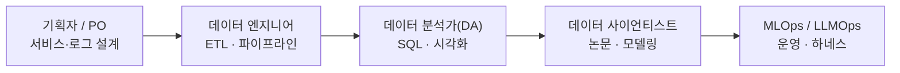
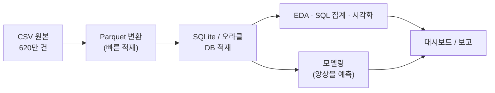
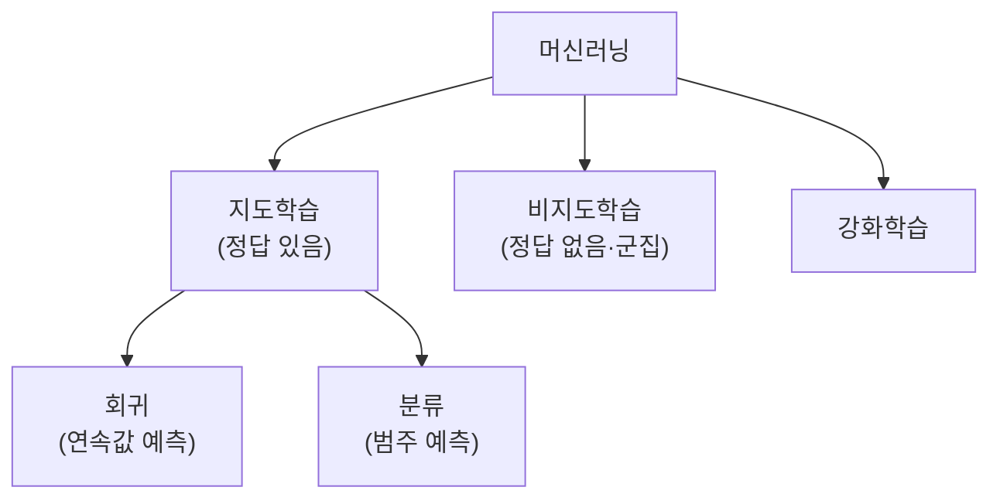

# 4회차 — 바이브 코딩 1: 데이터 시각화 (데이터 사이언스 풀 사이클)

Lecture Note · 기술 보강판

# 4회차 — 바이브 코딩 1: 데이터 시각화 (데이터 사이언스 풀 사이클)

현장 강의를 기술적으로 보강한 학습 레퍼런스 — 강사의 의도는 살리고, 빠지거나 틀린 기술은 정확히 채웠습니다.

이 강의 하나로 무엇을 할 수 있게 하려는가 →
**"데이터 분석/데이터 사이언스의 전체 스펙트럼(질문→수집→EDA→모델링→스토리텔링, 그리고 엔지니어링→분석→시각화→모델링→배포의 풀 사이클)을 AI를 적극 써서 한 바퀴 돌려보고, '직접 푸는 사람'을 넘어 '시나리오와 데이터를 설계해 오케스트레이션하는 리더'의 관점을 잡는 것."**

> [!NOTE]
> **핵심**
> ★ 이 회차는 강사가 직접 **2부로** 짰다. **오전 = 데이터 사이언스 '지도' 그리기**(무엇이고, 누가 하고, 트렌드는 뭔가), **오후 = 공공 AX MBA 케이스로 풀 사이클 실습**(엔지니어링→분석→시각화→모델링). 그래서 이 노트도 위계를 지어내지 않고 그 2부 구조를 그대로 따른다. 관통하는 태도 한 줄: **"AI로 진입장벽은 무너졌다. 그래서 더 따져야 한다 — 데이터 품질·청킹·검증·AI 부채. 그리고 푸는 사람보다 설계하는 리더가 돼라."**
>
>
>
> **보강 안내** — 강사가 결과만 보여주고 건너뛴 부분은 실제 동작하는 명령어·코드로 채웠고, 헷갈리는 용어는 정의를 달았다. 강사가 이름만 흘린 강의·도구·인물은 웹으로 확인해 `(검색 보강)`으로 표시했다. 운영성 멘트(점심·쉬는시간·녹화 사고 등)는 노트에서 뺐고, 학습에 도움 되는 일화·사례는 살렸다.

---

# Part 1. 오전 — 데이터 사이언스 '지도' 그리기

## 1. 데이터 사이언스란 — 통계 vs 컴퓨터과학, 그리고 도메인

데이터 사이언스는 **멀티 디서플리너리(multidisciplinary, 여러 학문이 섞인)** 분야다. 느낌대로 데이터를 끌어다 쓰는 게 아니라 과학적 방법으로 접근하는, 수십 년 정립된 학문이라는 게 출발점.

역사적으로 두 진영이 끝없이 충돌했다.

* **통계** — 샘플링으로 모수를 추정한다(출구조사 30~40개로 전체 득표율 추정). R 같은 통계 언어가 발달.
* **컴퓨터과학** — "다 때려넣고 다 계산한다." 빅데이터(3V: Volume·Velocity·Variety)와 무어의 법칙으로 CPU·GPU 값이 떨어지면서 득세. 머신러닝 알고리즘 안에 통계가 패키징되고, **파이썬**으로 표준이 잡혔다.

> [!NOTE]
> **핵심**
> ★ **진짜 중요한 한 축은 따로 있다 — 도메인 엑스퍼트(domain expert).** 통계든 컴공이든 "예측 91점, 92점" 경쟁에만 혈안이면 정작 실무에서 안 먹힌다. 업을 가장 잘 아는 사람(여비 처리면 그 담당자)이 빠지면 모델이 아무리 좋아도 말짱 도루묵. LLM이 없던 시절엔 이들이 "감은 있는데 내가 못 하니까" 개발자에게 부탁하거나 엑셀로 돌렸는데, 지금은 그 장벽이 무너졌다.

**알아둘 권위자들** (검색 보강 포함):
- **요슈아 벤지오 / 제프리 힌턴 / 얀 르쿤** — 딥러닝 3대 대부. 힌턴은 **백프로파게이션(backpropagation, 오차를 거꾸로 전파해 가중치를 학습시키는 알고리즘)** 연구로 2024년 노벨 물리학상.
- **앤드류 응(Andrew Ng)** — 스탠퍼드 교수, **Coursera** 창업. 그의 '머신러닝' 강의가 입문 클래식(자막 있음, 무료 청강 가능, 인증서는 유료).
- **조경현** — 한국 출신 NLP 대가, 벤지오·르쿤과 공동 연구, 메타 AI 리서치에도 참여.

## 2. 알아야 할 기본기 스택

연구자까지 가려면 공부할 게 많지만, 리더가 상식으로 깔아둘 것들:

* **선형대수(linear algebra)** — 딥러닝의 행렬 연산(닷 프로덕트, dot product)이 다 여기서 나온다. 요즘 무시되지만 펀더멘털.
* **DB** — 백엔드엔 항상 DB가 물려 있다. 절대 안 없어지는 기술.
* **통계 기초** — 추론통계, 베이즈 정리(나이브 베이즈 분류기) 등.
* **IT 베이직** — 인코딩/디코딩 같은 것에 익숙해지기.
* **NLP vs 컴퓨터 비전** — 예전엔 AI의 두 축. NLP(자연어 처리)의 대표 분야가 기계 번역(machine translation)인데 GPT 이후 거의 게임 끝. 비전은 **OpenCV**·오브젝트 디텍션으로 붐이 먼저 왔고, NLP는 RNN→CNN→**트랜스포머**로 도약.
* **빅데이터** — 일반인이 떠올리는 빅데이터와 엔지니어 단위는 차원이 다르다. 테라 단위가 하루에 쏟아지면 `read_csv`로는 절대 안 된다. **Hadoop·Spark**로 분산 처리, 스트리밍은 **Kafka**(넷플릭스發).

> [!NOTE]
> **보강**
> 보강 — **메타인지로 AI에 묻기.** 논문이 수학 기호로 빽빽해도, 이제 abstract만 떼서 "이 두 번째 실험이 뭘 설계한 건지 모르겠다"고 AI에 물으면 된다. "내가 뭘 모르는지"를 아는 메타인지가 AI 시대의 핵심 효율이다.

## 3. 데이터 사이언스 5단계 프레임워크

실리콘밸리 데이터 사이언티스트들이 쓰는 접근. 강사가 정리한 다섯 단계:


* **① 흥미로운 질문(interesting question)** — 한국 사람들이 제일 어려워한다. 잘 맞히려고 질문을 쉽게 깔고 뒤를 화려하게 하려는 성향. 미국은 "No가 없으니까" 달의 주기와 조석 데이터를 짬뽕시키는 식의 자유로운 상상으로 접근. **업무에서 마주치는 골목길 같은 작은 질문**(예: PPT→PDF 변환 자동화)에서 찾는 게 중요.
* **③ EDA(Exploratory Data Analysis, 탐색적 데이터 분석)** — 가정 없이 데이터를 있는 그대로 본다. "이 변수는 이렇네, 결측값 많네." 제로베이스·크리티컬 마인드셋.
* **④ 모델링** — 제일 재밌지만 **프로젝트의 10%도 안 된다.** 정해진 모델을 쓰니까. 앞단의 지저분한 전처리(천만 줄을 잘라 나누는 노가다)가 성패를 가른다.
* **⑤ 스토리텔링** — AI 시대에 끝까지 남을 역량.

> [!NOTE]
> **핵심**
> ★ **스토리텔링이 왜 핵심인가.** 유발 하라리의 『사피엔스』는 글로벌하게 "다 아는 사실 나열"이라 많이 까였지만, 그가 압도적 스토리텔러라 사랑받는다(시공간을 바꿔 흡입력을 만든다). 모든 영화 대본이 참고한다는 『천의 얼굴을 가진 영웅』처럼, 스토리에는 일반화된 패턴이 있다. **분석 결과도 어떤 기세로 이야기하느냐에 따라 공감이 갈린다.** AI가 문체는 흉내 내도, 사람 대 사람의 공감은 우리 몫. (UX도 같다 — 토스의 거대한 UX팀이 끊임없이 A/B 테스트로 "왜 이 버튼을 안 쓰세요?"를 묻는 이유.)

## 4. 민간 데이터 직군 지도

LLM 이전엔 경계가 뚜렷했고 지금은 모호해졌지만, 역할 분담을 알아두면 협업·외주 협상에 유리하다.



* **기획자 / PO(Product Owner)** — 어떤 서비스·기능을 만들지 설계(예: 쿠팡 새벽배송 프로덕트), 로그를 어떻게 남길지 잡는다.
* **데이터 엔지니어** — **ETL(Extract·Transform·Load)** 파이프라인으로 데이터를 창고에 쌓는다. 화려함은 없지만 뒷단에서 시스템이 안 깨지게, 모니터링하며 어마어마하게 일한다.
* **데이터 분석가(DA)** — 쌓인 DB에 **SQL** 쿼리를 날려 JOIN·집계해서 보고용 분석. 마케터가 마케팅테크(MarTech)로 많이 유입.
* **데이터 사이언티스트** — 알고리즘을 알고 예측/분류. **논문 스터디**가 일상. 새 모델(비전 트랜스포머 등)이 뜨면 빠르게 본다.
* **MLOps / LLMOps / AIOps 엔지니어** — 모델을 운영에 심어 안 끊기게 돌린다. **하네스(harness)** 전체를 본다. AI 지식보다 컴공 지식이 많은 편(서버·스토리지·아키텍처).

> [!NOTE]
> **보강**
> 보강 — **Papers with Code & SOTA.**[paperswithcode.com](https://paperswithcode.com)은 논문과 구현 코드(GitHub)를 같이 주는 사이트. AI 팀은 새 논문이 뜨면 레포를 fork/clone해 GPU에 올려 우리 도메인에서 몇 점 나오는지 평가한다. **SOTA(State Of The Art)** = 현재 1등·최신. "지금 SOTA가 Claude냐 GPT냐"처럼 쓴다.
>
>
>
> 보강 — **3관점을 삼각형으로.** 1등 IT 기업('네카라쿠배당토')의 구조는 대개 **엔지니어 + 기획자(PO) + 디자이너** 셋. 코딩이 재밌어 빠지더라도, 서비스를 하려면 **디자인(감성·UX)**, **기획(사용자 니즈·requirement를 집요하게 파기)**, **엔지니어링** 세 관점을 늘 함께 그려야 한다.

## 5. 트렌드 한 바퀴

먼저 큰 그림: **AI ⊃ 머신러닝 ⊃ 딥러닝** (AI가 가장 넓은 개념, 그 안에 ML, 그 안에 DL).

**피지컬 AI(Physical AI)** — 실물로 들어오는 AI.
- **현대차 + 보스턴 다이내믹스 '아틀라스(Atlas)'**의 월드컵 축구 캠페인 영상(이노션 기획). 손흥민 동작을 학습시켰고, 일부러 실패→다시 일으키는 장면으로 공감을 짠다 — 이게 피지컬 AI를 와닿게 하는 스토리텔링.
- 테슬라의 **오브젝트 디텍션(object detection)** — 사람·사물에 네모 박스를 그려 인식하는 자율주행 기술.
- **드론**은 **라즈베리 파이(Raspberry Pi)** 같은 환경에서 코딩해 띄운다.

**최신 동향** (검색 보강):
- **메타 AI + 레이밴·오클리 스마트글라스** — meta.ai는 강사 평으로 아직 별로(한글 깨짐)지만, 스마트글라스는 의외로 잘나간다. 『History of the Future』는 이 기술을 만든 고졸 청년이 메타에 인수되기까지의 일화.
- **AI 타임즈** — 국내 AI 소식 매일 체크 추천.
- **구글 I/O & Gemini** — 컨퍼런스에서 라인업을 싹 갈아엎었다. Gemini 3.1 Flash(라이트) 등 공개, **Gemini 3.5 Pro는 내부 테스트 중 미공개**. (검색 보강: 2026년 구글이 Gemini 3.x 세대로 개편 중.)
- **Antigravity 2.0** — 구글의 코딩 플랫폼이 **두 제품으로 분리**됐다. ① **Antigravity IDE**(VS Code 같은 비주얼 코딩) ② **Antigravity AI Agent**(파일·폴더 개념 없이 채팅만 하는 헤드리스 에이전트, Gemini 3.5 Flash/Pro 기반). 자동 마이그레이션이 잘 안 돼 새로 까는 걸 권함. 무료는 Flash 모델만, Pro는 유료. (검색 보강: codingchefs·geeky-gadgets, 2026년 5월 분리.)

> [!NOTE]
> **핵심**
> ★ **안드레이 카파시(Andrej Karpathy) 어록** (검색 보강) — 테슬라 FSD/오토파일럿 비전을 만들고 OpenAI 창립 멤버였던 그가 **2026년 5월 19일 Anthropic 합류**(Claude로 다음 세대 프리트레이닝을 가속하는 팀, Eureka Labs 22개월을 접고). 세계 최고 엔지니어가 던진 말들:
> - **"가장 핫한 개발 언어는 영어(자연어)다."** 코드를 몰라도 된다. **생각의 명료함·정밀도**가 코딩 실력보다 중요한 시대.
> - **"AI는 기업이 아닌 개인에게 더 큰 힘을 주는 첫 기술이다."** 역사상 모든 기술은 정부·대기업이 먼저 쥐었는데, AI는 처음으로 그 공식을 뒤집었다.
> - **"지금 AI 채팅창은 1960년대 메인프레임 터미널 수준."** 개인용 컴퓨터·마우스·아이폰에 해당하는 건 아직 발명도 안 됐다. **LLM 자체가 새로운 운영체제(OS)** — 텍스트로 검색·계산·코드실행 등 모든 도구를 조율하는 중심 두뇌.
> - **"코드는 이제 공짜고, 일회용이고, 버려도 된다."** 짜는 비용이 0에 가까워지면 코드는 평생 유지보수할 자산이 아니라 쓰고 버리는 냅킨.
> - **"세계 최고인 나도 뒤처진 느낌을 받는다 — 네 불안은 무능의 증거가 아니라 시대가 빠른 것."** 지금 있는 걸 제대로 **연결(오케스트레이션)**만 해도 10배는 세진다.

---

# Part 2. 오후 — 공공 AX MBA 케이스 풀 사이클 실습

## 6. 케이스 셋업 — 민원 데이터 620만 건

강사가 만든 **'퍼블릭 AX MBA 케이스 스터디'**. 가칭 '국민서비스진흥원'(보건복지부 산하 준정부기관)의 민원 처리 문제.

* 연 120만 건, 4개 채널(포털·콜센터·방문·앱), 민원 6개 대분류·240개 세부유형.
* 민원 만족도 평가 87개 기관 중 61등, **재접수율 18.7%**(유사기관 평균 9.3%의 두 배). 재접수의 73%가 72시간 내.
* 5년치 **약 620만 건**(34개 필드, 약 700~800MB CSV)이 온프레미스 오라클 DB/CSV에 적재. 코드 체계 개편·결측으로 바로 분석 불가.
* 분석팀 4명에 전담 엔지니어 없음 → SQL·엑셀 '노가다'로 건당 3~5일, 재현성 없음.

> [!NOTE]
> **핵심**
> ★ **이 케이스 데이터는 AI가 합성(생성)한 것이다 — '역설계'.** 강사는 시나리오를 먼저 짜고, 거기 맞는 데이터를 프롬프트로 생성시켰다(620만 줄을 20만씩 찍으며 생성, 결측·재접수 분포까지 현실적으로 섞고, 품질 검증 리포트와 CSV/Parquet 변환까지 한 방에). **리더가 가져갈 관점은 "직접 푸는 사람"이 아니라 "시나리오+데이터를 설계해 제공·오케스트레이션하는 사람"이다.**
>
>
>
> 보강 — **합성 데이터의 실전 가치(폐쇄망 우회).** 보안상 실데이터를 못 빼낼 때, 엑셀 **헤더 컬럼만** 스크린샷으로 주거나 기억하는 필드값으로 "이 기관 데이터 비슷하게 500줄만 가상 생성해줘" 하면 된다. 그러면 바깥(폐쇄망 밖)에서 테스트·조립해 안으로 들여올 수 있다. 코드는 모듈화해 **PyInstaller** 등으로 보안에 안 걸리는 형태로 돌리는 방법도.

## 7. 딜리버러블 & PRD / 문제 정의

강사가 정한 딜리버러블(끝점을 먼저 상상하는 게 중요 — 분석은 빠지면 시간만 간다):

* **AI 파워드 PRD** 작성
* **Parquet vs CSV 기술 검증**(PoC) 리포트
* **SQLite 적재 + SQL** 쿼리 확인
* **EDA·시각화**
* **예측 모델**(랜덤포레스트·XGBoost·LightGBM 앙상블)
* (욕심) 프론트엔드 샘플 서빙 → **Ollama 로컬 LLM**까지 엔드 투 엔드

**PRD(Product Requirement Document)** = 요구사항 정의서. 케이스의 페인포인트를 보고 필요한 기능·서버·통신을 기획 관점으로 적는다. 회사마다 양식이 다르니 정답은 없지만 기본은 "요구사항을 잘 정리".

> [!NOTE]
> **핵심**
> ★ **PRD의 핵심 두 가지.** ① **KPI는 반드시 숫자로**(quantify). ② **아웃 오브 스코프(out of scope, "이건 안 한다")를 명시**하라. 이걸 안 적으면 자꾸 끼워넣다 끝이 없어진다. PRD는 거의 **SOW(Scope of Work, 작업 범위)** = 계약서에 가깝게 디테일하게.

**문제 정의 프레임워크들** (AI에 프롬프트로 심으면 강력):
- **『기획의 정석』식** — 최상의 이상적 꼴과 현재 As-Is의 **갭(차이)을 파고든다.** "왜 차이가 나는가"로 원인을 빼고, 우선순위로 가능/불가능을 나눠 풀 수 있는 스코프를 정의.
- **As-Is / To-Be** — 현재와 향후.
- **P&S(Problem & Solution)** — 솔루션을 다각도로.
- **맥킨지 7 steps** — 신입이 6개월 배우는 무적 프레임워크. 문제 기술 → **이슈 트리(issue tree)** → **key/non-key 구분**(= 스코프 아웃) → WBS 워크플랜 → 가설·종합 → 장표 수렴.

> [!NOTE]
> **핵심**
> ★ **AX 리더의 포지션.** "내 머리로 다 한다"가 아니라, **이미 초고수들이 만든 프레임워크를 큐레이션해 프롬프트로 엮는 것.** "탑티어 컨설팅 펌 프레임워크 30개 줘 → 우리 상황에 맞는 5개 꼽아 → 그걸로 PRD 만들어"처럼 메타 관점으로 부린다. (맥킨지는 전략은 강해도 IT/시스템 requirement는 약한데, 그 빈틈도 LLM이 메운다.)

## 8. 실습 환경 — Colab + 구글 드라이브

웹에서 바로 되는 **구글 코랩(Colab)**으로 시연(VS Code·opencode·Antigravity로 해도 무방). 코랩은 구글 드라이브가 기본적으로 안 붙어 있어 마운트가 필요하다.

```python
# 1) 구글 드라이브 마운트 (왼쪽에 폴더가 생기고 액세스 허용을 묻는다)
from google.colab import drive
drive.mount("/content/drive")
# 2) 파일 경로 확인: 왼쪽 폴더에서 점 3개(⋮) → 'Copy path'
#    예) /content/drive/MyDrive/<폴더>/complaints.csv
```

> [!NOTE]
> **핵심**
> ★ 환경 세팅은 "가장 편한 상태"로 먼저 박아두는 게 중요하다. 계속 환경을 만지면 분석 자체에 집중이 안 된다.
>
>
>
> 보강 — **현장 베스트 케이스(공유).** 한 수강생은 **Codex + Claude Code에 병렬 에이전트 10개**(에이전트 A~H로 일을 쪼개)를 펴서 PRD→엔지니어링→서빙·검증까지 **한 큐에** 끝냈다. 또 한 명은 **MCP로 Notion을 연동**해 각 과제를 별도 페이지로 자동 정리(TensorFlow.js 웹 서빙까지). 강사도 "강의하면서 처음 봤다"며 멈칫. → **플랜을 먼저 설계하고 작업을 덩어리로 쪼개 병렬 에이전트에 위임**하는 게 핵심.

## 9. 데이터 엔지니어링 — CSV → Parquet → DB

실습의 척추. 큰 CSV를 그냥 읽지 말고 빅데이터식으로 다뤄보자.



**(A) Parquet vs CSV 속도 검증** — Parquet은 컬럼 기반의 빅데이터 형식. 클라우드 전처리에선 거의 기본.

```python
import pandas as pd, time
df = pd.read_csv("complaints.csv")                 # (먼저 한 번 로드)
df.to_parquet("complaints.parquet")                # 변환 (pip install pyarrow)

t = time.time(); pd.read_csv("complaints.csv");      csv_t = time.time() - t
t = time.time(); pd.read_parquet("complaints.parquet"); pq_t = time.time() - t
print(f"CSV {csv_t:.2f}s vs Parquet {pq_t:.2f}s → {csv_t/pq_t:.1f}배")
# 강사 환경에선 60만 줄 기준 약 2.6배 빠름
```

**(B) SQLite 적재 + SQL** — SQLite는 가벼운 단일파일 DB(원래 모바일용). PoC·로컬에 적합.

```python
import sqlite3
conn = sqlite3.connect("pipeline.db")              # 드라이브에 .db 파일 생성
df.to_sql("complaints", conn, if_exists="replace", index=False)   # 적재
top3 = pd.read_sql(
    "SELECT 민원유형, COUNT(*) c FROM complaints GROUP BY 민원유형 ORDER BY c DESC LIMIT 3", conn)
print(top3)   # 예: 이의신청 · 급여조정 · 제도문의
```

> [!NOTE]
> **보강**
> 보강 — **pandas의 정체.** 이름은 곰 판다가 아니라 계량경제의 **panel data**에서 왔다("파이썬 데이터 분석"의 뜻도 겹친다). 엑셀처럼 다루는 도구이고, 근간은 **NumPy**. 대용량에서 느려지면 판다스를 걷어내고 **NumPy 밑단에서 연산**하면 코드가 바뀌며 한두 배 빨라진다(노하우).

**아키텍처 관점** — 로컬에선 한 줄씩 절차형으로 되지만 실전은 서버 단위로 복잡하다. 강사가 Mermaid로 아키텍처 3안을 그려봤다(`"...아키텍처를 Mermaid로 도식화해줘"`). 핵심 개념:

* **랜딩 존(landing zone) / 스테이징(staging)** — 원본을 안 건드리고 중간 단계를 둬 끊김을 막는다.
* **ETL vs ELT** — 고전은 Extract→Transform→Load, 실전은 Extract→Load 후 Transform(ELT)도 많다.
* **연계 서버** — SAP 같은 운영 DB에 직접 붙으면 전체가 뻥난다. 중간에 연계 서버를 둬 파일을 떨궈주고 가져간다.
* **CDC(Change Data Capture, 증분 적재)** — 변경분만 처리. 매번 전체 오버라이트하면 DB에 무리.
* **메달리온 아키텍처(Medallion Architecture)** — 미국發 표준. 동·은·금 3층:

| 레이어 | 내용 |
| --- | --- |
| 🥉 브론즈(Bronze) | 원본 그대로 보존 (CSV) |
| 🥈 실버(Silver) | 정제된 Parquet, 스키마 표준화·결측·중복 처리 |
| 🥇 골드(Gold) | 분석용 집계, 부서별**데이터 마트(data mart)** |

> [!WARNING]
> **주의**
> 보강 — **데이터 파이프라인 모니터링: Airflow.** 파이프라인은 장애(끊김)가 가장 흔한 이슈인데, 그 재처리·모니터링을 **Apache Airflow**로 한다(현업 표준). 예전엔 리소스를 많이 먹어 인기가 없었지만 지금도 제일 많이 쓴다.
>
>
>
> 보강 — **DB 선택은 리더의 기술 검증 영역.** 오라클(상용), **PostgreSQL**(오픈소스 최다 사용), SQLite/DuckDB(가벼운 PoC용). DB마다 SQL 문법이 조금씩 다르고 **라이선스(MIT냐 GPL이냐, 연 비용)** 이슈가 있다 — 예전엔 찾는 것도 일이었지만 이제 AI에 물으면 바로 나온다(GitHub에 명시).
>
>
>
> 보강 — **Matplotlib 한글 깨짐(□□□) 고치기 — 코랩.** 코랩에서 자주 겪는 함정. 코드 스니펫을 떠 두면 편하다.
> `python
> !apt-get install -y fonts-nanum -q
> import matplotlib.pyplot as plt, matplotlib.font_manager as fm
> fm.fontManager.addfont("/usr/share/fonts/truetype/nanum/NanumGothic.ttf")
> plt.rcParams["font.family"] = "NanumGothic"
> plt.rcParams["axes.unicode_minus"] = False   # 마이너스 부호 깨짐 방지`

## 10. RAG 청킹 전략 — 실무에서 품질을 가르는 곳

이 케이스를 넘어, 기관이 LLM 사업을 하면 십중팔구 **RAG 챗봇**을 만들게 된다. 그때 진짜 중요한 건 모델보다 **청킹(chunking, 데이터를 어느 단위로 자를지)**이다.

> [!WARNING]
> **주의**
> ★ **청킹 스트래터지가 RAG 품질의 핵심.** 엔지니어에게 그냥 맡기면 "10줄마다" 기계적으로 자른다 → 검색하면 엉뚱한 답. 맥락(법령이면 조·절 단위)을 살려 잘라야 한다. **구분자를 넣고, 그 옆에 `## 맥락 레이블`(예: "법인세법 부당행위계산 부인 관련")을 살짝 달아주면 품질이 급상승.** 강사가 은행법·증권법으로 이렇게 했더니 PoC에서 현업 전문가가 던지는 질문에 다 답이 나와 놀랐던 사례.
>
>
>
> ⚠ 주의 — **라벨링을 LLM에 시키기는 어렵다.** 우리나라 법은 맥락이 "조금만 봐야 하는 것"과 "뭉뚱그려 한 장을 봐야 하는 것"이 섞여 있어, 기계적으로 자꾸 빗나간다 → 결국 사람이 한다(검수는 막판 말고 미리). 폐쇄망이라 **파운데이션 모델(Foundation Model)** 자체가 약하면 백날 던져도 안 되는 건 안 된다. 파서는 PDF/HWP를 마크다운이나 HTML로 변환하는 모듈을 잘 짜는 게 관건. (업스테이지 등이 RAG·문서 파싱에 강함.)

## 11. AI 부채 — "기술 부채보다 까다로운"

AI 타임즈 기사 소개. 기존 **기술 부채**(낡은 아키텍처·스파게티 코드·부실 문서)에 더해, AI 시대엔 새로운 부채가 쌓인다. AI는 다 **확률 기반**이라 오류가 미묘하고 **비선형적**으로 튀어나온다.

* **프롬프트 부채** — 잘 먹히던 프롬프트가 어느 날 안 먹힌다. 충돌·버전관리 없이 누적되면 시스템 전체가 불안정. 거기에 **프롬프트 스터핑(stuffing, 맥락을 억지로 욱여넣기)**까지 더하면 유지보수 불가.
* **모델 의존성** — "GPT-4.5로 끝냈더니 다음 버전이 나와 답이 다 바뀐다." OpenAI·Anthropic·구글 API에 종속.
* **검색 부채** — RAG 리트리버가 잘 땡겨오던 게 흔들리거나, 오래된 정보를 사실처럼 제시(환각보다 위험).
* **평가 부채** — LLM이 "잘한다"의 기준이 모호. 기계적 지표(**BLEU score** 등)와 사람 평가가 따로 논다.

> [!WARNING]
> **주의**
> 보강 — **LLM 평가/모니터링: Langfuse.** LangChain 계열의 모니터링 플랫폼. LLM 서비스 뒤에 붙여 토큰·비용·프롬프트·응답을 다 기록하고, **LLM-as-judge(LLM이 LLM을 평가)** 파이프라인까지 돌린다. **셀프 호스팅이 쉬워** 우리 서버(지금 노트북에도)에 올려볼 수 있다.
>
>
>
> ⚠ 주의 — **그래서 룰 기반이 오히려 안전할 수 있다.** AI는 "여기가 고장 날 수도, 안 날 수도 있고요"라 유지보수성(소프트웨어 공학의 핵심)이 흔들린다. AI 업계는 아직 **CI/CD(배포 파이프라인)·QA 같은 검증 표준**이 부족하다. 그래서 등장한 게 **하네스(harness) 엔지니어링** — 자원·프롬프트·사용자·모델버전·에이전트를 전체적으로 묶어 관리. 금융권 폐쇄망(계정계)은 여전히 함부로 못 건드린다.

## 12. 시각화

**Power BI 애니메이션** — 강사 단골 시연. 전 세계 시가총액 1등의 연도별 변화(MS→엑손모빌→애플→…→엔비디아)를 Power BI로 애니메이션. Tableau로는 거기까진 안 되고 Power BI가 다이내믹하게 잘 만든다.

> [!NOTE]
> **보강**
> 보강 — **시티즌 데이터 사이언티스트 사례(쿠팡이츠).** 개발자도 아닌 배달 기사가 파이썬을 독학해(LLM 없던 시절) 쿠팡이츠 배달 단가를 시간대·지역별로 수집·시각화했다. "단가는 천천히 오르고(분당 100~300원) 급하게 떨어진다(분당 500원)"는 패턴까지 발견. 이런 **다이내믹 프라이싱(dynamic pricing)**은 우버·쿠팡이츠가 수요·공급으로 가격을 실시간 조정하는 최적화 문제(트래블링 세일즈맨 등)와 닿아 있다.

**시각화 패키지** — 어떤 차트가 내 데이터를 가장 잘 전달하느냐는 AI에 묻는 게 빠르다("차원과 측정값을 분리해서, 이 오디언스에게 딱 들어오는 차트로").

* **Matplotlib** — 파이썬 기본. 안 예쁘고 문법이 까다롭지만 다 그려진다.
* **Seaborn** — 통계 시각화, 그나마 예쁨. 갤러리에 코드 스니펫 제공(조인트 플롯, 박스플롯 등).
* **Plotly** — **인터랙티브**(클릭·줌). 더 예쁘지만 느릴 수 있다. Plotly Dash로 대시보드.
* **Folium** — 지도 시각화. 위경도만 있으면 마커를 다 찍는다.

```python
import folium
m = folium.Map(location=[37.55, 126.98], zoom_start=11)   # 서울 중심
for name, lat, lon in places:                              # (이름, 위도, 경도)
    folium.Marker([lat, lon], tooltip=name).add_to(m)
m.save("seoul.html")    # 단일 HTML로 저장 → 더블클릭하면 지도 열림
```

> [!WARNING]
> **주의**
> 보강 — **프론트엔드 코딩만으로도 시각화.** 파이썬 없이 **HTML/CSS/JS** 단일 파일로 대시보드를 만들 수 있다("가상 데이터로 워드클라우드+차트 대시보드를 HTML 한 파일로 묶어줘"). IDE 없이 **메모장**에 붙여넣고 `모든 파일`로 `dashboard.html` 저장 → 더블클릭이면 끝. **Chart.js·Three.js** 같은 강력한 프론트엔드 패키지가 많다.
> ⚠ 폐쇄망 함정: 일부 프론트엔드 패키지는 **CDN 통신**이 필요하다. 폐쇄망에선 통신이 안 되니, **CDN 없이 로컬에서 도는 패키지**만 골라 리스트업하고 패키징해 들여와야 한다.
>
>
>
> 보강 — **OpenStreetMap.** 빅테크가 지도를 유료화하려 할 때 한 유럽 개발자가 직접 모은 지도를 전 세계에 무료로 푼 프로젝트. Folium과 함께 쓰기 좋고, 학교·체육시설 같은 위치 데이터는 **data.go.kr(공공데이터포털)**에서 위경도를 받아 지도에 뿌리면 된다.

## 13. 모델링 — 머신러닝 기초 한 바퀴



* **지도학습(supervised)** — 정답(타겟)이 있다. **회귀(regression)**는 연속값(집값·시험점수·내일 주가) 예측, **분류(classification)**는 범주(개/고양이, 고위험/저위험) 예측. 실전 분류는 binary보다 멀티클래스가 많다.
* **비지도학습(unsupervised)** — 타겟 없이 군집을 묶는다(클러스터링).
* **강화학습(reinforcement)** — 보상으로 학습.

**핵심 개념들:**
- **오버피팅/언더피팅** — 모의고사만 외워 수능을 못 풀면 오버피팅, 너무 안 풀어보면 언더피팅. 오버피팅 완화엔 **드롭아웃(dropout)** 등(데이터마다 다르니 돌려보고 판단). 아웃라이어에 덜 흔들리면 **로버스트(robust)·일반화(generalization)** 잘 된 모델.
- **경사 하강법(gradient descent)** — 오차(잔차)를 줄이며 최적의 선을 찾는다. **로컬 미니마/글로벌 미니마**를 찾는 최적화 문제.
- **평가 지표** — 회귀는 **MSE·RMSE·MAE·R²**(MSE는 제곱이라 미분 가능 → 경사하강 가능, 이상치에 민감). 분류는 **혼동 행렬(confusion matrix)**에서 accuracy·precision·recall·**F1 score**(프로젝트에서 제일 많이 씀).

```python
# 앙상블 — 3개 모델을 soft voting(확률 평균)으로 묶기
from sklearn.ensemble import RandomForestClassifier, VotingClassifier
from xgboost import XGBClassifier
from lightgbm import LGBMClassifier

ens = VotingClassifier(
    estimators=[("rf", RandomForestClassifier()),
                ("xgb", XGBClassifier()),
                ("lgbm", LGBMClassifier())],
    voting="soft", weights=[1, 1, 1])     # 동일 가중치(0.33씩)
ens.fit(X_train, y_train)

import joblib
joblib.dump(ens, "model.pkl")             # 학습 모델을 pickle로 저장
model = joblib.load("model.pkl")          # 다음엔 학습 없이 즉시 로드
```

* **피처 엔지니어링(feature engineering)** — 여기서 **피처 = 변수**(개발의 '기능'과 다름). 파생변수를 만들어(곱·나눗셈, 이미지엔 "반지 꼈음" 같은 자연어 묘사 한 줄 추가) 모델이 더 잘 알아먹게. 『머신러닝을 위한 피처 엔지니어링』(O'Reilly) 참고.
* **샘플링** — 620만 건을 다 넣기 부담되면 **층화 추출(stratified sampling)**로 레이블별 고르게. 분포가 치우치면(왜도, skewness) 로그 처리 등.
* **하이퍼파라미터 튜닝** — 모델 안에서 조정하는 값(예: 최적이 0.15인지)을 **그리드 서치/랜덤 서치**로 찾는다. **AutoML**은 이를 자동화. (요즘은 LLM에 물어도 AutoML 이상으로 모델 추천을 잘 해준다 — 단, 데이터 메타정보를 같이 줘야 하고 **human in the loop**로 검증.)
* **체크포인트(checkpoint)** — 학습이 끊겨도 그 시점부터 이어가게 저장(에폭 단위). 안 하면 0부터 다시.
* **피처 임포턴스(feature importance)** — 어떤 변수가 예측에 제일 영향을 줬는지.

> [!NOTE]
> **핵심**
> ★ **초보자가 꼭 구분할 것 — LLM은 우리가 학습 못 시킨다.** "LLM을 우리가 학습시킨다"는 틀린 말이다. 우리가 하는 건 **RAG(데이터를 참조)**이지 학습이 아니다. 진짜 '학습'은 백프로파게이션을 수십~수백조 파라미터로 도는 것 — 개인 컴퓨터로는 초기화(initialization)조차 안 된다. 또 모델이 값을 내는 **인퍼런스(inference, 예측)**와 LLM의 **리즈닝(reasoning, CoT=Chain of Thought)**은 전혀 다른 얘기. LLM은 보통 단일 파일이 아니라 분야별 서브셋이 모인 **MoE(Mixture of Experts)** 형태로 트레이닝·튜닝돼 있다.

## 14. 마무리 — 폐쇄망·SLM·소버린 AI

현장 Q&A에서 나온, 공공 실무자에게 가장 현실적인 이슈들.

* **STT(소방·재난)** — 음성을 텍스트로(Speech-to-Text). 크리티컬한 현장이라 **테스트 설계가 핵심**(사투리·잡음·다양한 사람이 던져도 잘 나오는지). 퍼블릭 STT는 오픈 기준이라, 폐쇄망이면 **SLM(소형 언어모델)**을 Papers with Code 등에서 리서치해 한국어 인식을 벤치마크해야 한다.
* **Ollama 로컬 LLM** — 폐쇄망에서 LLM을 직접 띄우는 표준 출발점.

```shell
ollama run gemma3      # 모델을 받아 바로 대화 (로컬)
ollama serve           # 로컬 API 서버(http://localhost:11434)로 코드에서 호출
```

> [!WARNING]
> **주의**
> ⚠ 사양 주의 — 강사 경험상 **램 32GB는 돼야** 쓸 만하다. 16GB는 빠듯. 노트북 사양을 먼저 확인하자. (폐쇄망 한국어 STT라면 오픈소스 **faster-whisper**를 로컬에 올려 벤치마크해보는 것도 자연스러운 선택.)
>
>
>
> ⚠ 주의 — **소버린(sovereign) AI 현실론.** 한국어는 아직 작은 모델이 "GPT의 70점만 나와도 성공"이라 할 만큼 약하다. 스크래치부터 한국어를 트레이닝(업스테이지·네이버·NC 등)하는데, GPT는 이미 저 멀리 가 있어 비교가 쉽지 않다. 그럼에도 가치는 **보안 프리(폐쇄망에서 그냥 쓸 수 있음)**와 **모델/데이터 주권**(해외 업체가 가격을 200만 원으로 올리거나 특정 국가를 막으면 다 잠식). → **PoC부터 작게.** "비전은 좋은데"로 크게 시작 말고, "이름 말하면 잘 나오나"부터.
>
>
>
> ★ **오늘의 숙제(역설계).** 분석을 끝까지 내라는 게 아니라, **각자 기관의 데이터 문제로 케이스 시나리오를 짜고, 거기 맞는 가상 데이터(5MB 정도면 충분)를 생성해 "문제집"을 만들라**는 것. 즉 **문제 출제자(설계자)가 되라.** 직접 코딩은 필수 아님.

---

# 부록 — 도구 · 개념 맵

| 분류 | 키워드 |
| --- | --- |
| 직군 | 기획자/PO, 데이터 엔지니어(ETL), DA(SQL), 데이터 사이언티스트, MLOps/LLMOps |
| 엔지니어링 | CSV→Parquet→SQLite/오라클, Airflow, 메달리온(브론즈·실버·골드), CDC, 데이터 마트 |
| DB | 오라클, PostgreSQL, SQLite, DuckDB (+라이선스 검토) |
| 분석/시각화 | pandas(NumPy), Matplotlib, Seaborn, Plotly, Folium, OpenStreetMap, Power BI |
| 모델링 | 회귀/분류, 앙상블(soft voting), pickle, checkpoint, 하이퍼파라미터 튜닝, AutoML, 피처 엔지니어링 |
| 평가 | MSE·RMSE·MAE·R²(회귀), confusion matrix·F1(분류), BLEU·Langfuse·LLM-as-judge(LLM) |
| RAG/운영 | 청킹 전략·레이블링, 파운데이션 모델, 하네스 엔지니어링, AI 부채 |
| 폐쇄망/로컬 | Ollama(32GB+), SLM, faster-whisper(STT), 합성 데이터, CDN 없는 프론트 패키지 |
| 학습자료 | 스탠퍼드 CME 295, 앤드류 응 Coursera, Papers with Code, 렉스 프리드먼 MIT 6.S094 |

> [!NOTE]
> **보강**
> 보강 — **추천 강의(검색 보강).****스탠퍼드 CME 295 "Transformers & Large Language Models"**(Afshine·Shervine **Amidi 쌍둥이** 교수) — 트랜스포머·셀프어텐션부터 LLM 프롬프팅·파인튜닝·RAG·에이전트·LLM-as-judge까지 한 학기. 자료·시험·치트시트(GitHub `afshinea/stanford-cme-295...`)가 공개돼 "스탠퍼드 학생처럼" 공부 가능. **렉스 프리드먼 MIT 6.S094**(자율주행·컴퓨터비전)도 클래식. 자막+'YouTube Summary' 플러그인으로 GPT에 던져 스터디.

## 검색 보강 출처

* 안드레이 카파시 Anthropic 합류(2026-05-19): cnbc.com, en.wikipedia.org/wiki/Andrej_Karpathy
* 구글 Antigravity 2.0 분리(IDE / AI Agent, Gemini 3.5): codingchefs.com, geeky-gadgets.com
* 스탠퍼드 CME 295(Amidi 쌍둥이 교수): cme295.stanford.edu, github.com/afshinea/stanford-cme-295-transformers-large-language-models

