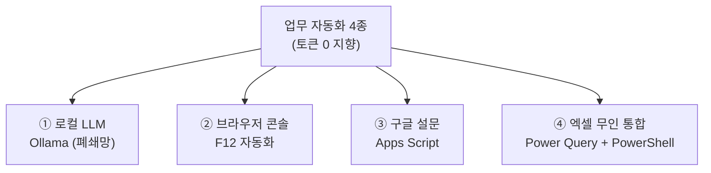
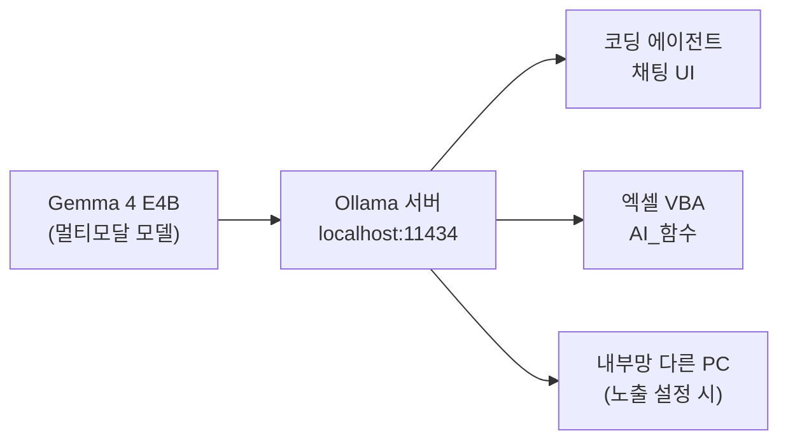
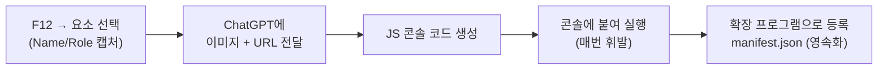
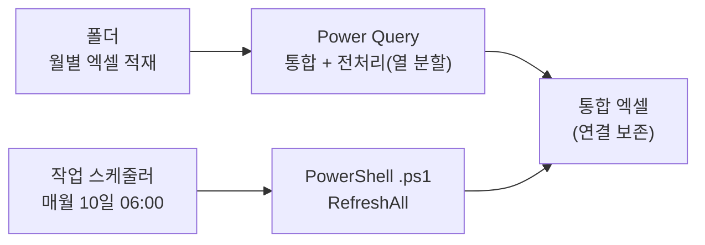

# 5회차 — 바이브 코딩 2: 업무 자동화 (로컬 LLM·콘솔·엑셀)

Lecture Note · 기술 보강판

# 5회차 — 바이브 코딩 2: 업무 자동화 (로컬 LLM·콘솔·엑셀)

현장 강의를 기술적으로 보강한 학습 레퍼런스 — 강사의 의도는 살리고, 빠지거나 틀린 기술은 정확히 채웠습니다.

이 강의 하나로 무엇을 할 수 있게 하려는가 →
**"AI를 최소한으로 쓰거나 아예 안 쓰고도 내 PC·폐쇄망 안에서 도는 업무 자동화 4종(로컬 LLM Ollama, 브라우저 콘솔 자동화, 구글 설문 자동생성, 엑셀 Power Query+PowerShell 무인 통합)을 직접 만들어, 거점 리더로서 동료 업무를 덜어주는 '도구화' 감각을 잡는 것."**

> [!NOTE]
> **핵심**
> ★ 이 회차는 강사가 **모듈 단위로 직접 번호를 매겨** 진행했다. 그래서 이 노트도 그 실제 모듈 구조를 그대로 따른다(억지 위계 없음). 관통하는 태도 한 줄: **"AI가 다가 아니다 — 토큰 안 드는 로컬·내장 도구(Ollama·콘솔·VBA·Power Query·PowerShell)로도 충분히 자동화된다. 겁나서 껐던 F12를 ChatGPT와 함께 열면 누구나 만든다. 그리고 도구보다 '어디에 적용할지'가 제일 어렵다."**
>
>
>
> **보강 안내** — 강사가 결과만 보여주고 건너뛴 부분은 실제 동작하는 명령어·코드로 채웠고, 틀린 값(포트 등)은 [정정]했다. 모델명·포트는 웹으로 확인해 `(검색 보강)`으로 표시했다. 운영성 멘트(점심·쉬는시간·장비 안내 등)는 뺐고, 학습에 도움 되는 일화·사례는 살렸다.

---

# 0. 관통하는 태도 — "토큰 0 자동화"

오늘 다룬 4가지는 묶는 실 한 가닥이 있다.



* **공공·폐쇄망 현실에서 쓸 수 있는 작은 자동화**다. ChatGPT를 마음껏 못 쓰는 환경에서도 돈다.
* **도구는 쉽다. 어디에 적용할지가 어렵다.** 강사가 가장 많이 반복한 말. "도대체 뭐가 문제야"를 찾는 것, 이해관계자를 느슨하게 푸는 것이 본체다.
* **거점 리더 = 동료 업무 덜어주기.** 설문 만드느라 밤새는 사람, 종이 폼 입력하는 계약직, 매달 엑셀 합치는 담당자 — 이들을 도우면 기관이 바뀐다.

---

# 1. 로컬 LLM — Ollama (인터넷 없이 내 PC에서)

**Ollama**는 로컬에서 언어 모델을 쉽게 돌리게 해주는 "껍데기(런타임)". 내 PC에 모델을 받아 인터넷 끊고도 쓴다 — 폐쇄망의 핵심 도구.



## 설치

```powershell
# 방법 1) winget (권장) — 설치 후 서비스가 자동 시작, localhost:11434 리슨
winget install -e --id Ollama.Ollama
# 방법 2) ollama.com/download/windows 에서 OllamaSetup.exe 받아 설치 (약 1.3GB)
ollama --version        # 설치 확인
```

> [!NOTE]
> **보강**
> 보강 — 강사가 "최근 PowerShell 한 줄 명령으로 설치된다"고 한 게 바로 **winget**. (리눅스/맥은 `curl -fsSL https://ollama.com/install.sh | sh`.) 기존 사용자도 다시 깔면 업데이트로 덮어쓴다. (검색 보강: docs.ollama.com/windows)

## 핵심 명령어 — 5개면 충분

```powershell
ollama pull gemma4:e4b   # 모델 다운로드만
ollama run  gemma4:e4b   # 있으면 실행, 없으면 받고 실행 (채팅 시작)
ollama list              # 내 PC에 깔린 모델 목록
ollama ps                # 지금 메모리에 올라간(실행 중) 모델
ollama rm   gemma4:e4b   # 모델 삭제
```

`ollama ps`가 비어 있으면 Ollama는 떠 있지만 모델은 안 올라간 상태다. `run` 하면 메모리에 올라온다(예: 4B는 약 9.5GB 점유).

## 모델 고르기 — Gemma 4 (E4B, 멀티모달)

내 노트북 사양(RAM)에 맞춰 크기를 고른다: 2B / 4B / 12B. 강사는 가장 만만한 **Gemma 4의 E4B**를 썼다.

> [!NOTE]
> **보강**
> 보강 — **Gemma 4 / "E4B"의 정체** (검색 보강). `gemma4:e4b`는 Ollama 라이브러리에 실재하는 모델로 **멀티모달(텍스트+이미지 입력)**이다. **E4B = "실효(effective) 4B"** — 선택적 파라미터 활성화(selective activation) 기술로 전체 파라미터보다 적은 자원으로 4B급 성능을 낸다(Gemma 3n 계열의 기법을 이음). 그래서 CPU·노트북에서도 돈다. 강사가 스커트 이미지를 넣었더니 색·질감·패턴을 잘 뽑았다는 게 이 멀티모달 덕분. (검색 보강: ollama.com/library/gemma4, ai.google.dev/gemma/docs/gemma-3n)

## 포트·노출 — 여기서 값 하나 바로잡자

> [!NOTE]
> **참고**
> ⚠ 정정 — **Ollama 기본 포트는 `11434`다** (강사가 말한 "12434"는 착오). 도는지 확인은 브라우저나 curl로:
> `powershell
> curl http://localhost:11434          # → "Ollama is running"`
> (검색 보강: Ollama는 기본적으로 `127.0.0.1:11434`에 바인딩, API는 `http://localhost:11434/api/generate`.)
>
>
>
> ⚠ 정정 — **내부망 IP 표기.** 강사가 "127로 시작하는 내부망, 196으로 시작하는 IP"라고 했는데, 정확히는 `127.0.0.1`은 **내 PC 자신(loopback)**이지 LAN이 아니고, 사설망 대역은 **`192.168.x` / `10.x` / `172.16~31.x`**다("196"은 192.168의 착오로 보임). 내부망 다른 PC에서 내 Ollama를 쓰게 하려면 외부 노출을 켜야 한다:
> `powershell
> setx OLLAMA_HOST "0.0.0.0:11434"     # (Ollama 재시작 필요)`
> 어느 군(郡)에서 폐쇄망에 Ollama를 큰 규모로 올렸다는 사례가 이 방식이다.

## 코딩 에이전트로 채팅 UI 만들기

VS Code·Windsurf·Antigravity 등 아무 코딩 에이전트에서 "내 PC에 Ollama 깔려 있으니 그걸로 간단한 챗봇 만들자"고 하면 금방 만들어진다. 강사 팁: **"첫 토큰까지 걸린 시간 + 총 출력 시간"을 화면에 찍게** 해서 내 PC/서버 성능을 체감하라(강사 측정: 첫 토큰 103초, 총 260초 — 느리지만 됨).

> [!WARNING]
> **주의**
> 보강 — **llama.cpp / MSTY.** Ollama는 편하지만 껍데기를 올려 자원을 좀 더 먹는다. **llama.cpp**는 C++로 짜여 더 가볍고 빠른 대안(서버 올리고 특정 모델만 띄워 localhost로 사용). UI 도구로는 **MSTY**도 있다. 작업 끝나면 Ollama는 트레이의 양(羊) 아이콘 → **Quit Ollama**로 내려라.
>
>
>
> ⚠ 주의(미확인) — 강사가 전한 "MS가 Claude Code 토큰 비용 5억 달러가 나와 사내에 쓰지 말라 했다"는 **출처 불명의 소문**이다. 사실로 단정 말 것. 다만 클라우드 LLM 토큰 비용이 부담이 되면서 로컬 LLM 수요가 커지는 흐름 자체는 맞다.

---

# 2. Ollama × 엑셀 — VBA로 AI 함수 만들고 배포

엑셀 셀에서 `=AI_Summarize(...)`처럼 로컬 LLM을 부르는 사용자 정의 함수를 만든다. (5주차 교안 14p "VBA + Ollama 완전 내부망".)

만들 함수 예: **AI_Summarize, AI_Classify, AI_Extract, AI_Translate, AI_Ask**. Ollama의 로컬 API(`:11434`)를 POST로 호출한다.

```vba
' 엑셀 사용자 정의 함수: 셀 내용을 로컬 Ollama로 요약
Function AI_Summarize(rng As Range, Optional max_len As Long = 150, _
                      Optional model As String = "gemma4:e4b") As String
    Dim http As Object, body As String, prompt As String
    prompt = "다음을 " & max_len & "자 이내 한국어로 요약: " & rng.Value
    body = "{""model"":""" & model & """,""prompt"":""" & _
           Replace(prompt, """", "\""") & """,""stream"":false}"
    Set http = CreateObject("MSXML2.XMLHTTP")
    http.Open "POST", "http://localhost:11434/api/generate", False
    http.setRequestHeader "Content-Type", "application/json"
    http.send body
    ' 응답 JSON의 "response" 값만 뽑는다 (실제 코드는 LLM이 파싱까지 생성)
    AI_Summarize = ParseResponse(http.responseText)
End Function
```

**등록 → 배포 흐름:**
1. 엑셀에서 `Alt+F11`(VBA 편집기) → **삽입 → 모듈** → 위 코드 붙여넣기.
2. **`.xlsm`**(매크로 사용 통합 문서)으로 저장 → 내 엑셀에서 `=AI_`로 함수 검색되면 성공.
3. **남들에게 배포**하려면 **`.xlam`**(엑셀 추가 기능)으로 저장 → 받는 사람은 **파일 → 옵션 → 추가 기능 → "Excel 추가 기능" → 찾아보기**로 그 `.xlam`을 등록.

> [!NOTE]
> **보강**
> 보강 — Ollama 대신 **외부 모델(GPT 등)도** 같은 구조로 가능. URL과 인증 헤더만 바꾸면 된다. 즉 "기관만의 AI 함수 팩(.xlam)"을 만들어 사내 배포하는 그림이다.

---

# 3. 구글 설문 자동화 — Apps Script + LLM

설문은 손으로 만들면 귀찮아서 문항을 줄이게 된다. **LLM으로 문항을 기획**하고 **Apps Script로 구글 폼을 코드 생성**하면 15개든 100개든 한 방에.

> [!NOTE]
> **보강**
> 보강 — **Apps Script**는 구글이 제공하는 자동화 언어(VBA의 구글판). `script.google.com`에서 실행한다. 구글 설문은 이름이 **구글 폼(Google Forms)**으로 바뀌었다.

```javascript
// script.google.com → 새 프로젝트 → 붙여넣고 저장 → 실행(권한 "모두 허용")
function createSurvey() {
  const form = FormApp.create('우리 관내 만족도 설문');
  form.addMultipleChoiceItem()
      .setTitle('서비스에 만족하십니까?')
      .setChoiceValues(['매우 만족', '만족', '보통', '불만족']);
  form.addParagraphTextItem().setTitle('개선 의견을 자유롭게 적어주세요');
  Logger.log('응답(배포) 주소: ' + form.getPublishedUrl());
  Logger.log('편집 주소: '      + form.getEditUrl());
}
```

실제로는 ChatGPT에 "이 설문을 구글 Apps Script로 작성해줘" 하면 15문항짜리 함수를 통째로 만들어준다. 위는 최소 패턴.

**적용 흐름:** ChatGPT에서 문항 기획 → "Apps Script로 작성" → 코드 복사 → 구글 드라이브 **신규 → 더보기 → Google Apps Script**(없으면 "더 많은 앱 연결하기"에서 추가) → 함수 붙여넣고 프로젝트명 저장 → **저장해야 "실행" 버튼이 활성화**됨 → 실행 → 권한 허용 → 응답/편집/스프레드시트 주소 생성.

> [!NOTE]
> **보강**
> 보강 — **결과 분석.** 응답은 구글 시트로 쌓인다. 구글 드라이브에 붙은 **Gemini**로 바로 분석·차트를 뽑거나, 시트 링크를 VS Code/코딩 에이전트로 연동해 **파이썬 대시보드**까지 자동화할 수 있다. 활용 의도: 개인/팀 프로젝트 주제를 정할 때 동료 대상 설문으로 "문제"를 데이터로 잡는 것.

---

# 4. 브라우저 콘솔 자동화 (F12) — 겁나서 껐던 그 창

`F12`(개발자 도구). 예전엔 "이거 뭐야" 하고 껐던 창인데, **Elements + Console** 두 탭과 요령 하나면 충분하다.



## 기본기 — 헬로월드

```javascript
console.log("안녕하세요");                 // 출력 (파이썬 print 같은 것)
const name = prompt("이름 입력하세요");     // 입력 팝업
alert("환영합니다 " + name + "님");         // 알림 팝업
```

> [!WARNING]
> **주의**
> ⚠ 함정 — **콘솔에 코드 붙여넣기가 막히면**, 콘솔에 먼저 `allow pasting`을 타이핑하고 엔터 친 뒤 붙여넣어라. 콘솔을 지울 땐 `delete`가 아니라 **콘솔 지우기(⊘) 버튼**.

## 핵심 워크플로우 — 요소 캡처 → ChatGPT → JS

`F12` → **요소 선택(Select an element) 아이콘** 클릭 → 원하는 부분에 마우스 올리면 뜨는 **접근성 팝업(Name / Role …)** 을 **캡처** → ChatGPT에 이미지 + 페이지 URL을 주고 "이걸 ○○하는 콘솔 코드 작성해줘" → 나온 JS를 콘솔에 붙여 엔터.

## 4-1. 첨부파일 일괄 다운로드

증권사 리포트·행안부 지침처럼 첨부가 여러 개일 때, 다운로드 버튼 요소를 캡처해 "이 페이지의 첨부를 한 번에 다 받는 콘솔 코드" 요청 → 콘솔 실행 → 한 번에 다운로드.

## 4-2. 두 번 클릭 자동화 (행안부 정책자료)

목록 클릭 → 상세 → 다운로드, 처럼 **2단계 클릭**이 필요한 경우. 첫 화면 요소 + 넘어간 화면의 다운로드 버튼을 **둘 다 캡처**해 주면, JS가 내부 코드를 읽어 한 번에 처리한다.

> [!NOTE]
> **핵심**
> ★ **왜 파이썬 크롤러 대신 콘솔인가.** 콘솔 코드는 **내가 지금 보고 있는 브라우저(클라이언트) 안에서** 실행된다. 그래서 네이버처럼 서버에서 IP를 차단(블로킹)하는 크롤링 방어를 **우회**하기 쉽다. 파이썬 크롤러보다 기능은 제한적이지만, 막히는 사이트엔 이 방식이 통한다. RAG용 자료를 대량 수집할 때 유용.

## 4-3. 종이 양식 → 이미지 OCR → 폼 자동 입력 (DX)

가장 임팩트 큰 사례. 농촌진흥청에 농민이 지퍼백 흙 시료에 **손글씨로 지번·이름**을 써 오면, 접수자가 종이에 옮기고 또 관리 프로그램에 입력한다(계약직까지 둘 정도). 이걸 콘솔로 줄인다.

흐름: 웹 입력 폼에서 `F12` → 폼 구조 캡처 → ChatGPT에 "종이에 적힌 회원 정보를 **이미지로 주면** 이 양식에 채우는 콘솔 코드" 요청(이미지 글자 인식은 **Gemini API 키** 붙여서) → 실행하면 **이미지 업로드 메뉴**가 생기고, 손글씨 사진을 넣으면 이름·성별·주소가 자동 입력됨(사용자는 눈으로 확인 후 제출).

> [!NOTE]
> **핵심**
> ★ **AX보다 DX가 먼저.** 종이 문서를 디지털로 바꾸는 게 선결. 옛 종이 차트(병원 EMR 이전), 학생 생기부 손글씨 기록 등 — 스캔 → 브라우저에서 바로 입력. 수천·수만 장이면 고속 스캔 후 PDF+OCR, 밤에 걸어두고 아침에 확인하는 식으로 작은 프로젝트화.

## 4-4. 데이터 시각화 + 확장 프로그램(익스텐션) 등록

콘솔 코드는 **매번 붙여 실행해야** 한다(휘발). 자주 쓰면 **확장 프로그램으로 등록(영속화)**한다. 강사가 만든 "외인 애널라이저"(네이버 증권에서 외국인·기관 순매수를 시계열 차트로) 사례.

흐름: 시각화 콘솔 코드를 ChatGPT가 만들어 줌 → "이걸 크롬/엣지 확장 프로그램으로 만드는 절차 알려줘" → `manifest.json` + 팝업 html 폴더 생성.

```json
{
  "manifest_version": 3,
  "name": "외인 애널라이저",
  "version": "1.0",
  "action": { "default_popup": "popup.html" },
  "permissions": ["activeTab", "scripting"]
}
```

등록: 브라우저 **확장 프로그램 → 개발자 모드 ON → "압축 해제된 확장 프로그램 로드" → 폴더 선택**. (Netlify에 index.html 폴더를 드래그하는 것과 같은 감각.) 남에게 배포하려면 크롬 웹스토어 심사 등록이 필요.

> [!WARNING]
> **주의**
> 보강 — **temperature 한 줄.** 코딩처럼 정확해야 하면 `temperature=0`(가장 확률 높은 토큰만 → 결정적, 환각·버그↓), 창의가 필요하면 `1`. **코딩 에이전트는 보통 0.** 버그가 잦으면 0으로 낮춰 다시 짜라. (덤: 시스템 프롬프트를 0으로 두면 "멋진 생각이에요" 같은 아첨 없이 드라이하게 답함.)
>
>
>
> ⚠ 주의 — **페이지 표시값은 못 믿는다.** 콘솔로 페이지의 숫자·텍스트를 그 자리에서 바꿀 수 있다(강사가 11번가 벨트를 천만 원으로, 통장 잔고·수상자 이름도). URL이 그대로여도 **새로고침하면 사라지는 가짜**다. "통장 인증/수익 인증" 캡처를 곧이곧대로 믿지 말 것 — "리프레시 해봐"가 검증.

---

# 5. 토큰 0 자동화 — 엑셀 Power Query + PowerShell

AI와는 거리가 있지만 "old is best". 주기적으로 떨어지는 동일 양식 엑셀을 **함수·코드·토큰 없이** 통합·전처리하고, 그 갱신마저 무인으로 돌린다.



## 5-1. Power Query로 폴더 단위 가져오기

엑셀은 **여러 파일을 한 번에 못 연다**(하나씩). HIRA(심평원)·AirKorea 같은 월별 CSV 12개를 시계열로 합치려면 노가다. **Power Query 편집기**가 이걸 푼다.

경로: 빈 엑셀에서 **데이터 → 데이터 가져오기 → 파일에서 → 폴더에서** → (월별 파일이 쌓일) 폴더 지정 → **데이터 결합 및 변환 → 데이터 결합** → 파일 병합. (여기서 "가져오기"는 열기(open)가 아니라 **연결(connect)** 개념. DB(오라클·PostgreSQL·MySQL 등)에서도 직접 연결 가능.)

> [!WARNING]
> **주의**
> ⚠ 함정 — 가져올 폴더 안 엑셀 파일이 **열려 있으면 안 된다**(닫고 진행). 그리고 **맥/구버전 제약**: 맥 일부·MS Office 2016에는 "폴더에서"가 없을 수 있다(2016은 `Alt+F12`로 Power Query 별도 설치). M365 권장.

## 5-2. 함수 없이 전처리 (열 분할)

한 셀에 `서비스;정보`, `영업중|허가`처럼 여러 값이 섞인(원-셀-원-데이터 위반) 데이터. 엑셀이면 FIND/LEFT 함수로 발라내는데, Power Query는 **클릭만으로**: 열 선택 → **열 분할 → 구분 기호 기준**(세미콜론·파이프 `|` 등) → 확인. 함수 한 줄 없이 쪼개진다.

> [!NOTE]
> **보강**
> 보강 — 이 단계 데이터는 아직 엑셀 시트엔 없다(Power Query 안에만 있음). 다 만지고 **"닫기 및 로드"**를 눌러야 시트로 내려온다. 이 통합 엑셀은 **원본을 담은 게 아니라, 폴더를 읽어 전처리한 결과만** 뿌리는 "껍데기+프로세스"다.

## 5-3. 데이터 추가 → 새로 고침 → PowerShell 무인 실행

폴더에 다음 달 파일(2월)을 넣고 **데이터 → 모두 새로 고침**만 누르면 통합본이 갱신된다(202행부터 2월 데이터 추가). 이 클릭조차 자동화 → **엑셀을 열지 않고** PowerShell로.

```powershell
# 엑셀리프레시.ps1 — 엑셀을 화면에 안 띄우고 '모두 새로 고침' 실행
$path  = "C:\월단위매출데이터\강남구_소상공인_통합데이터.xlsx"
$excel = New-Object -ComObject Excel.Application
$excel.Visible = $false
$wb = $excel.Workbooks.Open($path)
$wb.RefreshAll()                 # = 데이터 → 모두 새로 고침
Start-Sleep -Seconds 5           # 새로고침 완료 대기
$wb.Save(); $wb.Close($true); $excel.Quit()
```

```powershell
# 실행 (경로는 캡처해서 ChatGPT에 주면 오류 적다)
powershell.exe -NoProfile -ExecutionPolicy Bypass -File "C:\월단위매출데이터\엑셀리프레시.ps1"
```

> [!WARNING]
> **주의**
> ⚠ 함정 — **경로 오류가 제일 많다**(파이썬도 마찬가지: 경로 + "No module named ○○"). 경로를 손으로 치지 말고 **폴더 화면을 캡처해서** "내 경로 이거야"라고 주면 한 글자 실수가 준다. 또 **PowerShell 한글 깨짐**이 잦다 → 콘솔 인코딩을 UTF-8로(`chcp 65001`, 또는 스크립트 상단 `[Console]::OutputEncoding=[Text.Encoding]::UTF8`). 붙여넣을 때 따옴표·틸드(`~`)가 섞여 깨지는 것도 주의.

## 5-4. 작업 스케줄러(Task Scheduler) 등록 — 마지막 무인화

PowerShell 스크립트를 **매월 자동 실행**. `Win+R` → `taskschd.msc` → 작업 스케줄러.

```powershell
# 명령으로 등록 (매월 10일 06:00 실행)
schtasks /create /tn "엑셀월간통합" ^
  /tr "powershell -NoProfile -ExecutionPolicy Bypass -File C:\월단위매출데이터\엑셀리프레시.ps1" ^
  /sc monthly /d 10 /st 06:00
```

이러면 PC(또는 윈도우 서버)가 켜져 있는 한, 매월 10일 새벽에 스스로 폴더를 읽어 통합·전처리·갱신한다. 자동화 안 된 단 하나는 **폴더에 새 파일을 넣는 것**뿐. 통합본 위에 차트/대시보드를 그려놨다면 그것도 같이 갱신된다 — **사람 손이 0**.

## 5-5. 왜 이 방식인가 — 오버엔지니어링 경계

> [!WARNING]
> **주의**
> ★ 강사의 메시지: 민원 누적 분석처럼 **개인 PC에서 도는 반복 업무**라면, 파이썬(인메모리라 데이터 커지면 부담)이나 MCP·에이전트로 **오버 엔지니어링** 하지 말고, **윈도우 내장(Power Query + PowerShell + 스케줄러)**으로 충분할 때가 많다. 토큰도 0, 파이썬 설치도 불필요. "이걸 해보면 오히려 'AI가 여기 들어가면 좋겠다'는 지점이 보인다"는 게 의도. 단, 원본은 보통 전처리가 안 돼 있어 **누군가는 전처리(마사지)를 해야** 하는데, 그 자리를 Power Query가 메운다.

---

# 마무리 & 과제

오늘 한 4가지: ① Ollama 로컬 LLM(설치·모델·내 PC 성능 체감) ② Ollama×엑셀 VBA 함수 ③ 구글 설문 Apps Script ④ 콘솔 자동화(다운로드·폼입력·시각화·확장) ⑤ Power Query+PowerShell 무인 통합. 공통 메시지는 **"기능은 쉽다 — 내 업무·동료 업무 어디에 붙일지가 핵심"**.

> [!NOTE]
> **핵심**
> ★ **과제** — 가장 재밌었을 **콘솔 프로그램**으로, 내 기관에 맞는 걸 하나 만들어 **확장 프로그램으로 압축**하고, 누구나 등록할 수 있게 **README**를 붙여 공유 폴더에 올리기. (작은 자동화로 동료를 돕는 '거점 리더' 연습.)

---

# 부록 — 도구 · 개념 맵

| 분류 | 키워드 |
| --- | --- |
| 로컬 LLM | Ollama(:11434),`pull/run/list/ps/rm`, Gemma 4 E4B(멀티모달), llama.cpp, MSTY, OLLAMA_HOST |
| 엑셀×AI | VBA 사용자정의함수, MSXML2.XMLHTTP,`.xlsm`→`.xlam`배포, 파일→옵션→추가기능 |
| 구글 자동화 | Apps Script, FormApp, getPublishedUrl, 구글 폼, 드라이브 Gemini |
| 브라우저 콘솔 | F12, Elements/Console, 요소 선택, allow pasting, console.log/prompt/alert |
| 확장 프로그램 | manifest.json(v3), 개발자 모드, 압축 해제 로드, Listly·Easy Scraper |
| 엑셀 자동화 | Power Query(데이터 가져오기→폴더에서), 열 분할, 모두 새로 고침, 닫기 및 로드 |
| 무인 실행 | PowerShell(.ps1, Excel COM, RefreshAll),`taskschd.msc`, schtasks |
| 개념 | temperature 0/1, 클라이언트 vs 서버 크롤링, DX→AX, 사설망 IP(192.168.x) |

## 검색 보강 출처

* Ollama 기본 포트 11434 / `:11434/api/generate`: docs.ollama.com/faq, pinggy.io
* Ollama Windows 설치(winget): docs.ollama.com/windows, winstall.app
* Gemma 4 E4B 멀티모달 / 선택적 활성화: ollama.com/library/gemma4, ai.google.dev/gemma/docs/gemma-3n

