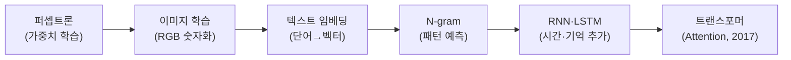
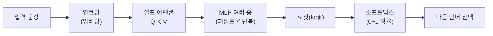
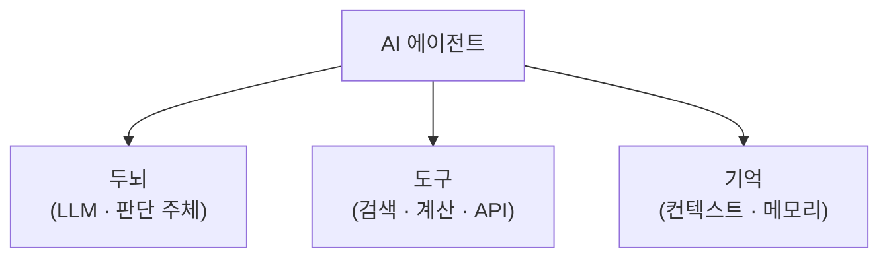
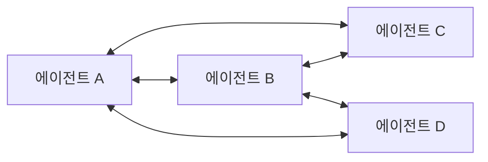
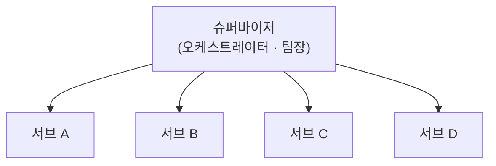
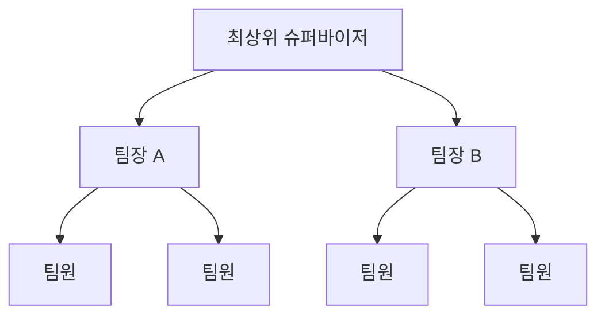
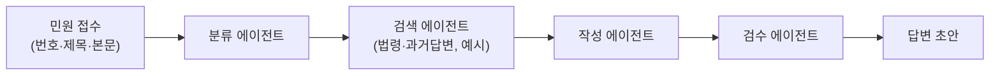
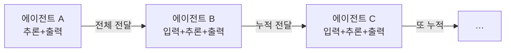

# 6회차 — AI 에이전트 이해: 트랜스포머 기초부터 멀티 에이전트 실습까지

Lecture Note · 기술 보강판

# 6회차 — AI 에이전트 이해: 트랜스포머 기초부터 멀티 에이전트 실습까지

현장 강의를 기술적으로 보강한 학습 레퍼런스 — 강사의 의도는 살리고, 빠지거나 틀린 기술은 정확히 채웠습니다.

이 강의 하나로 무엇을 할 수 있게 하려는가 →
**"AI 에이전트가 '무엇으로 이루어졌고(두뇌·도구·기억), 어떤 구조로 협업하며(싱글~멀티 6종), 왜 돈이 드는지'를 이해하고, OpenRouter로 값싼 모델을 붙여 '민원 초안 생성 멀티 에이전트'와 '픽셀 에이전트'를 직접 뜯어 만들어보는 것."**

> [!NOTE]
> **핵심**
> ★ 이 회차는 신성진 강사의 **AI 에이전트 실습 세션**이다. 원제는 "에이전트 툴 마스터리 기반 개발 입문"이었지만, 강사가 "도구는 이미 많이 써봤을 테니 **에이전트 자체를 이해**하는 쪽"으로 방향을 틀었다고 서두에 밝혔다. 큰 흐름은 다섯 덩어리 — ① 프롤로그(카파시·코딩=현대인 소양) ② 딥러닝/트랜스포머 기초 ③ 에이전트의 구성(두뇌·도구·기억)과 조건 ④ 에이전트 6종 구조 + 핸드오프·오케스트레이션 ⑤ 실습(OpenRouter 민원 에이전트 → 픽셀 에이전트) + 멀티 에이전트의 비용 그림자.
>
>
>
> **보강 안내** — 강사가 화면으로 빠르게 지나간 실습(OpenRouter 등록·`.env`·`git clone`·`npm`·`plan.md`)을 초보자가 따라 할 수 있게 **실제 동작하는 명령어/코드**로 채웠다. 값·주장(모델 가격, Attention 논문 연도·저자, LatentMAS 논문, 에이전트 정의)은 웹으로 검증해 **틀린 건 `[정정]`, 확인한 건 `(검색 보강)`**으로 표시하고 출처는 부록에 모았다. 운영성 멘트(쉬는시간·자리·"몇 분 남았다"·장비 인식 오류 등)는 뺐고, 학습에 도움 되는 비유·일화(세 얼간이·붕어·아보카도·레고·"폭군" 슈퍼바이저·3살 아이 심부름)는 살렸다.

---

# 들어가며 — 왜 '에이전트를 이해'하는가

강사가 이 회차를 통째로 '에이전트 이해'에 쓴 이유는 하나다. **도구를 아무리 많이 써봐도, 그 도구가 어떻게 도는지 모르면 결국 남이 만든 걸 클릭만 하게 된다.** 그래서 밑바닥(모델이 말을 배우는 원리)부터 위(에이전트가 협업하는 구조)까지 한 번 훑는다.

프롤로그의 메시지 두 개:

> [!NOTE]
> **핵심**
> ★ **코딩은 개발자만의 기술이 아니라 현대인의 기본 소양이다.** 코딩을 '배우라'는 게 아니라, **AI가 짜준 코드와 주석을 읽고 "얘가 뭘 만들어줬구나"를 파악**할 줄 알라는 것. 안드레이 카파시(전 테슬라 오토파일럿 AI 총괄)조차 "프로그래밍에서 이렇게 뒤처진다는 느낌은 처음"이라고 했을 만큼 발전이 빠르다.
>
>
>
> **보강 — "따라 하기 벅찬 시대"의 실체.** 강사 말대로 모델 출시 주기가 급격히 짧아졌다. 이 회차엔 GPT-5.4/5.5/5.5 Pro, Claude Opus 4.8·Sonnet·Fable 5 같은 이름이 쏟아지는데, **뒤에서 이 중 몇 개는 값을 웹으로 검증해 바로잡았다**(모델 가격 파트 참고). 강사가 "우리나라 통신사 지분 때문에 특정 모델이 막혔다"류로 언급한 건 강사 스스로 **"카더라(찌라시)"라고 못 박은 소문**이므로 노트에서는 사실로 다루지 않는다.

---

# 1부 · 모델은 어떻게 '말'을 배웠나 (딥러닝 → 트랜스포머)

에이전트의 '두뇌'는 결국 LLM이다. 그 LLM이 어떻게 만들어졌는지를 역사 순으로 훑는다. **핵심 한 줄: 다음 단어를 확률로 예측하는 기계**다.



## 퍼셉트론 — 딥러닝의 최소 단위

**퍼셉트론(perceptron)** = 입력에 가중치를 곱해 더한 뒤, 결과를 보고 **가중치를 조금씩 고쳐나가는** 최소 학습 단위. 스위치와 다이얼 비유(웰치랩스 영상)가 딱 이거다 — "이쪽으로 올리면 양수, 저쪽이면 음수"를 패턴으로 익히며 다이얼(가중치)을 돌린다. '러닝(학습)'이란 곧 **가중치를 고쳐나가는 것**이다.

> [!NOTE]
> **보강**
> **보강 — 용어 한 줄씩.***가중치(weight)* = 각 입력의 중요도. *편향(bias)* = 기준선 조정값. *손실함수(loss)* = 정답과 얼마나 틀렸나. *순전파* = 입력→출력 계산, *역전파* = 틀린 만큼 거꾸로 가중치를 고치는 과정. 딥러닝은 이 손실을 줄이는 방향으로 가중치를 반복해서 고친다. NAND/OR/XOR 게이트 학습이 이 원리의 고전 예제다.

## 이미지에서 텍스트로 — 임베딩

이미지는 컴퓨터에서 **RGB 숫자**(0,0,0 ~ 255,255,255)로 표현된다. 비트맵을 잘게 쪼개 각 칸에 색 값을 넣은 것 — 옛날 컴퓨터에서 확대하면 깨지던 건 **하드웨어 한계로 크게 쪼갤 수밖에 없어서**(=해상도 낮음)다.

그럼 텍스트는? **임베딩(embedding) = 단어를 숫자 벡터로 바꾸는 것.** 자주 같이 나오는 단어끼리 가깝게, 안 나오는 단어끼리 멀게 좌표를 찍는다. 2·3차원으론 부족해서 수백~수천 차원으로 늘려 저장한다.

> [!WARNING]
> **주의**
> ⚠ **주의 — "1036차원"은 예시 숫자.** 강사가 든 "1036차원"은 개념 설명용 숫자다. 실제 임베딩 차원은 모델마다 다르지만 **768 / 1024 / 1536 / 4096** 같은 값이 흔하다("1036"이라는 표준 차원은 없다). 요점은 **"엄청나게 넓은 공간에 점 하나 찍기"** 이고, 이게 가능해진 건 하드웨어(메모리·연산) 발전 덕이다.

## N-gram → RNN/LSTM — 그리고 그 한계

* **N-gram**: 앞의 몇 단어 패턴을 보고 다음 단어를 예측. 문장이 길어지면 패턴을 못 잡고, "안 되잖아 영어는" ↔ "영어는 안 되잖아" 같은 어순 변형에 취약. 리뷰 감성분석(긍/부정)에서 문장이 길어지면 엉뚱하게 판정하던 게 이 한계다.
* **RNN / LSTM**: 여기에 **시간·기억**을 더해 "앞의 것을 기억하며 다음을 예측"하게 만든 것. 하지만 **앞 단어가 많아질수록 맨 처음 단어를 잊는다**(사람이 어제 건 기억해도 1년 전은 흐릿한 것과 같다). 긴 문맥에서 결국 실패에 가까웠다.

## Attention Is All You Need — 트랜스포머 (2017)

손 놓고 있던 판을 뒤집은 게 **트랜스포머**다.

> [!NOTE]
> **핵심**
> ★ **핵심 (검색 보강) — 논문 사실 확인.** "Attention Is All You Need"는 **2017년, 구글(Google Brain/Research)의 Vaswani 외 8인**이 발표했다(2017년 6월 공개, NeurIPS 2017 게재). 강사가 말한 **"2017년, 구글"은 정확하다.** BERT·GPT 등 오늘날 거의 모든 LLM의 뿌리이며, 핵심 메커니즘이 **어텐션(attention)**이다.

**셀프 어텐션(self-attention)**의 QKV를 초보용으로 풀면:

* **Q(쿼리)** = "나는 누구와 관련 있지?"라고 묻는 값
* **K(키)** = 후보 단어들의 '이름표'
* **V(밸류)** = 실제로 가져올 '내용'

예: "고양이가 매트 위에 앉았다"에서 "앉았다"가 **Q**로 "누가 앉았나?"를 물으면, 후보(고양이·매트·위에) 중 **고양이**와의 연관도가 제일 높게 계산된다. 이걸 패턴으로 학습한다.



용어 정리:
- **인코딩/디코딩(LLM 관점)**: 인코더 = 입력을 '읽고 이해'하는 부분, 디코더 = 그 의미로 **다음 단어를 하나씩 생성**하는 부분. (문자 인코딩/디코딩과는 다른 개념.)
- **MLP(멀티레이어 퍼셉트론)**: 어텐션 결과를 앞서 배운 딥러닝(퍼셉트론)으로 수십 층 반복 가공. 파라미터가 70억·80억·800억 개로 커질수록 다양한 패턴을 학습.
- **로짓(logit) → 소프트맥스(softmax)**: 후보 단어별 '점수(로짓)'를 **0~1 사이 확률**로 바꿔, 가장 높은 걸 다음 단어로 뽑는다.

> [!NOTE]
> **보강**
> **보강 — 왜 지금 되나.** 2017년엔 6→5나노 공정이었는데 지금은 3나노, 2나노까지 왔다. 하드웨어가 기하급수적으로 좋아지며 훨씬 많은 패턴을 학습할 수 있게 된 게 오늘의 모델이다. 구글이 예전 PaLM에서 삐끗했다가 Gemini로 갈아엎은 것도 이 흐름 위에 있다.

---

# 2부 · AI 에이전트란 무엇인가

멀티모달(텍스트+이미지)을 지나 지금 화두는 **AI 에이전트**다. 정의부터 못 박는다.

> [!NOTE]
> **핵심**
> ★ **핵심 — 에이전트 = 자율적으로 도구를 골라 쓰는 AI.** '에이전트'는 원래 있던 말(스포츠 에이전시, 요원)이고, 거기 'AI'를 붙인 것. 규칙대로만 도는 게 아니라 **사람처럼 필요할 때 필요한 도구를 알아서 가져다 쓰는** 게 핵심. 젠슨 황(NVIDIA)이 "사람 한 명당 수십~수백 개 에이전트가 붙어 일할 것"이라 한 그 개념이다.

## 구성 3요소 — 두뇌·도구·기억



* **두뇌** = LLM. 어떤 도구를 쓸지 판단하는 주체.
* **도구** = 계산기·검색·외부 API 등. 두뇌가 못하는 일(예: 정확한 수 계산)을 맡긴다.
* **기억** = 컨텍스트/메모리. 지금까지의 대화·결과를 담아둔다.

> [!NOTE]
> **보강**
> **보강 (검색 보강) — 강사의 정의는 Anthropic과 일치한다.** Anthropic의 *"Building Effective Agents"*는 에이전트의 기본 블록을 **"증강된 LLM(augmented LLM) = LLM + 검색(retrieval) + 도구(tools) + 기억(memory)"**로 정의한다. 강사가 "Anthropic은 '검색'을 따로 두는데 나는 그걸 '도구'에 포함시켰다"고 한 대목은 **정확한 대조**다 — 검색도 결국 도구의 하나로 볼 수 있어서다. 강사 말대로 이 분야는 "아직 정의가 굳지 않은 학문"이라, 회사·문서마다 구분이 조금씩 다르고 시간이 지나면 또 바뀐다.

## 행동·설계·조건 — 그리고 "왜 기억인가 = 돈"

에이전트는 결국 **구조**다. 사용자의 질문을 받아 → 어떤 도구를 쓸지 계획하고 → 넘기고 → 답을 생성하는 **4단계 흐름**으로 돈다. 여기서 강사가 강조한 세 조건:

* **행동** — 실제로 도구를 써서 결과를 만들어내야 에이전트다.
* **설계** — 어떤 도구를 몇 개 붙일지 정한다(계산기 하나만 있으면 그것만 함).
* **조건(기억)** — 중간 기억을 반드시 설계해야 한다.

> [!NOTE]
> **핵심**
> ★ **핵심 — 기억을 설계하는 진짜 이유는 '돈'이다.** 기억이 없으면 에이전트는 매번 초기화되는 **"붕어 같은 존재"**가 된다. 바로 전 단계 결과를 가져오면 될 걸 똑같은 작업을 반복하고, **그때마다 두뇌(LLM) 호출 = 토큰 = 돈**이 나간다. 일관성·일회성 문제도 있지만, **가장 근본은 비용 효율**이다. "에이전트를 만들 때 1순위로 생각할 것 = 기억 설계"라고 강사가 못 박았다.
>
>
>
> **보강 — RPA와의 차이.** 에이전트 이전의 각광주였던 **RPA(Robotic Process Automation)**는 **룰 베이스(규칙 기반)**라, 예상 밖(튀는) 값이 들어오면 무너진다. '스마트팜/스마트팩토리'가 대개 RPA 기반이었는데 지금은 소리가 쏙 들어갔다. **알고리즘도 규칙 기반이라 그 자체는 'AI 에이전트'가 아니다** — 두뇌(자율 판단)가 있어야 AI 에이전트다. 두뇌가 빠지면 그냥 RPA다.

---

# 3부 · 에이전트 6종 구조 — 싱글부터 멀티까지

강사가 정리한 대표 6종. **위계가 실제로 있는 건 계층형뿐**이니, 나머지를 억지로 "N계층"으로 세우지 말 것. (LangChain의 LangGraph 문서가 정리한 멀티 에이전트 구조 — network / supervisor / supervisor(tool-calling) / hierarchical / custom — 와 거의 일치한다. **검색 보강**.)

| 구조 | 한 줄 정의 | 강점 | 약점 |
| --- | --- | --- | --- |
| **싱글(바닐라)** | 한 에이전트가 다 함 | 목적 명확하면 간단(100줄이면 끝) | 도구 많아지면 "뭘 써야 하지" 판단 부담 폭증 |
| **네트워크** | 모두가 서로 직접 대화(그물망) | 병렬·유연·애자일 | 리더 없어 헤맴, 이상치 하나에 전체 오염, 코드 수백 줄 |
| **슈퍼바이저(+서브)** | 팀장 1 + 서브 에이전트 N | 조율자 존재, 병렬·유지보수 용이 | 팀장에 요청 몰리면**병목**, 팀장 API 비용 급증 |
| **슈퍼바이저 as 툴** | 서브를 '도구'로만 취급 | 통제 강함 | **"폭군"**— 서브 의견 무시, 사실상 싱글과 유사 |
| **계층형(hierarchical)** | 팀장의 팀장의 팀장… | 전문성 있게 세밀 운영 | 비용·시간 큼 |
| **커스텀** | 내가 흐름을 직접 설계 | 완전 자유 | 유지보수 지옥 |

## 싱글(바닐라) 에이전트

에이전트 하나가 계획·설계·테스트·검증·유지보수를 다 한다(지금 우리가 Claude 데스크탑 등으로 쓰는 대부분이 이것). 목적이 명확하면 툴 선택도 명확하다. 문제는 **커질수록** 생긴다 — "나도 써", "우리 팀도 연결해줘"로 도구가 늘면, **같은 질문에도 "어떤 툴을 써야 하지?"라는 판단 부담**이 폭증한다. "팀원 한 명이 회사 일 다 하면 죽어난다"와 같은 이치.

> [!WARNING]
> **주의**
> **보강 — "그럼 좋은 모델 쓰면 되잖아?" 의 함정 = 가격.** 여기서 강사가 모델 가격을 예로 들었다. 값 검증 결과는 아래 [정정] 참고.
>
>
>
> ⚠ **[정정] — Claude Fable 5 가격.** 강사는 Claude Fable 5를 **"입력 100만 토큰당 $20, 출력 $1,150"**로 소개했는데, 이는 **사실과 다르다.** Anthropic 공식 기준(2026년) **Claude Fable 5 = 입력 $10 / 출력 $50 (100만 토큰당)** 이다(Fable 5는 Anthropic의 가장 강력한 상용 모델). 출력 $1,150은 실제값($50)의 20배가 넘는 큰 오차다. (검색 보강: platform.claude.com 모델/가격)
>
>
>
> ★ **핵심 (검색 보강) — GPT-5.5 가격은 강사가 맞다.** 강사가 말한 **"GPT-5.5 = 입력 $5 / 출력 $30 (100만 토큰당)"**은 정확하다(2026년 6월 기준, 1M 컨텍스트). 참고로 GPT-5.5 Pro는 $30/$180로 더 비싸다. 요점은 그대로 유효하다 — **고성능 모델은 개인이 감당하기 어렵다.** 그래서 실습에선 값싼 모델을 쓴다(4부).

## 멀티 에이전트 — "바통"과 핸드오프

멀티 에이전트 = 팀장·팀원 A·B·C처럼 **컨텍스트가 분리된** 여러 에이전트가 협업. 나눈 이유는 크게 넷:

* **컨텍스트 분리** — 대기업처럼 역할이 명확 → 전문성(좁고 깊게)
* **병렬 처리** — 한 번에 뿌리고 한 번에 받음
* **관심사 분리** — 스파게티처럼 얽히지 않음
* **유지보수** — 문제 있는 에이전트만 쏙 빼서 교체

에이전트끼리 결과를 넘기는 걸 강사는 **"바통"**이라 불렀다. 전문 용어로 **핸드오프(handoff)** — "무엇을 / 언제 / 누구 책임으로" 넘길지의 경계 설정이다.

> [!NOTE]
> **핵심**
> ★ **핵심 — 핸드오프 vs 델리게이트.** 팀장에게 보고서를 올리고 **손 털면 핸드오프**, 팀장이 "다시 해" 해서 **되돌아와 다시 하면 델리게이트(위임)**. 그래서 일반 멀티 에이전트는 "100% 핸드오프"가 아니다(돌아올 수 있으니까). **순차(탑다운) 에이전트**만 무조건 아래로만 흐르므로 100% 핸드오프 — 대신 **앞 단계가 잘못 넘기면 뒤가 다 무너진다**는 게 순차의 최대 약점.

## 네트워크 에이전트 — "팀장님 보고 싶어요"

모든 에이전트가 서로 직접 대화(카카오톡 친구망 같은 그물망). 병렬로 빠르고 유연하지만, **리더(결정권자)가 없어** 서로 헤맨다. 이상치 하나가 등장하면 옆으로 옆으로 번져 전체가 오염된다. 같은 일을 싱글은 100줄, 네트워크는 수백 줄이 필요할 만큼 복잡해진다.



> [!NOTE]
> **보강**
> **보강 — 언제 쓰나.** 창의성을 억누르고 **정확한 답**이 필요한 업무(예: **법령 검토** — 계속 검수 필요)에 어울린다. 대신 최적화하려는 개발자는 예외 처리 지옥에 빠지므로, **에이전트 수를 최대한 줄여** 구성하는 게 요령.

## 슈퍼바이저 & 슈퍼바이저 as 툴 — 오케스트레이션

네트워크의 "리더 없음"을 푸는 게 **오케스트레이션(orchestration)** — 전체를 조율하는 팀장(슈퍼바이저)을 하나 둔다. 뉴스에 나오는 "서브 에이전트/멀티 에이전트"가 대개 이 그림이다. (서브 에이전트는 멀티 에이전트의 **하위 개념** — 반대 개념이 아니다.)



* **슈퍼바이저**: 팀장이 요청을 나눠주고 서브와 어느 정도 대화·재요청도 함. 단, **요청이 몰리면 팀장이 병목**에 빠지고, 팀장에 붙인 모델의 **API 비용이 기하급수적으로** 든다.
* **슈퍼바이저 as 툴**: 서브를 아예 **'도구'로만** 본다. **"너네는 내 노예야"** 식 — 서브가 "이것도 검토하면 좋을 것 같은데요" 하면 **"감히 도구가 의견을 내? 시키는 것만 해"**. 통제는 강하지만 사실상 싱글 에이전트와 비슷해진다("폭군" 비유).

## 계층형(hierarchical) & 커스텀

* **계층형**: 슈퍼바이저 위에 또 슈퍼바이저. 주간보고가 팀장→과장→그 위로 올라가는 **회사 조직도** 그대로. 전문성 있게 돌지만 **비용·시간**이 크다.
* **커스텀**: "둘이 어딨어, 내 맘대로 짤래." 내가 흐름을 직접 설계("너는 얘한테만 보내", "너는 쟤랑 답변하지 마"). 자유롭지만 **유지보수가 지옥**이다.



> [!WARNING]
> **주의**
> **보강 — 레고 비유(커스텀의 함정).** 탱크 레고는 **설명서**가 있어 쉽다. 그런데 그 부품으로 **공룡**을 만들려면 전부 내 머리로 설계해야 하고, 놀다 보면 부품이 없어져 유지보수가 힘들어진다. 커스텀 구조가 딱 이렇다.

---

# 4부 · 실습 1 — 민원 초안 생성 멀티 에이전트 (OpenRouter)

이제 위 구조를 손으로 만든다. 주제는 **"민원 초안 생성 멀티 에이전트"**. 입력은 배포된 **민원 예제 40개**(번호·제목·본문, 실제 인사혁신처 민원 기반)이고, 이걸 읽어 **답변 초안**을 만드는 게 목표.



각 에이전트는 **페르소나 + 쓸 수 있는 도구**를 함께 줘야 한다.

> [!NOTE]
> **핵심**
> ★ **핵심 — 페르소나만 주면 '챗봇', 도구까지 줘야 '에이전트'.** "너는 분류 담당이야"만 주면 전용 챗봇이고, **도구를 붙여 결과를 만들어내야 에이전트**다. 구조(순차/슈퍼바이저/계층형/커스텀)는 자유롭게 골라도 된다. 실습에선 검색·법령 API는 **"예시 도구"로 대체**해도 된다(진짜 API를 붙이면 너무 커진다).

## OpenRouter — 키 하나로 수백 개 모델

강사가 값싼 모델을 쓰라고 한 배경이 **OpenRouter**다.

> [!NOTE]
> **보강**
> **보강 (검색 보강) — OpenRouter란.****키 하나로 60여 개 공급자의 400~500+ 개 모델**(OpenAI·Anthropic·Google·Meta·Mistral 등)을 **OpenAI 호환 방식**으로 부르는 통합 게이트웨이다. 공급자별로 인증·결제·SDK를 따로 만들 필요가 없고, 장애 시 다른 모델로 **폴백**도 된다. 실습에선 **한도 2달러/인**이라 **작은(싼) 모델만** 쓰라고 제한했다(어떤 모델을 썼는지 대시보드에 다 뜬다). 중국 모델은 보안 우려로 제외. (출처: openrouter.ai)
>
>
>
> ★ **핵심 — 작은 모델을 쓰게 한 진짜 의도.** "기관에 가면 어차피 좋은 모델 못 쓴다. **싼 모델로도 되는지**를 미리 체감하고, '이 정도면 우리 기관에 도입할 만하다'를 테스트해보라"는 것.

## 실제로 붙이는 법 — API 키와 `.env`

강사가 "AI에 잘 얘기하면 다 연결된다"며 건너뛴 부분을 **동작하는 형태**로 채운다. 핵심: **API 키를 코드에 박지 말고 `.env`(환경변수)에 둔다.**

`.env` 파일 (프로젝트 루트에 두고, **깃에 올리지 않는다**):

```shell
OPENROUTER_API_KEY=sk-or-v1-여기에_본인_키
```

`.gitignore`에 반드시 추가:

```gitignore
.env
node_modules/
```

파이썬에서 부르기(OpenAI 호환 방식):

```python
# pip install openai python-dotenv
import os
from dotenv import load_dotenv
from openai import OpenAI

load_dotenv()  # .env 읽어 환경변수로

client = OpenAI(
    base_url="https://openrouter.ai/api/v1",     # ← OpenRouter 엔드포인트
    api_key=os.environ["OPENROUTER_API_KEY"],
)

resp = client.chat.completions.create(
    model="openai/gpt-5.5",                       # ← 싼 모델로 바꿔 쓰기(예시)
    messages=[
        {"role": "system", "content": "너는 민원 분류 담당이다. 카테고리만 한 단어로 답하라."},
        {"role": "user",   "content": "민원 본문: ..."},
    ],
)
print(resp.choices[0].message.content)
```

> [!WARNING]
> **주의**
> ⚠ **주의 — 키는 절대 코드/HTML에 노출하지 마라.** 강사도 "그건 내 개인 키니 등록하지 말라"고 했다. `.env`에 넣고 `.gitignore`로 깃 추적에서 빼는 게 표준. HTML 프론트에서 직접 키를 부르면 브라우저에 그대로 노출되니, **키를 쓰는 호출은 서버(백엔드)나 로컬 스크립트에서** 해야 한다.

각 에이전트마다 **다른 모델**을 붙이고 싶으면, 위 `create(model=...)`의 모델 문자열만 에이전트별로 바꾸면 된다(예: 분류=싼 모델, 검수=조금 더 나은 모델). 웹/파이썬 서버/Node.js 등 **형식은 자유** — "제대로 돌기만 하면 된다."

> [!NOTE]
> **보강**
> **보강 — 잘 모르겠으면 역공학.** 배포된 `.ipynb`(주피터) 예제나, 좋아요 많은 오픈 멀티 에이전트(4개 에이전트 제공)를 **하나만 뜯어보며(리버스 엔지니어링)** 어떻게 구성했는지 따라가는 것도 방법. "모방은 창조의 어머니."

---

# 5부 · 적정 에이전트 수 & 개발 습관 (플랜·기록·Git)

만들고 나면 "에이전트가 너무 많나 적나"가 헷갈린다. 강사의 지침.

> [!NOTE]
> **핵심**
> ★ **핵심 — "적정 에이전트 수"를 정하라.** "백지장도 맞들면 낫다"지만, 너무 잘게 쪼개면 **"사공이 많으면 배가 산으로 간다"**. 에이전트가 7~8개로 계속 왔다 갔다 하는 건 **각자 일이 명확하지 않아서**다. "누가 어디까지 하고 넘길지"를 명확히 하고, **의심스러우면 줄여라(줄이는 게 최고).**
>
>
>
> **보강 — 의사결정나무 depth 비유.** 머신러닝에서 정확도를 가장 크게 좌우하는 게 **의사결정나무의 깊이(depth)** 이듯, 에이전트 수도 너무 적어도·많아도 안 된다. 최적값은 결국 **경험(측정)**으로 찾는다 — 에이전트별 소비 금액을 기록하고, 예컨대 민원 100건을 돌려 구조별 비용·정확도를 비교한다. (게임의 클로즈베타→오픈베타처럼, 최적은 처음부터 못 찾는다.)

## 무조건 '플랜' 먼저 — 메타 프롬프트로

> [!NOTE]
> **핵심**
> ★ **핵심 — "뭐 만들어줘" 금지, 플랜부터.** 바로 만들라고 하지 말고 **① 목표 ② 범위 ③ 단계 ④ 완료 기준**을 먼저 세우게 하라. 오늘 처음 본 멀티 에이전트를 어떻게 다 설명하나? → **메타 프롬프트**로: *"내가 지금 이런 상황이니, 그 프롬프트(플랜)를 더 명확하게 네가 만들어줘."* 만든 플랜은 **다른 AI에게 교차 검토**시킨다: *"이 플랜에서 가장 크리티컬한 부분이 뭐야? 냉정하게 검토해."*
>
>
>
> **보강 — "코딩은 3살 아이 심부름 + 아보카도 사건."** 3살짜리에게 "우유 사와" 하면 별의별 변수가 다 생긴다. 컴퓨터도 하나하나 다 지정해줘야 한다. 유명한 밈: *"우유 사는데 아보카도 있으면 6개 사와"* → 남자가 아보카도가 있길래 **우유를 6개** 사왔다. 사람 말은 생각보다 안 명확하다. (정가자 포항공대 편 "개발자 빡치게 하는 법"이 같은 맥락 — 숟가락 드는 것조차 각도·거리를 다 지정해야 한다.) 그래서 **플랜을 최대한 구체적으로** 먼저 세우는 것이다.

## 변경 이유를 남겨라 — `plan.md`와 Git

> [!NOTE]
> **핵심**
> ★ **핵심 — 계획은 변해도 되지만, '바뀐 이유'가 사라지면 안 된다.** 강사가 신입 때 가장 많이 혼난 것도 *"고쳤으면 제발 어딘가에 남겨라"*. 그래서 **`plan.md` 하나를 만들어** "언제/왜/어디를 바꿨는지"를 기록하거나, 코드에 **주석**으로 설명을 남긴다.

`plan.md` 최소 뼈대(그대로 복붙해 시작 가능):

```markdown
# 민원 초안 멀티 에이전트 — plan

## 목표
- 민원(번호·제목·본문) → 답변 초안 자동 생성

## 범위
- 분류 → (예시)검색 → 작성 → 검수 (순차 or 슈퍼바이저)
- 모델: OpenRouter의 값싼 모델 (한도 2달러/인)

## 단계
1. .env 에 OPENROUTER_API_KEY 등록
2. 분류 에이전트 (카테고리 1단어)
3. 작성/검수 에이전트
4. 결과 확인

## 완료 기준
- 민원 1건 넣으면 답변 초안 1건이 나온다

## 변경 이력
- 2026-07-01: 검색 에이전트는 API 대신 '예시 도구'로 대체 (이유: 범위 폭증 방지)
```

Git으로 기록·관리(가장 표준적인 방법):

```shell
git init
git add plan.md
git commit -m "plan: 민원 멀티 에이전트 초기 계획"
# 이후 변경마다
git add -A
git commit -m "fix: 검색 에이전트를 예시 도구로 대체 (범위 축소)"
```

> [!NOTE]
> **보강**
> **보강 — 커밋(commit) = "언제 뭘 했다"의 영구 기록.** 픽셀 에이전트 레포를 보면 원저자가 **커밋을 145개** 남겨놨는데, 그게 다 "언제 무엇을 고쳤나"의 이력이다. 개발자가 GitHub를 쓰는 가장 큰 이유가 이 관리 편의성이다.

---

# 6부 · 실습 2 — 픽셀 에이전트 클론 & 커스텀

두 번째 실습은 남이 만든 걸 **뜯어고치는** 것. **픽셀 에이전트**를 `git clone`으로 내 PC에 복제해, 회의 주제("다음 달 AI 교육 계획")로 멀티 에이전트를 돌려본다.

> [!NOTE]
> **보강**
> **보강 (검색 보강) — 픽셀 에이전트란.** 멀티 에이전트의 활동을 **픽셀아트 '사무실'로 시각화**하는 오픈소스류다(각 에이전트가 캐릭터로 등장해 코딩할 땐 타이핑, 검색할 땐 읽기, 대기 시 물음표 등으로 표현). GitHub에 `pixel-agents`·`pixtuoid`·`agentroom`·`claude-office` 등 여러 구현이 있고, 대개 **Claude Code(CLI) 훅**에 연동돼 돈다. 강사가 쓴 정확한 레포는 **강의 단톡방에 배포된 링크로 확인**하는 게 안전하다(동명 레포가 여럿). 목적은 하나 — **에이전트가 어떻게 왔다 갔다 하는지 눈으로 보는 것.**

## Git 설치 확인 → 클론

먼저 Git이 있는지 확인(강사가 알려준 그 명령):

```shell
git -v
# 예: git version 2.52.0  ← 이렇게 숫자가 나오면 설치됨
```

없으면 git-scm.com(구글에 **"Git"**, GitHub 아님)에서 설치. **이미 있으면 재설치 금지**(충돌 남).

바탕화면에 클론(≈80~90MB):

```shell
cd ~/Desktop            # 윈도우: cd %USERPROFILE%\Desktop
git clone <배포된_픽셀에이전트_레포_URL>
cd <클론된_폴더명>
```

## 의존성 설치 & 실행 (Node.js 프로젝트 기준)

대부분 이 계열은 Node.js 기반이라, 폴더 안에 `package.json`이 있으면:

```shell
npm install             # package.json의 의존성 설치 → node_modules/ 생성
npm run dev             # 또는 npm start (레포의 scripts에 맞춰)
```

> [!WARNING]
> **주의**
> ⚠ **주의 — 어떤 스크립트인지는 `package.json`에서 확인.** 실행 명령(`dev`/`start`/`build`)은 레포마다 다르다. 폴더에서 `package.json`의 `"scripts"` 항목을 보거나, README를 따르거나, **막히면 오류 메시지를 그대로 캡처해 AI에 물어보면** 된다(표준 디버깅 루프). 로컬 서버가 뜨면 브라우저로 `localhost` 주소에 접속해 사무실 화면을 본다.

## 뜯어고치기 — 순서와 요령

강사가 정한 순서:
1. **먼저 파악** — "이 프로젝트가 뭐 하는 건지" AI에게 질문(가설 검증)으로 구조를 이해. (계획은 그 다음.)
2. VS Code / Claude Code / Codex 등으로 **해당 폴더 열기** → 대화로 커스텀.
3. **"Claude Code 없이도 동작하게"** 고치기 — 원본은 Claude CLI 전용이라, "터미널 창을 새로 띄우고, 뒷단 모델은 붙이지 말고, 내가 텍스트를 주면 거기 나타나게" 식으로 요청.
4. **전부 한국어로** 번역 요청(안 그러면 영어로만 답한다).

> [!NOTE]
> **보강**
> **보강 — "다 뜯어보라"의 의미.** 겁먹지 말고(한숨 금지) 구조를 파악한 뒤 플랜을 세우고, **변경을 기록하며** 조금씩 고친다. 에이전트별로 다른 OpenRouter 모델을 붙이고 싶으면 "추가할 때마다 이 모델로 체결" 식으로 지시하면 된다.

---

# 7부 · 멀티 에이전트의 그림자 — 왜 돈이 눈덩이처럼 부나

멀티 에이전트의 최대 단점은 **비용**이고, 그게 왜 선형이 아니라 눈덩이처럼 커지는지가 이 파트의 핵심.

## Thinking 기본 + 핸드오프는 공짜가 아니다

> [!WARNING]
> **주의**
> ⚠ **주의 — 요즘 모델은 'Thinking(추론)'이 기본.** 질문을 던지면 무조건 추론부터 하는데, **그 추론 과정도 전부 토큰으로 과금**된다. 그래서 입력 대비 출력 가격 차이가 크게는 몇 배까지 벌어진다. (강사가 "effort: high/medium/low 같은 레벨이 왜 생겼냐"고 한 게 이 **추론량 조절** 장치다.)
>
>
>
> **보강 (검색 보강) — 현재 Claude 가격 감각(2026).** 참고로 Anthropic 공식 기준 **Opus 4.8 = 입력 $5 / 출력 $25**, **Sonnet(5·4.6) = $3 / $15** 정도다(100만 토큰당). 강사가 "Opus 4.8은 비싸니 Sonnet이나 4.6으로 바꿔 써도 충분"이라 한 방향은 맞다. (강사가 예로 든 "4.5 시절 $2.5/$10 → Thinking 붙으며 급등"이라는 **추세 자체는 타당**하나, 세부 숫자는 모델·시점마다 다르니 값이 필요하면 공식 페이지로 재확인.)



> [!NOTE]
> **핵심**
> ★ **핵심 — 토큰 스노우볼.** A가 "여기까지 했어"라며 작업 파일을 넘기면, B는 그걸 **전부 입력 토큰**으로 받고 → 다시 추론(추론 토큰) → 출력(출력 토큰). 이게 다음, 그다음으로 **누적**되며 비용이 **일차함수가 아니라 로그·지수처럼** 불어난다. 왔다 갔다가 잦을수록 더. **에이전트를 너무 많이 만들면 과금 폭탄**이 되는 이유.

## 연구 최전선 — LatentMAS 논문

강사가 "요즘 학자들은 이렇게 접근한다"며 소개한 신박한 논문.

> [!NOTE]
> **보강**
> **보강 (검색 보강) — "Latent Collaboration in Multi-Agent Systems (LatentMAS)".** arXiv:2511.20639, **2025년 11월 25일** 공개(Gen-Verse/LatentMAS, 학습 불필요 프레임워크). 아이디어: 모델 사이에 굳이 **사람 말(디코딩)로 바꾸지 말고**, 마지막 층 **잠재(latent) 표현을 그대로 넘기자**(공유 잠재 메모리로 무손실 전달). 논문 주장은 9개 벤치마크에서 **토큰 70.8~83.7% 절감, 속도 4~4.3배, 정확도 최대 +14.6%**. 강사가 말한 "비용 70~80% 절감"은 이 수치와 정확히 맞다.
>
>
>
> ⚠ **[정정]·확인 필요 — 날짜와 '정확도' 뉘앙스.** ① 강사가 "2025년 6월쯤"이라 했는데 실제는 **2025년 11월**이다(arXiv 2511 = 25년 11월). ② 강사는 "자기들은 정확도 올렸다지만 실제론 대화가 길어질수록 떨어진다"고 했는데, **원 논문은 정확도 상승(+14.6%)을 보고**한다. 강사가 지적한 **"모델마다 토크나이저·임베딩이 달라 여러 홉을 거치면 본래 값을 잃는다"**는 문제는, **서로 다른 모델(이종, heterogeneous)** 사이 잠재 전달에서 실제로 제기되는 연구 쟁점이다(후속 연구들이 이 열화를 다룬다). 즉 **강사의 직관(이종 모델 간 열화)은 방향이 타당하되, "이 논문이 정확도를 떨어뜨렸다"는 단정은 원문과 어긋난다.** 이 대목은 오케스트레이터가 한 번 더 확인하면 좋다.
>
>
>
> ★ **핵심 — 왜 토크나이저가 문제인가.** 같은 단어라도 GPT계열과 Gemini계열은 **임베딩 값이 다르다**(각자 만든 임베딩·`tokenizer.json`). 잠재값을 그대로 넘기면 보정을 넣어도 100%는 못 맞추고, **대화가 길어질수록 원래 뜻을 잃는다.** 해결책으로 학생들이 낸 "어휘(vocabulary) 통일"이 이론상 최선이지만 — **구글·OpenAI가 서로 표준을 통일해줄 리 없다**(마케팅상). 정답 없는 열린 문제.

---

# 마무리 & 과제

> [!NOTE]
> **핵심**
> ★ 오늘의 한 줄: **에이전트는 결국 '구조'다.** 두뇌·도구·기억으로 이루어지고, 행동·설계·조건(특히 **기억=비용**)으로 돌며, 싱글~멀티 6종의 구조 중 목적에 맞는 걸 고른다. 도구는 쉽고, **어디에·어떻게 나눌지가 어렵다.**

**과제** — 실습에서 만든 걸 **GitHub에 업로드하고 그 주소를 제출**한다.
- 에이전트 하나만 만들었으면 싱글 에이전트를 구현한 것(강사가 "멀티로 만들라"고 강제하진 않았다 — 픽셀 에이전트를 **고쳐서 구현**해보는 게 핵심).
- 완벽할 필요는 없고 **어느 정도 성공한 상태**로 올리면 된다.

**다음 주(7회차) 예고** — **RAG**를 직접 구축한다. RAG가 무엇인지, **청크(chunk) 사이즈**를 어떻게 나눌지, 그리고 RAG의 역사(**Naive → Advanced → Modular → GraphRAG**)까지 훑고 하나씩 구현해본다.

---

# 부록 — 용어 사전 · 출처

## 용어 빠른 사전

| 용어 | 한 줄 정의 |
| --- | --- |
| 퍼셉트론 | 가중치를 고쳐가며 학습하는 딥러닝 최소 단위 |
| 임베딩 | 단어·이미지를 숫자 벡터(좌표)로 바꾸는 것 |
| N-gram | 앞 몇 단어 패턴으로 다음 단어를 예측(구식) |
| RNN / LSTM | 시간·기억을 더한 예측 모델(긴 문맥엔 약함) |
| 트랜스포머 / 어텐션 | "Attention Is All You Need"(2017, 구글)의 구조 / 연관도 계산 메커니즘 |
| QKV(셀프 어텐션) | 쿼리·키·밸류로 "누구와 관련 있나"를 계산 |
| MLP | 멀티레이어 퍼셉트론, 어텐션 결과를 여러 층 가공 |
| 로짓 / 소프트맥스 | 후보 단어 점수 / 이를 0~1 확률로 변환 |
| 인코딩 / 디코딩(LLM) | 입력을 이해하는 부분 / 다음 단어를 생성하는 부분 |
| 에이전트 3요소 | 두뇌(LLM) · 도구 · 기억(컨텍스트) |
| RPA | 룰(규칙) 기반 자동화 — 튀는 값에 약함, 두뇌 없음 |
| 핸드오프 / 델리게이트 | 손 털고 넘김 / 되돌아와 다시 함(위임) |
| 오케스트레이션 | 전체를 조율하는 팀장(슈퍼바이저)을 두는 것 |
| 슈퍼바이저 / as 툴 | 팀장+서브 / 서브를 '도구'로만 취급("폭군") |
| 계층형 / 커스텀 | 슈퍼바이저의 슈퍼바이저 / 내가 흐름 직접 설계 |
| 순차 에이전트 | 위→아래 일방향(100% 핸드오프, 앞이 틀리면 다 무너짐) |
| OpenRouter | 키 하나로 수백 개 모델을 부르는 통합 게이트웨이 |
| `.env` | API 키 등 비밀값을 담는 환경변수 파일(깃 제외) |
| `git clone`/ commit | 레포를 내 PC로 복제 / "언제 뭘 했다" 기록 |
| plan.md | 목표·범위·단계·완료기준·변경이력을 남기는 계획 문서 |
| Thinking(추론) 토큰 | 답 전 추론 과정도 과금되는 토큰 |
| 토큰 스노우볼 | 핸드오프마다 입력·추론·출력이 누적돼 비용 급증 |
| LatentMAS | 사람 말 대신 잠재(latent) 표현을 넘기는 멀티 에이전트 연구 |

## 검색으로 확인·보강한 출처

* **Attention Is All You Need** (2017, Vaswani 외 8인, 구글; 2017-06 공개 / NeurIPS 2017): [Wikipedia](https://en.wikipedia.org/wiki/Attention_Is_All_You_Need)
* **GPT-5.5 가격** ($5/$30 per 1M, 2026): [OpenRouter — GPT-5.5](https://openrouter.ai/openai/gpt-5.5), [Morph — OpenAI API Pricing 2026](https://www.morphllm.com/openai-api-pricing)
* **Claude Fable 5 가격** ($10/$50 per 1M; 강사값 $20/$1150 정정): Anthropic 공식 모델/가격(platform.claude.com) — claude-api 스킬 캐시 기준(2026)
* **OpenRouter** (키 하나·400~500+ 모델·60+ 공급자·OpenAI 호환): [openrouter.ai](https://openrouter.ai/), [OpenRouter Docs](https://openrouter.ai/docs/guides/overview/models)
* **Anthropic "Building Effective Agents"** (augmented LLM = retrieval+tools+memory): [anthropic.com/research/building-effective-agents](https://www.anthropic.com/research/building-effective-agents)
* **LangGraph 멀티 에이전트 구조** (network/supervisor/hierarchical/custom): [LangGraph Supervisor](https://reference.langchain.com/python/langgraph-supervisor), [langgraph-supervisor-py](https://github.com/langchain-ai/langgraph-supervisor-py)
* **LatentMAS 논문** (arXiv:2511.20639, 2025-11-25 공개; 토큰 70.8~83.7%↓, 속도 4~4.3배, 정확도 최대 +14.6%): [arXiv](https://arxiv.org/abs/2511.20639), [GitHub Gen-Verse/LatentMAS](https://github.com/Gen-Verse/LatentMAS)
* **픽셀 에이전트류** (멀티 에이전트를 픽셀아트 사무실로 시각화, Claude Code 연동): [pixel-agents-hq/pixel-agents](https://github.com/pixel-agents-hq/pixel-agents), [paulrobello/claude-office](https://github.com/paulrobello/claude-office) — *정확한 레포는 강의 배포 링크로 확인 필요*

